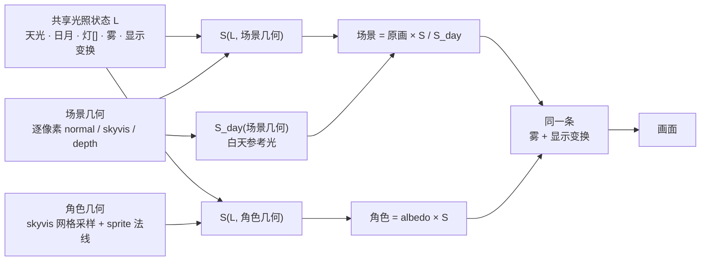
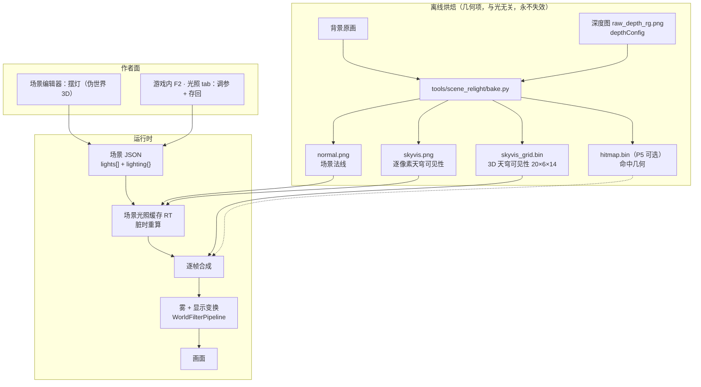
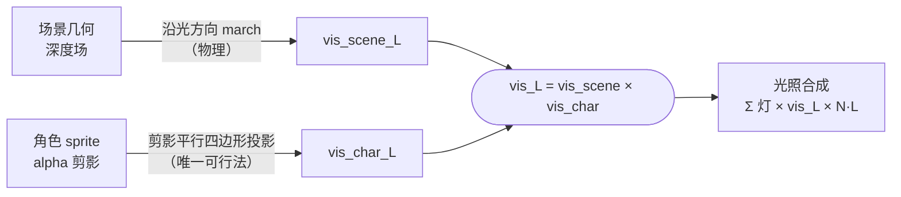
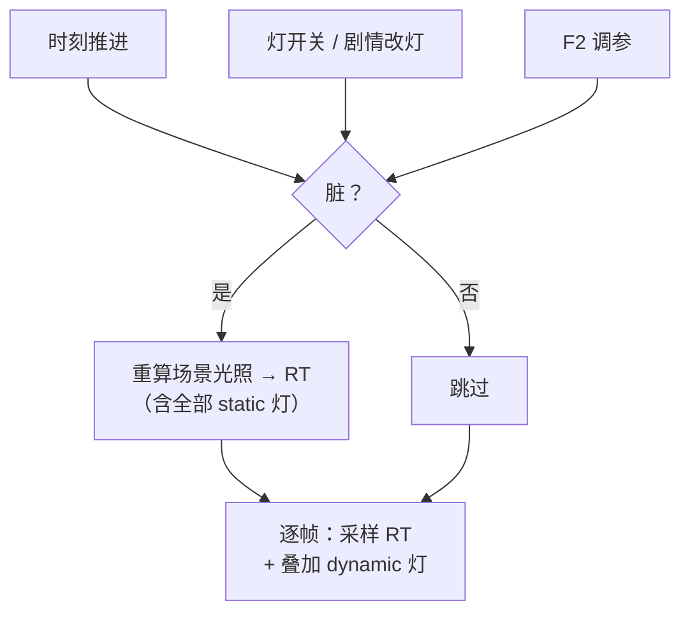
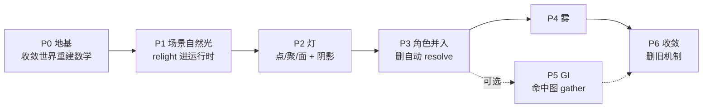

# 统一光影系统 · 实施方案

- 日期：2026-08-20 ｜ 分支：`lighting-rebuild` ｜ 状态：**待签字**
- 上游：[统一光影系统-需求与现状盘点-2026-08-20.md](统一光影系统-需求与现状盘点-2026-08-20.md)
  （需求 R1–R13、现状盘点、访谈结论、审批题答复全在那份，本文不重复）
- 本文只回答一件事：**具体怎么做**——改哪些文件、算法怎么写、分几期、每期怎么验收。

---

## 1. 核心模型：一个 S 函数，两种消费方式

整套系统的骨架可以压缩成一句话：

> **场景与角色接受同一份光照状态 `L`。场景因为 albedo 被画进了像素里，只能用「除旧光乘新光」；
> 角色的 albedo 是显式的，直接乘。两者算的是同一个 `S`。**



`S` 的定义（**唯一一份 GLSL，见 §4.1**）：

```
S(L, 几何) = 天光色 × 天光强度 × skyvis(几何)
           + Σ_日月 色 × 强度 × max(N·L,0) × shadow(几何, L)
           + Σ_灯   色 × 强度 × falloff(灯, 位置) × max(N·L,0) × vis(几何, 灯)
```

**"完美融合"是结构性的**：两边吃同一个 `L`、同一个 `skyvis` 场、同一套 `S`，
不依赖任何事后补偿。

---

## 2. 数据流全景



**离线只产几何项**（法线、可见性、命中图）——它们与时刻、天气、灯全无关，
**光怎么变都不用重烘**（R1 的落地形式）。

---

## 3. 数据契约

### 3.1 `LightDef`（新增，`src/data/types.ts`）

```ts
/** 光源类型。天光不是 Light（它是场景级唯一项，见 SceneLightingDef.sky）。 */
export type LightKind = 'point' | 'spot' | 'area' | 'directional';

export interface LightDef {
  id: string;
  kind: LightKind;
  /** 伪世界坐标 [x,y,z]。铁律：一切光照发生在伪世界空间。directional 忽略本字段。 */
  pos?: [number, number, number];
  /** 色温 K（与 color 二选一；两者都写时 color 赢） */
  kelvin?: number;
  color?: RgbColor;
  intensity: number;
  /** 作用半径（世界单位）。用于屏幕包围盒剔除与高斯截断。directional 忽略。 */
  range?: number;

  /** spot 专用 */
  dir?: [number, number, number];
  innerAngleDeg?: number;
  outerAngleDeg?: number;

  /** directional 专用（日月）：来向 */
  elevationDeg?: number;
  azimuthDeg?: number;

  /** area 专用：矩形尺寸；orientation 缺省时从深度场在 pos 处的法线自动取 */
  size?: [number, number];
  orientation?: [number, number, number];
  twoSided?: boolean;

  /** 投不投影。既是效果开关，也是性能预算闸门（见 §6） */
  castShadow?: boolean;
  /** area 软阴影采样点数，缺省 2 */
  shadowSamples?: number;

  /** true = 每帧重算（闪烁/移动）；缺省 false = 进场景光照缓存，稳态零帧成本 */
  dynamic?: boolean;
  /** 初始是否点亮。运行时可由 Action 改 */
  enabled?: boolean;
}
```

### 3.2 `SceneLightingDef`（新增，挂在 `SceneData.lighting`）

```ts
export interface SceneLightingDef {
  /** 天光（半球环境光）。经 skyvis 调制 */
  sky: { kelvin?: number; color?: RgbColor; intensity: number; hemi: number };
  /** 白天参考光 S_day 的构成——决定"除掉多少白天光" */
  day: { hemi: number; sunIntensity: number; sunElevationDeg: number; sunAzimuthDeg: number };
  /** 灯（含日月 directional） */
  lights: LightDef[];
  /** 雾：按消光系数 σ 定义，不按混合系数（S4） */
  fog: { sigma: number; heightFalloff: number; baseY: number; kelvin?: number; scatter: number };
  /** 显示变换 */
  display: { ev: number; contrast: number; saturation: number; whiteKelvin: number;
             lift: number; liftKelvin: number; tonemap: 'reinhard' | 'filmic' | 'none' };
  /** 场景辐射尺度 ↔ 角色 albedo 尺度的标定常数（U11）。缺省自动估 */
  radianceScale?: number;
  /** 天穹遮蔽强度（AO 强度旋钮，U12） */
  aoStrength?: number;
}
```

### 3.3 实体阴影绑定（R8，实体级 + Action 可控）

```ts
export interface EntityShadowBinding {
  /** 'light:<id>' 绑真实灯 | 'virtual' 用虚拟灯 | 'none' 不投影 */
  source: string;
  /** virtual 时生效：只影响影子，不照亮角色（Q7） */
  virtual?: { azimuthDeg: number; elevationDeg: number;
              darkness: number; softness: number; length: number };
}
```

配套 Action `setEntityShadow`，走 [add-Action 四件套](../../agent_docs/runtime/mechanisms/action-registration-quadruple.md)
＋ 第五件 `ENTITY_REF_PARAMS`（`source` 含灯 id 引用）。

### 3.4 烘焙产物

| 文件 | 内容 | 尺寸估算 |
|---|---|---|
| `lighting2/normal.png` | 场景法线（RGB8，xy + \|z\|） | ~200 KB |
| `lighting2/skyvis.png` | 逐像素天穹可见性（R8 单通道） | ~100 KB |
| `lighting2/skyvis_grid.bin` | **3D 天穹可见性**，20×6×14 = 1680 个 f32 | **6.7 KB** |
| `lighting2/hitmap.bin` | 命中 UV + miss 标记（P5 可选），1680×64×RG16 | 430 KB |
| `lighting2/meta.json` | 网格参数、world 矩阵、background_sha1、版本号 | ~2 KB |

★ **新目录 `lighting2/`**，与现有 `lighting/` 并存到 P6 才删——旧载荷不动，回滚零成本。

---

## 4. 关键算法规格

### 4.1 单一真相源：两份 GLSL

| 文件 | 内容 | 消费方 |
|---|---|---|
| `src/rendering/lighting/worldReconstruct.glsl` | 屏幕/世界 ↔ work px ↔ 伪世界 q ↔ M-world 的**全部**换算 | 场景 pass、角色 filter、角色 mesh、实体阴影、调试滤镜 |
| `src/rendering/lighting/lightingCore.glsl` | `S(L, 几何)`：天光×skyvis + 日月×N·L×shadow + Σ灯 | 同上 + 工具预览（WebGL） |

⚠ **S11 是 P0 的全部内容**：现状是同一套世界重建数学散在 **9 处**且已出现口径分叉
（`uDepthPerSy` 缺字段时一处从 M 现推、另一处直接 `?? 0` 等于悄悄退回 billboard）。
**不先收敛，新系统只会把 9 变 11。**

工具侧预览必须**跑同一份 GLSL**（沿用 `charShadeCore.glsl` 喂给 viewer 的既有范式），
numpy 实现降级为离线参考基准 + parity 测试基准。

### 4.2 天穹可见性 `skyvis`

**逐像素版（场景用）**：每像素向上半球 12 个方向（2 仰角 × 6 方位）沿深度场 march，
16 步、长度 2.2 wu：

```
skyvis(x) = Σ_d vis(x,d) · max(N(x)·d, 0) / Σ_d max(up·d, 0)
```

开阔地 ≈ 1，巷道深处 / 屋檐下 / 墙根按真实遮蔽衰减。参考实现：
`tools/scene_relight/relight.py` `sky_field()`（已验收）。

**3D 网格版（角色用）**：同一套 march、同一组方向，但采样点是 3D 网格，每点存**一个标量**。
24×10×16 = 3840 × f32 = **15 KB**，比现有 probe atlas 小两个数量级。

⇒ 角色按自己的伪世界位置做三线性插值，头脚高度差天然被 3D 网格表达，
不需要"脚点采样 + 高度补偿"这种近似。**这是 R4「角色吃天光遮蔽」的落地。**

#### ★★ 实施中发现的刻度错误（2026-08-20，已修）

烘网格时实测出**世界单位的真实刻度**，与既有系统的假设差 6–8 倍：

| | 雾津街头 | 码头白天 |
|---|---|---|
| 角色真实高度 | **0.170 wu** | **0.227 wu** |
| 建筑离地 | 1.03 wu = 角色的 **6.1 倍** | 1.44 wu = **6.3 倍** |
| 1 wu ≈ | **10.0 m** | 7.5 m |

刻度链：`场景坐标 --(native_w / worldWidth)--> 背景像素 --(1/ppu)--> 世界单位`。
建筑是人的 6 倍高**是物理正确的**（两层楼 vs 人）。

⚠ **既有 probe 管线的 `probe_band = 1.6` 建立在"1 wu = 1 m、角色高 1.5 wu"的错误假设上**
（其 README 的调参实验写着"比对角色身上 0.1~1.55 **m**"，把 wu 当成了米）。
后果：probe 网格竖直方向覆盖了 6–8 倍于需要的空间，**角色真正所在的那一薄层被挤进最底下不到一格**。
这多半是该系统长期"角色照明不跟场景"的一个根因，值得在 P3 单独复核。

**本系统不复制该错误**：`bake.py` 的 `character_band_wu()` 从角色真实世界高度推带高，
并把 `scale{char_wu, scene_per_wu, meters_per_wu}` 写进 `meta.json` 供下游（含 U11 标定）使用。

实测修正效果（雾津街头）：

| | 修正前（band=1.6，6 层） | 修正后（band=0.196，10 层） |
|---|---|---|
| 网格 y 跨度 | 2.04 wu | **0.617 wu** |
| 角色占几层 | < 1 层 | **约 2.8 层** |
| 逐层均值 | 0.15 → 0.57 → **0.95 就饱和** | 0.31 → 0.91 **全程平滑** |

#### ★ 推论：世界单位是**逐场景**的，作者面必须用米

28 个场景全量烘完实测，`1 wu` 的物理长度从 **2.0 m 到 10.0 m** 不等
（各场景的 `worldWidth` 与深度标定 `ppu` 独立，世界单位自然不同尺）。

⇒ **任何有物理含义的作者参数都不能用 wu 直接填**，否则同一个数在不同场景差 5 倍：
- `LightDef.range`（灯的作用半径）
- `fog.heightFalloff` / `fog.baseY`
- 阴影长度

**做法**：作者面一律用**米**（以玩家 1.7 m 为锚），运行时按该场景 `meta.json` 的
`scale.meters_per_wu` 转成 wu。这样一盏"照 5 米"的灯笼在任何场景都照 5 米。

⚠ 这条同时是 U11 标定的一半——`scale` 块已随 `meta.json` 落盘，下游直接读。

### 4.3 阴影：两个来源，一处汇聚



- **场景阴影**：`_march_blocked` 同式（`relight.py` 已验收），半分辨率 + 高斯软化后放大。
- **角色阴影**：保留 `PlanarEntityShadow` 的剪影几何与着色（quad 构造、平行四边形 UV 反解、
  碰撞方向 march、前景深度 blend、脚底接触斑）。**只把方向/强度的来源换成手动绑定的灯**（R8）。
- **同一盏灯的两个遮挡源相乘**：都挡住 = 这盏灯照不到，到此为止，不会叠成两倍黑。

⚠ 这与 `entity-lighting` 硬契约②「遮挡代理与着色代理禁止合并」**不冲突**：
合并的是阴影的两个**来源**，不是那两个代理。

### 4.4 面光：Lambert 闭式解，零采样

本项目 Lambert-only（不重建 specular），故**多边形面光有闭式解**：

```
E = (1/2π) Σ_边 acos(p_i · p_j) × ( normalize(p_i × p_j) · N )
```

`p_i` = 面光顶点投影到着色点单位球的方向。矩形 = 4 条边 = 4 次 `acos`，
约点光的 2–3 倍开销，**精确、零噪点**。

- **不需要 LTC**（那是为 GGX 高光准备的）。
- 背面裁剪：先用 `max(0, ·)` 兜底，实测有问题再加 horizon clip（多边形裁到 `N·p>0` 半空间，
  最多变成 5 边）。
- **朝向自动**：`orientation` 缺省时取深度场在 `pos` 处的法线——贴到窗户位置朝向就对了。

★ 面光特别契合本画风：**亮窗、门洞、纸灯笼本来就是矩形**。

### 4.5 雾：统一 σ 模型，本期只做高度雾

```
消光  T = exp(−∫σ(x) ds)                    ← 高度雾与体积雾共用
颜色  = T · scene + (1−T) · scatter          ← 高度雾：scatter 为常数
                                              体积雾（未来）：scatter 逐灯积分
```

★ **正交相机 ⇒ 每像素视线方向恒定 ⇒ 高度雾的积分有闭式解**，不需要 march：

```
σ(y) = σ₀ · exp(−(y − baseY) / H)
∫σ ds = σ₀·H/|d_y| · [ exp(−(y_cam − baseY)/H) − exp(−(y_surf − baseY)/H) ]
```

- **参数按 σ 定义，不按混合系数**（S4）——将来上体积雾时已调好的浓度/高度/颜色全部继续有效。
- **场景与角色共用同一组 σ 参数**，各自用自己的深度：
  背景 pass 用逐像素深度，实体 filter 用实体自己的 quad 深度。
  ⇒ **不需要合成深度缓冲**（避开 Pixi v8 多目标渲染的坑）。

### 4.6 显示变换

顺序固定：`曝光(EV) → tonemap → 白平衡 → 对比 → 饱和 → 暗部提升 → sRGB`

- 挂 `WorldFilterPipeline`（已存在，覆盖背景+阴影+实体三层，GUI 不受影响）。
- **同时作用于场景与角色**——这是两者亮度永远一致的结构性保证。
- `tonemap` 三选一（`reinhard` / `filmic` / `none`），缺省 `reinhard`。

⚠ **显示变换绝不能烤进辐射场**。这正是当前 `scene_relight` 导出图动态范围只有 17× 的根因
（`ev` + `ratio_max` clamp + 8bit 三件事一起把辐射压进了显示区间）。

### 4.7 场景光照缓存（效率的关键）



- **静态灯**（`dynamic: false`，缺省）进缓存 ⇒ **稳态每帧零光照计算**，只有一次纹理采样。
- **动态灯**（闪烁烛火、玩家手持灯笼）逐帧算。
- ⚠ **这是缓存不是烘焙**：运行时算、参数一变就重算，不违反 R1。文档与注释措辞必须区分。

### 4.8 命中图 gather（P5，可选加分项）

- 离线：每个 probe 沿 64 个八面体方向 march，记命中的背景像素 UV 或 miss 标记。
  **纯几何，与光无关。**
- 运行时：按 UV 采样**当前线性 HDR 场景辐射**，余弦加权求和 → E，投 SH/bins。
- ⚠ **gather 源必须是线性 HDR 中间图，不是显示成品**（否则角色把调色和雾吃进受光里）。
- ⚠ **不是屏幕空间积分**：命中图在伪世界空间烘、深度分离在烘焙期完成，
  运行时只按既定命中点取色。**新决策卡必须写明这条区别**，否则会被误判为翻案（铁律 S12）。
- **双重记账**：灯的直接光走解析式，就不能再从 gather 里重复收一次
  ⇒ gather 源须排除解析灯的直接贡献。因为灯是我们摆的，位置强度全知道，
  这条比旧系统靠 SAM3 猜发光体简单得多。

---

## 5. 模块与文件清单

### 5.1 新增

```
src/rendering/lighting/
├── worldReconstruct.glsl      世界重建数学（S11 单一真相源）
├── lightingCore.glsl          S(L, 几何) 单一真相源
├── LightRegistry.ts           灯的运行时注册表（装载 / Action 改 / 脏标记）
├── SceneLightingPass.ts       场景光照缓存 pass（渲染到 RT）
├── AtmospherePass.ts          雾 + 显示变换（挂 WorldFilterPipeline）
└── types.ts                   运行时光照类型

tools/scene_relight/
└── bake.py                    烘 normal / skyvis / skyvis_grid / hitmap
```

### 5.2 修改

| 文件 | 改什么 |
|---|---|
| `src/data/types.ts` | +`LightDef` +`SceneLightingDef` +`EntityShadowBinding`；`SceneData.lighting` |
| `src/core/SceneDepthSystem.ts` | 提供 normal / skyvis 纹理与 uniform；世界重建改用 `worldReconstruct.glsl` |
| `src/core/CharacterLightingSystem.ts` | **大改**：删自动 resolve，改消费 `lightingCore` + skyvis 网格 |
| `src/rendering/CharacterShadingFilter.ts` | 改吃 `lightingCore.glsl`，删自有光照数学 |
| `src/rendering/CharacterLitSprite.ts` | 同上 |
| `src/rendering/EntityShadow.ts` | 阴影方向来源改成绑定的灯 / 虚拟灯 |
| `src/systems/SceneManager.ts` | 装载 `lights[]` 与 `lighting{}`；接 `AtmospherePass` |
| `src/core/DebugTools.ts` | 新增「光照」tab（R12），含存回按钮 |
| `src/core/Game.ts` | 装配；删 `driveEntryShadows` 的自动槽解算 |
| `tools/editor/editors/scene_editor.py` | 灯位摆放（复用 `lightEnvCurve` 画布交互）+ 带影灯数预算显示 |
| `tools/editor/validate.py` | 灯与光照字段校验；`lighting2/` 载荷尺寸校验 |
| `tools/scene_relight/*` | 预览改 WebGL 跑同一份 GLSL；导出参数而非烤图 |

### 5.3 删除（P6）

```
src/rendering/DeferredEntityShadow.ts            整文件（死码，无消费者）
src/rendering/shadowField.ts                     自动 resolve 抽象
CharacterLightingSystem.resolveShadowLights      （:269-382）
CharacterLightingSystem.sampleFluxLum            （:385-425，顺带消解 BIN 档不可用）
Game.driveEntryShadows 的自动槽绑定/时间低通      （Game.ts:3818-3902）
F2「影子跟灯」旋钮（gain / 槽 k / ambScale / tauMs）
SceneData.lightEnv / lightEnvCurve / filterId    ＋ 5 处引用
public/assets/data/filters/{night,test}.json     无人引用
test_room_b 的 timeVariants 脏数据               键名 "night" 不在 辰/午/暮/夜
```

⚠ 删烘焙导出字段须做**下线扫描**（`scene-bake-downstream` 硬契约④）：
①服务端 API 回包 KeyError 被 except 吞成"导出失败" ②旁支工具读到 undefined→NaN
③已构建的 dist 产物。

---

## 6. 性能预算（GTX 970 = 目标机）

| 项 | 估算 | 说明 |
|---|---|---|
| 无阴影的灯 | 20–40 ALU/盏 | 配合 `range` 屏幕包围盒剔除 ⇒ **几十盏无压力** |
| **带阴影的灯** | 半分辨率 24–32 步 march ≈ 16M taps/盏 | **同屏 4–6 盏是预算线** |
| 带阴影的面光 | ≈ 2–4 盏带阴影点光 | 软阴影 2–4 采样点 |
| 场景光照 | **稳态每帧 0**（缓存命中） | 只在脏时重算 |
| 角色光照 | 逐帧，像素少 | 采样几个场 + 解析灯 |
| 雾 | ~10 ALU/像素 | 正交相机解析解，无 march |

⇒ **`castShadow` 就是预算闸门**。编辑器必须显示「当前带影灯数 N / 预算」，
不能等跑起来掉帧才发现。

**实测计划**：P2 结束时在雾津街头（灯最多的场景）做一次 profiling，
按实测结果校准预算数字并写回本文。⚠ 现有性能怀疑项
（`artifact/Reviews/运行时深度审查-2026-07-02.md:163` baseline softness=1.0 的逐实体 RTT）
**至今标着 SUSPECTED、从未 profiling**，一并在这次测掉。

---

## 7. 分期



### P0 · 地基（表现零变化）

**做**：把散在 9 处的世界重建数学收敛进 `worldReconstruct.glsl`；建 `lightingCore.glsl` 骨架；
修 `BackgroundDebugFilter` 的 `uHasGroundTex` 恒 0 那个真 bug。

**验收**：`tsc` + `npm test` 绿；**逐场景截图与改动前逐像素一致**（走
[无头画面验证](../../agent_docs/runtime/recipes/headless-visual-verification.md)）；
`uDepthPerSy` 口径分叉消失。

### P1 · 场景自然光

**做**：`bake.py` 烘 normal / skyvis / skyvis_grid；`SceneLightingPass` 产线性 HDR RT；
`AtmospherePass` 做显示变换挂 `WorldFilterPipeline`；F2「光照」tab 初版（天光/日月/调色）。

**验收**：
1. 雾津街头能在游戏里实时从白天调到「暮」「辰」「夜」，**与工具预览逐像素 parity**（≤2/255）；
2. 拖动参数实时响应，无卡顿；
3. **辐射场是线性 HDR**——检查 RT 内容动态范围 > 100×（当前烤图只有 17×）。

### P2 · 灯

**做**：`LightDef` 类型 + 场景 JSON 装载 + `LightRegistry`；点/聚/面三种着色；
每盏 `castShadow` 的场景阴影 march；静态/动态分离与缓存；编辑器灯位摆放（含高度）+ 预算显示。

**验收**：
1. 雾津街头点上灯笼（含至少一盏**面光**贴在亮窗上），970 上 60fps；
2. 关掉某盏灯，只有它的光与影消失，其余不变；
3. 一盏 `dynamic` 灯闪烁时，**静态灯不重算**（帧时间不上升）；
4. `audit` 门全绿。

### P3 · 角色并入

**做**：角色消费 `lightingCore` + skyvis 网格三线性；**删掉自动 resolve 全套**（R6）；
角色阴影绑定灯/虚拟灯 + `setEntityShadow` Action（四件套 + `ENTITY_REF_PARAMS`）；
标定常数 `radianceScale` 自动估 + 旋钮。

**验收**：
1. 角色走进巷子变暗、走到灯下变亮，**明暗与脚下地面一致**（目视 + 取样比对）；
2. 影子跟着**指定的**灯，改绑定立刻生效，虚拟灯只改影子不改受光；
3. Action 能在过场里改影子方向；
4. 关掉全部灯与 GI，角色仍有正确的天光明暗结构。

### P4 · 雾

**做**：统一 σ 模型；高度雾解析解；场景与角色共享同一组参数。

**验收**：雾随深度正确衰减；**角色走进雾里同样被雾化**（不再是贴纸）；
σ 参数改动同时影响两者。

### P5 · GI（可选加分）

**做**：`hitmap.bin` 烘焙 + 运行时 gather；双重记账（排除解析灯直接贡献）。

**验收**：开关对比——角色能收到墙面反射的暖光；关掉后不崩、只是少一层。

### P6 · 收敛

**做**：删 §5.3 全部旧机制；**3 个场景人工重调**（teahouse、dev_teahouse_alive、梦_夜路）；
就地改写 `2026-07-21` 决策卡；改写 `character-lighting` / `entity-lighting` 硬契约条目；
`tools/scene_relight` 入 `paths-triggers.json`（当前是治理空洞）。

**验收**：29 个场景全部走新系统；旧字段全仓零引用；
`validate-data` 零 error 且**警告数不增加**（棘轮）。

---

## 8. F2「光照」tab 设计（R12）

分组折叠，缺省只展开①②：

| 组 | 控件 |
|---|---|
| ① 天光 | 强度 / 色温 / 半球权重 / **AO 强度**（U12） |
| ② 日月 | 强度 / 仰角 / 方位 / 色温 / 投影浓度·长度·软化 |
| ③ 灯 | 列表（点/聚/面图标 + 开关 + `castShadow` 勾选）；选中后编辑该盏全部参数；**顶部显示「带影灯数 N / 预算」** |
| ④ 雾 | σ / 高度衰减 / 基准高度 / 散射色温 / 散射强度 |
| ⑤ 显示 | EV / tonemap / 白平衡 / 对比 / 饱和 / 暗部提升 |
| ⑥ 标定 | `radianceScale`（自动估值 + 手调） |
| ⑦ 调试 | 显示 skyvis 场 / 显示某盏灯的 vis / 显示线性 HDR 直方图 |

**存回**：底部「存回场景」按钮，走 vite 中间件写盘通道
（`debug-ui-persistence` 卡：localStorage-only 已于 2026-07-07 被明确否决）。

⚠ 调试可视化（⑦）必须**单独兜错并排在最后**——Pixi 坑③：一个坏掉的调试滤镜能让整场景照明陪葬，
且默认静默。

---

## 9. 编辑器改动

- **灯位摆放**：复用 `scene_editor.py:1447-1600` 的画布折线编辑器交互
  （拖顶点 / 双击插点 / 右键删点 / 画方向箭头），改造成灯位摆放。
  **高度**：选中灯后出一个立杆手柄（画布上画一条竖线 + 顶端方块），拖它调 y；
  缺省高度 = 深度场在该点的地面高度 + 2.0 wu。
- **面光**：额外拖两个角控制尺寸；朝向缺省自动取法线，可手动覆盖。
- **预算显示**：灯列表顶部常驻「带影灯数 N / 预算 6」，超了标红。
- **`validate.py`**：灯 id 唯一、`kind` 与必填字段匹配、`range > 0`、
  绑定的灯 id 存在（悬垂引用 error）、`lighting2/` 载荷尺寸与网格声明一致
  （⚠ 期望值必须以**运行时消费端**为准——2026-08-06 那次多乘 4 导致 28 场景全量误报的教训）。

---

## 10. 风险与对策

| 风险 | 对策 |
|---|---|
| **Pixi 坑①** 多张离屏 RT 清屏串台 | 一律走 `renderer.renderTarget.bind(rt,true,color)`，禁用 `renderer.clear({target})` |
| **Pixi 坑②** 纹理销毁顺序反了会**永久烧毁滤镜** | 卸载时先解绑回占位图再销毁；跨场景长活对象重点检查 |
| **Pixi 坑④** alpha 当数据用的纹理被解码期预乘 | normal / skyvis / hitmap 全部走 `data.alphaMode:'premultiplied-alpha'` |
| **Pixi 坑⑦** `Sprite` 子节点不渲染 | 光照/雾层挂成**兄弟节点**，不挂角色 Sprite 下 |
| **Pixi 坑⑧** `extract.pixels` 不过 filter ⇒ **现有取证法失效** | P0 就重定验证手段：mesh 路径取证 / RT 直读 |
| 屏幕空间积分复活被否方案 | **铁律 S12**：任何 pass 若在屏幕空间做模糊/衰减/传播，须证明深度分离在伪世界空间完成 |
| `validate-data` 因载荷格式变动全量误报 | 校验器期望值以运行时消费端为准；`lighting2/` 与 `lighting/` 并存期分别校验 |
| 梦_夜路那条曲线是**刻意的非物理演出**，纯物理复现不出来 | P6 重调时先试纯物理；不行再补"氛围参数的位置调制"薄层，**别提前造** |
| 28 场景重烘耗时 | 缓存热约 2'40"–3'25"/场景、24 场约 1h36m；`out/` 本机不存在须先重烘。P1 先做 1 个场景打通再批量 |
| `renderRaw` 装饰实体被新系统吃进光照会**集体串色** | 保留 `renderRaw` 旁路 |

---

## 11. 验收门（每期都跑）

```bash
npx tsc --noEmit
npm test
./dev.sh validate-data              # 零 error，警告数不增加（棘轮）
python -m tools.editor.shared.asset_reference_audit . --strict
./dev.sh audit-depth
./dev.sh audit-walkable             # 重导任一场景碰撞时
git diff --check
python3 agent_docs/_meta/audit.py   # 动过 agent_docs 后
```

**真机验证义务**：不以"编译过 + 测试绿"为完成标准。每期须走
[无头画面验证](../../agent_docs/runtime/recipes/headless-visual-verification.md) 出帧取证
（判读技巧：`darkness=1.0` + 关 AO + 低 elevation 最不容易看漏阴影错误）。

**收尾**：向 `agent_docs/_meta/inbox/` 投三行偏差记录。

---

## 12. 待签字

1. 本方案的**分期与验收口径**是否认可？
2. **U6 旧机制处置**采纳建议（P6 一次性收敛、3 个场景人工重调、`timeVariants` 保留类型清脏数据）？
3. **P5（GI）** 是做还是先挂起？它是可选加分项，不做不影响 P0–P4 与 P6 成立。
