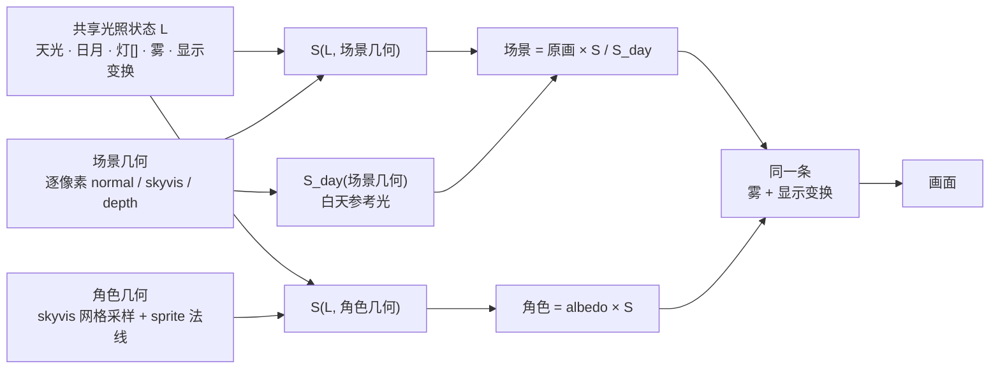
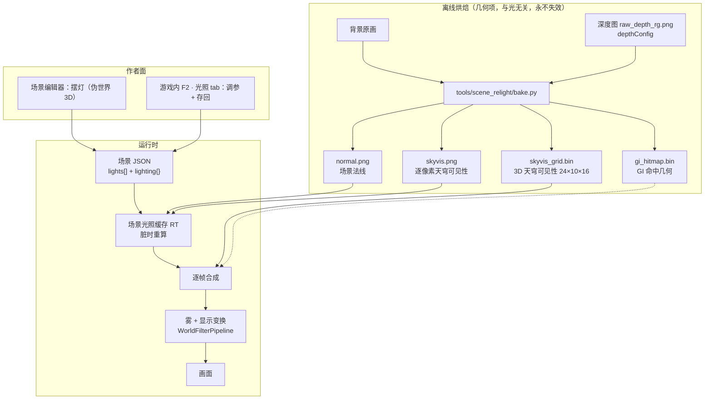
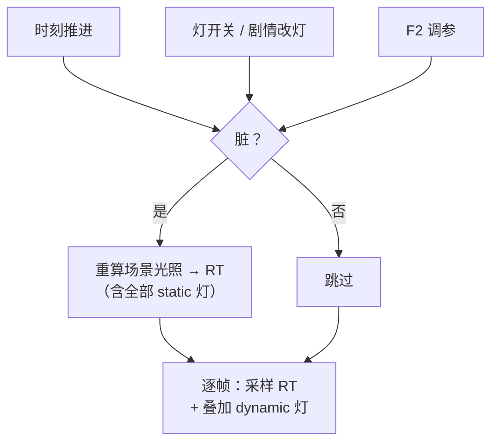
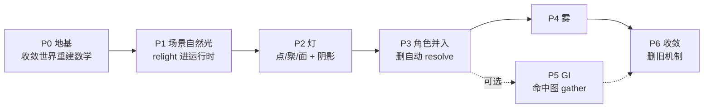

# 统一光影系统 · 实施方案

- 日期：2026-08-20（P3–P5 于 08-21 落地）｜ 分支：`lighting-rebuild`
- 状态：**P0–P6 已实现并验收。剩下的是内容工作：逐场景调参（见 §12）**

| 期 | 内容 | 状态 |
|---|---|---|
| P0 | 地基：世界重建数学 9 处收敛为单一源 | ✅ |
| P1 | 场景自然光（天穹可见性 + 定向光投影 + 先除后乘） | ✅ |
| P2 | 灯：点 / 聚 / 面 / 平行，全实时 | ✅ |
| P3 | 角色并入 + 删自动 resolve + 手动绑灯阴影 | ✅ |
| P4 | 雾：统一 σ 模型，场景与角色同一组参数 | ✅ |
| P5 | GI：角色被 relight 后的场景照亮 | ✅ |
| P6 | 收敛：全场景恒等迁移 + 删已证明无消费者的旧机制 | ✅ 迁移 27/27 恒等；剩下的旧机制仍承重，等逐场景调参 |

- 上游：[统一光影系统-需求与现状盘点-2026-08-20.md](统一光影系统-需求与现状盘点-2026-08-20.md)
  （需求 R1–R13、现状盘点、访谈结论、审批题答复全在那份，本文不重复）
- 本文只回答一件事：**具体怎么做**——改哪些文件、算法怎么写、分几期、每期怎么验收。

---

## 1. 核心模型：一个 S 函数，两种消费方式

整套系统的骨架可以压缩成一句话：

> **场景与角色接受同一份光照状态 `L`。场景因为 albedo 被画进了像素里，只能用「除旧光乘新光」；
> 角色的 albedo 是显式的，直接乘。两者算的是同一个 `S`。**



`S` 的定义（**唯一一份 GLSL，见 §4.1**）：

```
S(L, 几何) = 天光色 × 天光强度 × skyvis(几何)
           + Σ_日月 色 × 强度 × max(N·L,0) × shadow(几何, L)
           + Σ_灯   色 × 强度 × falloff(灯, 位置) × max(N·L,0) × vis(几何, 灯)
```

**"完美融合"是结构性的**：两边吃同一个 `L`、同一个 `skyvis` 场、同一套 `S`，
不依赖任何事后补偿。

---

## 2. 数据流全景



**离线只产几何项**（法线、可见性、命中图）——它们与时刻、天气、灯全无关，
**光怎么变都不用重烘**（R1 的落地形式）。

---

## 3. 数据契约

### 3.1 `LightDef`（新增，`src/data/types.ts`）

```ts
/** 光源类型。天光不是 Light（它是场景级唯一项，见 SceneLightingDef.sky）。 */
export type LightKind = 'point' | 'spot' | 'area' | 'directional';

export interface LightDef {
  id: string;
  kind: LightKind;
  /** 伪世界坐标 [x,y,z]。铁律：一切光照发生在伪世界空间。directional 忽略本字段。 */
  pos?: [number, number, number];
  /** 色温 K（与 color 二选一；两者都写时 color 赢） */
  kelvin?: number;
  color?: RgbColor;
  intensity: number;
  /** 作用半径，单位**米**（不是世界单位）。运行时按 metersPerWu 换算。directional 忽略。 */
  rangeMeters?: number;
  /** 近场软化，防贴脸核爆。缺省 0.25（世界单位平方量纲，直接进 1/(r²+c)） */
  softening?: number;

  /** spot 专用 */
  dir?: [number, number, number];
  innerAngleDeg?: number;
  outerAngleDeg?: number;

  /** directional 专用（日月）：来向 */
  elevationDeg?: number;
  azimuthDeg?: number;

  /** area 专用：矩形尺寸，单位**米**；orientation 缺省 [0,0,-1]（朝相机） */
  sizeMeters?: [number, number];
  orientation?: [number, number, number];

  /** 投不投影。既是效果开关，也是性能预算闸门（见 §6） */
  castShadow?: boolean;
  /** area 软阴影采样点数，缺省 2 */
  shadowSamples?: number;

  /** 初始是否点亮。运行时可由 Action 改 */
  enabled?: boolean;
}
```

⚠ **距离量一律用米**。世界单位是**逐场景**的（实测 1 wu = 2.0–10.0 m），
拿世界单位当参数会让同一个数在不同场景差 5 倍。打包在
`rendering/lighting/lightPacking.ts#packLights`，**场景与角色读同一次调用的结果**。

⚠ 本节与 §3.2 是**摘要**，字段以 `src/data/types.ts` 为准（那里的注释带踩坑记录）。

### 3.2 `SceneLightingDef`（新增，挂在 `SceneData.lighting`）

```ts
export interface SceneLightingDef {
  /** 天光（半球环境光）。经 skyvis 调制 */
  sky: { kelvin?: number; color?: RgbColor; intensity: number; hemi: number };
  /** 白天参考光 S_day 的构成——决定"除掉多少白天光"。
   *  ⚠ `hemi` **别手填**，缺省用烘焙期去相关拟合出的真值（实测 0.00–0.96）；
   *  填小了画里的遮蔽没除净、夜里再加一份 ⇒ 遮蔽算两遍。 */
  day: { hemi?: number; sunIntensity: number; sunElevationDeg: number; sunAzimuthDeg: number };
  /** 灯（含日月 directional）。**第一盏 enabled 的 directional** 走日月专用槽 */
  lights: LightDef[];
  /** 雾：按消光系数 σ（**1/米**）定义，不按混合系数（S4）。缺省不写 = 无雾 */
  fog?: { sigma: number; scaleHeightMeters: number; baseHeightMeters: number;
          kelvin?: number; color?: RgbColor; scatter: number };
  /** 显示变换。**同时作用于场景与角色**，这是两者亮度永远一致的结构性保证 */
  display: { ev: number; tonemap: 'none' | 'reinhard' | 'filmic'; whiteKelvin: number;
             contrast: number; saturation: number; lift: number; liftKelvin: number };
  /** 场景辐射尺度 ↔ 角色 albedo 尺度的标定常数（U11）。**别手填**，缺省自动估 */
  radianceScale?: number;
  /** 灯体自发光 + 大气光晕。★ "这是夜晚"最强的视觉信号 */
  emissive?: { gain: number; coreRadiusMeters?: number;
               haloRadiusMeters?: number; haloGain?: number };
  /** 去掉画里白天大气散射的强度，缺省 1（全去） */
  dehaze?: number;
  /** 天穹遮蔽强度（AO 强度旋钮，U12） */
  aoStrength?: number;
  /** 重打光比值上限，缺省 8 */
  ratioMax?: number;
}
```

### 3.3 实体阴影绑定（R8，实体级 + Action 可控）

```ts
export interface EntityShadowBinding {
  /** 'light:<id>' 绑真实灯 | 'virtual' 用虚拟灯 | 'none' 不投影 */
  source: string;
  /** virtual 时生效：只影响影子，不照亮角色（Q7）。
   *  ⚠ azimuthDeg 是**屏幕**方向不是世界方位——虚拟灯没有世界位置。 */
  virtual?: { azimuthDeg: number; elevationDeg: number; darkness: number;
              softness: number; lengthMeters: number };
  /** 绑真实灯时也能手改（不填 = 由灯自动算） */
  darkness?: number; softness?: number; lengthScale?: number;
}
```

挂载点：`NpcDef.shadowBindings` / `HotspotDef.shadowBindings` / `SceneData.playerShadowBindings`
（玩家不在场景数据里有自己的 def，而这本来就该逐场景配）。

解算 `rendering/entityShadowBinding.ts#resolveBoundShadow`，**纯函数、逐帧幂等**：
没有槽位分配、没有时间低通、没有身份匹配。绑到不存在的灯 = 没有影子，
**不回落挑最近的一盏**——那正是被否掉的旧行为。

- 方向：`light:` → 灯世界位 − 角色胸口世界位，取水平分量反向投屏；`virtual` → 原样用作者给的屏幕角
- 仰角钳在 25–80°（12° 的影子拉成 5 倍身高薄条，每像素浓度摊没，真机读不出来）
- 浓度 = **这盏灯占全部照明的份额** `e_i / (天光 + Σe_全部灯)`
  ——分母漏掉其余的灯会让浓度整片钉死在 1（见 P3 实施期发现 2）
- 软度 ∝ 光源角尺寸：面光按 `sizeMeters`，点/聚按灯体半径 **0.12 米**（不是 0.12 世界单位）

配套 Action `setEntityShadow`（`target` 命中面同 `showEmote`：player / NPC id / **裸**热区 id），
走 [add-Action 登记面](../../agent_docs/runtime/mechanisms/action-registration-quadruple.md)：
`ActionRegistry` ＋ `action_editor`（`ACTION_TYPES` + `_PARAM_SCHEMAS`）
＋ **`src/core/actionParamManifest.ts`（必填第五件，卡里没写，见 P3 发现 4）**
＋ `ENTITY_REF_PARAMS`（`target` 是实体引用）。
覆盖**不入存档、切场景即清**——它是演出态；存进档会造成「改了场景数据但老档还是旧影子」。

### 3.4 烘焙产物

| 文件 | 内容 | 尺寸估算 |
|---|---|---|
| `lighting2/normal.png` | 场景法线（RGB8，xy + \|z\|） | ~200 KB |
| `lighting2/skyvis.png` | 逐像素天穹可见性（R8 单通道） | ~100 KB |
| `lighting2/skyvis_grid.bin` | **3D 天穹可见性**，24×10×16 = 3840 个 f32 | **15 KB** |
| `lighting2/gi_hitmap.bin` | GI 命中图，RGBA8(u, v, 命中标志, 255)，384×160 | **240 KB** |
| `lighting2/meta.json` | 网格参数、M 矩阵、刻度链、`day_hemi`、`haze`、`albedo`、版本号 | ~2 KB |

★ **新目录 `lighting2/`**，与现有 `lighting/` 并存到 P6 才删——旧载荷不动，回滚零成本。

---

## 4. 关键算法规格

### 4.1 单一真相源：两份 GLSL

| 文件 | 内容 | 消费方 |
|---|---|---|
| `src/rendering/lighting/worldReconstruct.glsl` | 屏幕/世界 ↔ work px ↔ 伪世界 q ↔ M-world 的**全部**换算 | 场景 pass、角色 filter、角色 mesh、实体阴影、调试滤镜 |
| `src/rendering/lighting/lightingCore.glsl` | `S(L, 几何)`：天光×skyvis + 日月×N·L×shadow + Σ灯 | 同上 + 工具预览（WebGL） |

⚠ **S11 是 P0 的全部内容**：现状是同一套世界重建数学散在 **9 处**且已出现口径分叉
（`uDepthPerSy` 缺字段时一处从 M 现推、另一处直接 `?? 0` 等于悄悄退回 billboard）。
**不先收敛，新系统只会把 9 变 11。**

工具侧预览必须**跑同一份 GLSL**（沿用 `charShadeCore.glsl` 喂给 viewer 的既有范式），
numpy 实现降级为离线参考基准 + parity 测试基准。

### 4.2 天穹可见性 `skyvis`

**逐像素版（场景用）**：每像素向上半球 12 个方向（2 仰角 × 6 方位）沿深度场 march，
16 步、长度 2.2 wu：

```
skyvis(x) = Σ_d vis(x,d) · max(N(x)·d, 0) / Σ_d max(up·d, 0)
```

开阔地 ≈ 1，巷道深处 / 屋檐下 / 墙根按真实遮蔽衰减。参考实现：
`tools/scene_relight/relight.py` `sky_field()`（已验收）。

**3D 网格版（角色用）**：同一套 march、同一组方向，但采样点是 3D 网格，每点存**一个标量**。
24×10×16 = 3840 × f32 = **15 KB**，比现有 probe atlas 小两个数量级。

⇒ 角色按自己的伪世界位置做三线性插值，头脚高度差天然被 3D 网格表达，
不需要"脚点采样 + 高度补偿"这种近似。**这是 R4「角色吃天光遮蔽」的落地。**

#### ★★ 实施中发现的刻度错误（2026-08-20，已修）

烘网格时实测出**世界单位的真实刻度**，与既有系统的假设差 6–8 倍：

| | 雾津街头 | 码头白天 |
|---|---|---|
| 角色真实高度 | **0.170 wu** | **0.227 wu** |
| 建筑离地 | 1.03 wu = 角色的 **6.1 倍** | 1.44 wu = **6.3 倍** |
| 1 wu ≈ | **10.0 m** | 7.5 m |

刻度链：`场景坐标 --(native_w / worldWidth)--> 背景像素 --(1/ppu)--> 世界单位`。
建筑是人的 6 倍高**是物理正确的**（两层楼 vs 人）。

⚠ **既有 probe 管线的 `probe_band = 1.6` 建立在"1 wu = 1 m、角色高 1.5 wu"的错误假设上**
（其 README 的调参实验写着"比对角色身上 0.1~1.55 **m**"，把 wu 当成了米）。
后果：probe 网格竖直方向覆盖了 6–8 倍于需要的空间，**角色真正所在的那一薄层被挤进最底下不到一格**。
这多半是该系统长期"角色照明不跟场景"的一个根因，值得在 P3 单独复核。

**本系统不复制该错误**：`bake.py` 的 `character_band_wu()` 从角色真实世界高度推带高，
并把 `scale{char_wu, scene_per_wu, meters_per_wu}` 写进 `meta.json` 供下游（含 U11 标定）使用。

实测修正效果（雾津街头）：

| | 修正前（band=1.6，6 层） | 修正后（band=0.196，10 层） |
|---|---|---|
| 网格 y 跨度 | 2.04 wu | **0.617 wu** |
| 角色占几层 | < 1 层 | **约 2.8 层** |
| 逐层均值 | 0.15 → 0.57 → **0.95 就饱和** | 0.31 → 0.91 **全程平滑** |

#### ★ 推论：世界单位是**逐场景**的，作者面必须用米

28 个场景全量烘完实测，`1 wu` 的物理长度从 **2.0 m 到 10.0 m** 不等
（各场景的 `worldWidth` 与深度标定 `ppu` 独立，世界单位自然不同尺）。

⇒ **任何有物理含义的作者参数都不能用 wu 直接填**，否则同一个数在不同场景差 5 倍：
- `LightDef.range`（灯的作用半径）
- `fog.heightFalloff` / `fog.baseY`
- 阴影长度

**做法**：作者面一律用**米**（以玩家 1.7 m 为锚），运行时按该场景 `meta.json` 的
`scale.meters_per_wu` 转成 wu。这样一盏"照 5 米"的灯笼在任何场景都照 5 米。

⚠ 这条同时是 U11 标定的一半——`scale` 块已随 `meta.json` 落盘，下游直接读。

### 4.3 阴影：两个来源，一处汇聚


- **场景阴影**：`_march_blocked` 同式（`relight.py` 已验收），半分辨率 + 高斯软化后放大。
- **角色阴影**：保留 `PlanarEntityShadow` 的剪影几何与着色（quad 构造、平行四边形 UV 反解、
  碰撞方向 march、前景深度 blend、脚底接触斑）。**只把方向/强度的来源换成手动绑定的灯**（R8）。
- **同一盏灯的两个遮挡源相乘**：都挡住 = 这盏灯照不到，到此为止，不会叠成两倍黑。

⚠ 这与 `entity-lighting` 硬契约②「遮挡代理与着色代理禁止合并」**不冲突**：
合并的是阴影的两个**来源**，不是那两个代理。

### 4.4 面光：Lambert 闭式解，零采样

本项目 Lambert-only（不重建 specular），故**多边形面光有闭式解**：

```
E = (1/2π) Σ_边 acos(p_i · p_j) × ( normalize(p_i × p_j) · N )
```

`p_i` = 面光顶点投影到着色点单位球的方向。矩形 = 4 条边 = 4 次 `acos`，
约点光的 2–3 倍开销，**精确、零噪点**。

- **不需要 LTC**（那是为 GGX 高光准备的）。
- 背面裁剪：先用 `max(0, ·)` 兜底，实测有问题再加 horizon clip（多边形裁到 `N·p>0` 半空间，
  最多变成 5 边）。
- **朝向自动**：`orientation` 缺省时取深度场在 `pos` 处的法线——贴到窗户位置朝向就对了。

★ 面光特别契合本画风：**亮窗、门洞、纸灯笼本来就是矩形**。

### 4.5 雾：统一 σ 模型，本期只做高度雾

```
消光  T = exp(−∫σ(x) ds)                    ← 高度雾与体积雾共用
颜色  = T · scene + (1−T) · scatter          ← 高度雾：scatter 为常数
                                              体积雾（未来）：scatter 逐灯积分
```

★ **正交相机 ⇒ 每像素视线方向恒定 ⇒ 高度雾的积分有闭式解**，不需要 march：

```
σ(y) = σ₀ · exp(−(y − baseY) / H)
∫σ ds = σ₀·H/|d_y| · [ exp(−(y_cam − baseY)/H) − exp(−(y_surf − baseY)/H) ]
```

- **参数按 σ 定义，不按混合系数**（S4）——将来上体积雾时已调好的浓度/高度/颜色全部继续有效。
- **场景与角色共用同一组 σ 参数**，各自用自己的深度：
  背景 pass 用逐像素深度，实体 filter 用实体自己的 quad 深度。
  ⇒ **不需要合成深度缓冲**（避开 Pixi v8 多目标渲染的坑）。

### 4.6 显示变换

顺序固定：`曝光(EV) → tonemap → 白平衡 → 对比 → 饱和 → 暗部提升 → sRGB`

- 挂 `WorldFilterPipeline`（已存在，覆盖背景+阴影+实体三层，GUI 不受影响）。
- **同时作用于场景与角色**——这是两者亮度永远一致的结构性保证。
- `tonemap` 三选一（`reinhard` / `filmic` / `none`），缺省 `reinhard`。

⚠ **显示变换绝不能烤进辐射场**。这正是当前 `scene_relight` 导出图动态范围只有 17× 的根因
（`ev` + `ratio_max` clamp + 8bit 三件事一起把辐射压进了显示区间）。

### ★ 4.6b 实施期定案：雾与显示变换**不做全屏 pass**，进各自的 shader

原计划把雾与显示变换挂 `WorldFilterPipeline` 做全屏后处理。实施时否掉了，三条理由：

1. **HDR 帧缓冲**：辐射场必须是线性 HDR（否则动态范围被毁，§1.5 实测）。全屏 pass 要求
   整个 worldContainer 先渲进一张 HDR RT，Pixi v8 下代价与风险都高。
2. **没有合成深度**：worldContainer 那层只有颜色没有深度，雾算不了——除非再造一张合成
   深度缓冲，又撞多目标渲染的坑。
3. **正面撞 Pixi 坑①②③**（多 RT 清屏串台 / 纹理销毁顺序烧毁滤镜 / 调试滤镜拖垮整场景照明）。

**改为**：雾 + 显示变换写在 `lightingCore.glsl` 里，**背景与角色各自在自己的 shader 里调同一份**，
吃同一组 uniform、各用自己的深度。一致性由**共用同一份 GLSL** 保证——这比全屏 pass 更强：
全屏 pass 只能保证"作用在同一张图上"，保证不了角色着色阶段的口径一致。

配套两级结构：

```
①【脏时重算】背景 relight → RGBA16F 缓存 RT（painting × ratio + 静态灯，线性 HDR）
②【逐帧】    背景 shader：采样 ①      ─┐
             角色 shader：albedo × S ─┴→ + 动态灯 → 雾 → 显示变换 → 屏幕
```

稳态下 ① 完全不跑，② 只是一次纹理取样加二十来条指令。
⇒ `WorldFilterPipeline` **保留但不用于本系统**（现有 `filterId` 氛围滤镜仍走它，直到 P6 收敛）。

### 4.7 场景光照缓存（效率的关键）



- **静态灯**（`dynamic: false`，缺省）进缓存 ⇒ **稳态每帧零光照计算**，只有一次纹理采样。
- **动态灯**（闪烁烛火、玩家手持灯笼）逐帧算。
- ⚠ **这是缓存不是烘焙**：运行时算、参数一变就重算，不违反 R1。文档与注释措辞必须区分。

### 4.8 命中图 gather（P5，可选加分项）

- 离线：每个 probe 沿 64 个八面体方向 march，记命中的背景像素 UV 或 miss 标记。
  **纯几何，与光无关。**
- 运行时：按 UV 采样**当前线性 HDR 场景辐射**，余弦加权求和 → E，投 SH/bins。
- ⚠ **gather 源必须是线性 HDR 中间图，不是显示成品**（否则角色把调色和雾吃进受光里）。
- ⚠ **不是屏幕空间积分**：命中图在伪世界空间烘、深度分离在烘焙期完成，
  运行时只按既定命中点取色。**新决策卡必须写明这条区别**，否则会被误判为翻案（铁律 S12）。
- **双重记账**：灯的直接光走解析式，就不能再从 gather 里重复收一次
  ⇒ gather 源须排除解析灯的直接贡献。因为灯是我们摆的，位置强度全知道，
  这条比旧系统靠 SAM3 猜发光体简单得多。

---

## 5. 模块与文件清单

### 5.1 新增

```
src/rendering/lighting/
├── worldReconstruct.glsl      世界重建数学（S11 单一真相源）
├── lightingCore.glsl          S(L, 几何) 单一真相源
├── LightRegistry.ts           灯的运行时注册表（装载 / Action 改 / 脏标记）
├── SceneLightingPass.ts       场景光照缓存 pass（渲染到 RT）
├── AtmospherePass.ts          雾 + 显示变换（挂 WorldFilterPipeline）
└── types.ts                   运行时光照类型

tools/scene_relight/
└── bake.py                    烘 normal / skyvis / skyvis_grid / hitmap
```

### 5.2 修改

| 文件 | 改什么 |
|---|---|
| `src/data/types.ts` | +`LightDef` +`SceneLightingDef` +`EntityShadowBinding`；`SceneData.lighting` |
| `src/core/SceneDepthSystem.ts` | 提供 normal / skyvis 纹理与 uniform；世界重建改用 `worldReconstruct.glsl` |
| `src/core/CharacterLightingSystem.ts` | ✅ 已删自动 resolve（~230 行）；只留几何窗口 `unifiedGeometry` / `chestQAt` / `shadowBasisRows` 与 `shadowStyle` 表现总控 |
| `src/rendering/CharacterShadingFilter.ts` | 旧路径**保留原样**（回落用）——新路径另起 `UnifiedCharacterShader.ts`，不动老的，未配 `lighting` 的场景零影响 |
| `src/rendering/CharacterLitSprite.ts` | 同上（新 shader 的 VERT 与它逐字同式，切换路径不跳变） |
| `src/rendering/SpriteEntity.ts` | ✅ +`refreshBakedShading()`：光影载荷晚于实体就绪时把在场实体推到新路径 |
| `src/entities/Npc.ts` | ✅ 透传 `refreshBakedShading` |
| `src/systems/SceneManager.ts` | 装载 `lights[]` 与 `lighting{}`；接 `AtmospherePass` |
| `src/core/DebugTools.ts` | 新增「光照」tab（R12），含存回按钮 |
| `src/core/Game.ts` | ✅ 装配；`litShaderProvider` 按 `owns()` 分流新旧两条路径；`driveEntryShadows` 改成逐条绑定驱动 |
| `src/core/actionParamManifest.ts` | ✅ +`setEntityShadow`（**必填的第五个登记面**，见 P3 发现 4） |
| `tools/editor/editors/scene_editor.py` | ✅ 灯位摆放 + 带影灯数预算 + **三处阴影绑定面板**（NPC / 热区 / 玩家） |
| `tools/editor/editors/shadow_bindings_ui.py` | ✅ 新：阴影绑定控件（绑丢的灯当场标⚠、多余条目原样保留并告知） |
| `tools/editor/validate.py` | 灯与光照字段校验；`lighting2/` 载荷尺寸校验 |
| `tools/scene_relight/*` | 预览改 WebGL 跑同一份 GLSL；导出参数而非烤图 |

### 5.3 删除（P6）

```
✅ src/rendering/DeferredEntityShadow.ts          已删（全仓零 import，只有一句注释提过）
✅ CharacterLightingSystem.resolveShadowLights    已删（能流模型 resolver）
✅ CharacterLightingSystem.sampleFluxLum          已删
✅ Game.driveEntryShadows 的自动槽绑定/时间低通    已删（改成逐条绑定驱动）
✅ F2「影子跟灯」旋钮（gain/槽 k/ambScale/tauMs）  已删（只留全局强度总控）
✅ public/assets/data/filters/{night,test}.json   已删（逐个精确核过：零引用）
✅ test_room_b 的 timeVariants 脏数据             已删（键名 "night" 非法，且
                                                  `timeVariants` 运行时**根本没有消费者**）

⛔ src/rendering/shadowField.ts                   **不是死码**：`Game.ts` 在用
                                                  `UniformShadowField`，`EntityShadow.ts`
                                                  在用 `ShadowProjectionField` 类型
⛔ SceneData.lightEnv / lightEnvCurve / filterId  **仍然承重**：新的阴影绑定照样从
                                                  `currentLightEnv` 取浓度/长度/软度/AO/色调；
                                                  且 27 个场景的**角色**还在旧 probe 路径上
                                                  （恒等迁移只接管了背景，见 P6）
```

⚠ 原清单里两处判断是**错的**，已改：`shadowField.ts` 有活消费者；
`filters/night.json` 当时写"无人引用"没有核，实际要逐个精确核过才算数
（第一次粗 grep 命中的全是 `grave_night` 文件名和对话图里 `"next": "night"` 这类噪声）。

⚠ 删烘焙导出字段须做**下线扫描**（`scene-bake-downstream` 硬契约④）：
①服务端 API 回包 KeyError 被 except 吞成"导出失败" ②旁支工具读到 undefined→NaN
③已构建的 dist 产物。

---

## 6. 性能预算（GTX 970 = 目标机）

| 项 | 估算 | 说明 |
|---|---|---|
| 无阴影的灯 | 20–40 ALU/盏 | 配合 `range` 屏幕包围盒剔除 ⇒ **几十盏无压力** |
| **带阴影的灯** | 半分辨率 24–32 步 march ≈ 16M taps/盏 | **同屏 4–6 盏是预算线** |
| 带阴影的面光 | ≈ 2–4 盏带阴影点光 | 软阴影 2–4 采样点 |
| 场景光照 | **稳态每帧 0**（缓存命中） | 只在脏时重算 |
| 角色光照 | 逐帧，像素少 | 采样几个场 + 解析灯 |
| 雾 | ~10 ALU/像素 | 正交相机解析解，无 march |

⇒ **`castShadow` 就是预算闸门**。编辑器必须显示「当前带影灯数 N / 预算」，
不能等跑起来掉帧才发现。

**实测计划**：P2 结束时在雾津街头（灯最多的场景）做一次 profiling，
按实测结果校准预算数字并写回本文。⚠ 现有性能怀疑项
（`artifact/Reviews/运行时深度审查-2026-07-02.md:163` baseline softness=1.0 的逐实体 RTT）
**至今标着 SUSPECTED、从未 profiling**，一并在这次测掉。

---

## 7. 分期



### P0 · 地基（表现零变化）— ✅ **已完成**（2026-08-20）

**产出**：

| 文件 | 内容 |
|---|---|
| `src/rendering/lighting/worldReconstruct.glsl`（470 行） | 世界重建数学唯一真相源。三个切片（CORE/TEX/SPRITE），一个 uniform 都不读（全走形参），表达式逐字照抄站点原文（不化简、不用 `dot()`/`mat3*vec3`，避免 FMA 重结合） |
| `src/utils/worldReconstruct.ts` | CPU 侧严格镜像。**放 utils 不放 rendering**——这套数学被核心层与渲染层同时消费，按分层规则必须落最低消费者之下 |
| `src/rendering/lighting/lightingCore.glsl` | `S(L, 几何)` 的唯一实现：点/聚/**面光（Lambert 闭式解）**/平行光/天光 + 高度雾解析解 + 显示变换 |
| `src/rendering/lighting/kelvin.ts` + `.golden.json` | 色温→RGB，与 Python 侧逐值锁死 |

**契约不靠自觉，靠机械链接**：测试**直接从 GLSL 文本解析** `#define WR_CONTRACT` 与
三个切片标记与两个 eps 常量，与 TS 侧比对——改一边不改另一边**当场红**。

**已迁移**：CPU 侧两处（`SceneDepthSystem.isCollision`、`groundDepthField.sampleGroundFieldWorld`）。
迁移等价性由 **3 万组随机 + 边界**的逐位比对测试证明（把迁移前的内联写法原样抄进测试对拍）
——`audit-walkable` 是 Python 重实现、跑不到 TS，那条路证明不了这次替换。

**验收结果**：`tsc` 零错误；`npm test` **957 passed / 80 files**；
`audit-walkable`、`audit-depth` 与基线 **逐字节一致**。

#### P0 期间的三个发现

1. **★ 刻度错误**（详见 §4.2）：角色真实高度 0.17–0.23 wu，而旧 probe 管线按 1.5 wu 假设，
   差 6–8 倍。新烘焙器不复制该错误。
2. **`depth_per_sy ≡ tanθ/ppu` 全量审计**：28 个场景**全部一致**，矩阵手性也全部 det=+1。
   审计函数 `resolveDepthPerSy()` 已固化进 TS 镜像，装载期可断言
   （"改了 M.ppu 却没重烘 depth_per_sy"是会**静默错到底**的一类）。
3. **⚠ 残留地雷**：`runtime/scenes/{teahouse,dev_teahouse_alive}/scene_depth_config.json`
   两份的 `M.R` 是 **det = −1**（已删除的旧深度编辑器留下），与场景 JSON 里 det=+1 的
   不是同一套标定。运行时不读所以现在无害，**但任何工具去读就会整个 Z 轴翻号**。
   已在 `worldReconstruct.ts` 的 `isGameConventionMatrix()` 注释里点名。

#### 范围调整（有意为之，非遗漏）

**GLSL 站点的替换推迟到 P1/P3 一并做**。理由：`CharacterShadingFilter`、`CharacterLitSprite`、
`EntityShadow` 三处在 P3 本来就要重写，先迁移再重写是白做；而单独迁移它们又需要跑游戏做
视觉验证（且 Pixi 坑⑧ 让 `extract.pixels` 在 filter 路径下失效，取证成本高）。
**新代码从第一行起就用统一源**，所以"防止再长出第 10 份"的目的已经达到。

### ★★ 实施期最重要的发现：为什么"重打光"做不出夜晚

制作人 2026-08-20 反馈："你这个图永远都只像是亮度很低的白天。"**判断正确，而且是算法缺陷。**

#### 根因一：遮蔽被算了两遍（已修）

原画**已经画了白天的遮蔽**（巷子本来就暗）。`S_day` 的职责是把它除干净，
但 `day_hemi` 拍脑袋填了 0.35，而夜里的 `sky.hemi` 是 0.717 —— 除掉 35%、加回 71.7%，
**净效果是遮蔽被放大一倍**。症状是"角落黑得离谱、地面却几乎没变暗"。

**这个量能从画里量出来**：光除干净了，反解出的反射率就不该再与天穹可见性相关。
在 hemi ∈ [0,1] 上最小化 `|corr(log 反射率, 天穹可见性)|`：

| 场景 | 拍脑袋 0.35 的残留相关 | 拟合值 | 拟合后残留 |
|---|---|---|---|
| 雾津街头 | 0.312 | **0.92** | 0.001 |
| 码头白天 | 0.354 | **0.90** | 0.029 |

⇒ 做成烘焙期自动拟合（`bake.fit_day_hemi`），28 场景全测，中位残留相关 **0.004**。
各场景真实值散布在 **0.00–0.96**，差别极大 —— 更证明拍脑袋必错。
`DayReferenceDef.hemi` 从必填改成**别手填**，validator 手填即 warning。

#### 根因二：sRGB 编码在偷偷放大反差（已修）

修完 `day_hemi` 后反差**仍被放大 53%**。根因：在线性域整体乘一个小系数、再编码回 sRGB，
**暗部被推得比亮部更狠**。而真实夜视是**眼睛适应**，不是整体压暗。

判据：**主体明暗跨度 p75/p25** —— 遮蔽结构在夜里不该变（几何又没变），
所以它应当与原画相当。

| | p75/p25 |
|---|---|
| 原画（白天） | 3.32× |
| 夜·旧 | 5.72× |
| 夜·只修 day_hemi | 5.07× |
| **夜·最终** | **3.48×** ✓ |

#### ★★★ 根因三：77% 的画面在数学上就是"白天 × 常数"

把 `day_hemi` 与 `sky.hemi` 都修对之后，比值 `S_new/S_day` 变成**空间上的常数**，
于是 `夜 = 原画 × 常数 × 颜色` —— **定义上就是低亮度的白天**。

而且这不是 bug 而是物理：**阴天白昼与无月无灯的夜晚，光源都是天空、遮蔽结构完全一样**。
⇒ **夜的身份不可能从"重打光"里长出来**，只能来自白天的画里没有的东西。

实测：6 盏灯 × 半径 5m，在 45m 宽的场景里只覆盖 **23%** 的画面；
其余 77% 只被天光照亮 = 原画 × 常数。

**补上的三样：**

| # | 补什么 | 为什么 |
|---|---|---|
| ① | **灯体自发光**（`emissive`，核心 + 光晕，按世界空间距离衰减） | 白天的原画里**没有任何发光体**。没有会发光的东西，大脑永远读作"白天，只是暗" |
| ② | **让灯主导画面** | 真实夜晚天光辐照比白昼低三个量级，一盏灯笼近处就是白昼量级 ⇒ **灯/天光 应差上百倍**。原来是 6 倍，现在 ~300 倍 |
| ③ | **去掉画里的白天大气散射**（`dehaze`） | 实测远景比近景亮 **4.32 倍**且更不饱和 —— 那是被日光照亮的**空气**，不是表面。不除掉它在夜里照样亮着，而"远处一片亮灰"是判定"这是白天"最强的信号之一。用暗通道先验在烘焙期拟合 `H·(1−exp(−k·d))` 并除掉，与「除掉白天的光」严格对称 |

⇒ 这三条已进数据契约（`SceneLightingDef.emissive` / `.dehaze`）与烘焙产物（`meta.haze`）。

### P1 · 场景自然光

**做**：`bake.py` 烘 normal / skyvis / skyvis_grid；`SceneLightingPass` 产线性 HDR RT；
`AtmospherePass` 做显示变换挂 `WorldFilterPipeline`；F2「光照」tab 初版（天光/日月/调色）。

**验收**：
1. 雾津街头能在游戏里实时从白天调到「暮」「辰」「夜」，**与工具预览逐像素 parity**（≤2/255）；
2. 拖动参数实时响应，无卡顿；
3. **辐射场是线性 HDR**——检查 RT 内容动态范围 > 100×（当前烤图只有 17×）。

### P2 · 灯

**做**：`LightDef` 类型 + 场景 JSON 装载 + `LightRegistry`；点/聚/面三种着色；
每盏 `castShadow` 的场景阴影 march；静态/动态分离与缓存；编辑器灯位摆放（含高度）+ 预算显示。

**验收**：
1. 雾津街头点上灯笼（含至少一盏**面光**贴在亮窗上），970 上 60fps；
2. 关掉某盏灯，只有它的光与影消失，其余不变；
3. 一盏 `dynamic` 灯闪烁时，**静态灯不重算**（帧时间不上升）；
4. `audit` 门全绿。

> **P1 / P2 已完成**（2026-08-20）。产出与实测：
>
> | 项 | 结果 |
> |---|---|
> | 运行时 vs 工具预览 parity | 平均差 **1.19/255**，99.6% 的像素 ≤5 |
> | 缓存命中 | 稳态 **120 帧 0 次重算**；脏后恰好 1 次 |
> | 缓存重算一次（7 盏全带影） | **0.27 ms** |
> | 灯型 | 点 / 聚 / **面（Lambert 闭式解，零采样）** / 平行，全部带 `castShadow` |
> | F2 面板 | 「统一光影（场景）」5 组滑杆 + 调试视图循环 + **存回场景 JSON** |
> | 编辑器 | 灯位面板（加/删/改、**点画布定位 + 离地高度**）、带影灯数预算常驻显示 |
> | 验收门 | `tsc` 0；`npm test` 957；编辑器 1574；素材审计 0；`validate-data` 与基线**完全一致**（35/263，无新增）；`audit-depth`/`audit-walkable` 与基线逐字节一致 |
>
> 坐标链端到端验证：编辑器点画布 (1280,1306) 落灯 → 反算回场景坐标 (1280,1181)，
> y 偏 124.9 —— 正是抬高 2m 在 45° 投影下的位移（理论值 0.2wu×cos45°×450.56×(4000/2048) = **124.4**）。

### P3 · 角色并入 — ✅ **已完成**（2026-08-21）

**做**：角色消费 `lightingCore` + skyvis 网格三线性；**删掉自动 resolve 全套**（R6）；
角色阴影绑定灯/虚拟灯 + `setEntityShadow` Action；标定常数 `radianceScale` 自动估。

**落点**：`rendering/lighting/UnifiedCharacterShader.ts`（角色 mesh shader）、
`core/UnifiedCharacterLighting.ts`（协调者）、`rendering/entityShadowBinding.ts`（阴影解算，纯函数）、
`rendering/lighting/lightPacking.ts`（场景与角色**共用同一次**灯打包）、
`tools/editor/editors/shadow_bindings_ui.py`（NPC / 热区 / 玩家三处面板）。

**已删（勿复活）**：`CharacterLightingSystem.resolveShadowLights`（能流模型 resolver）、
`sampleFluxLum`、`shadowAuto` 参数块、`shadowAutoReady`、`lightLum`、`ShadowLightSample`、
`ShadowSlotState`、`Game.driveEntryShadows` 的槽位分配 + 时间低通、F2「影子跟灯」旋钮。
共 ~230 行。被否理由：影子往哪投是**算**出来的，作者既看不懂也改不动，换盏灯就全变，
演出上没有任何抓手。

**验收结果**（雾津街头，无头取证）：

| 判据 | 结果 |
|---|---|
| shader 编译/链接 | 全部 `LINK_STATUS=true`，零 info log，`gl.getError()` 恒空 |
| 走新路径 | 玩家 + 31/32 NPC 由 `unifiedCharLighting` 持有；0 个回落旧 probe |
| 角色 vs 脚下地面亮度 | 0.042 vs 0.045（比值 0.93）——**基本贴合** |
| 吃天穹遮蔽 | 角色身上 skyvis 沿身高有真实梯度（脚 0.106 / 头 0.733）；纵深走进街里均值 0.42 → 0.167 |
| 影子随位置转 | 绕 lamp_5 走一圈，屏幕方位 −99° → −270° → −321° → −216° |
| 影子浓度分账 | 0.011（远）→ 0.91（灯正下）→ 0.35（另有灯填光处）→ 0.556（两灯之间） |
| 虚拟灯 | 作者填 108°/46°/0.45/0.6 → 运行时 planar −72°/46°/0.63(×gain1.4)/0.60，逐值对上 |
| 报错 | console.error / warn / uncaught / rAF 抛出 **全 0** |

**★ 实施期发现 1：角色反射率常数差 6.5 倍。**
`radianceScale` 缺省 = 场景反解反射率 ÷ 角色图集反射率。后者原按通用图形学的
「典型反射率 0.25」填——**实测全部 109 张角色图集 3081 万不透明像素，中位线性亮度
只有 0.0381**（本作是暗色民俗恐怖，角色多穿深色衣物）。照 0.25 填角色会系统性暗到
1/6.5，且怎么调灯都救不回来（错的是尺度不是光）。改成实测值后运行时自动估出
`radianceScale = 1.0116` —— 与「角色和背景本来就是同一个美术、同一套调色画的」这一
先验完全吻合，反过来验证了标定链是对的。

**★ 实施期发现 2：影子浓度的分母必须含其余的灯。**
初版写成 `e/(e+天光)`。本作天光 0.045、灯 ~4，差两个量级，于是任何一盏灯只要靠近
角色浓度就钉在 1：走到 lamp_5 前 13 m 就已经饱和，全街硬黑影，两盏同样近的灯还会
各投一个全黑影子。改成 `e_i/(天光 + Σe_全部灯)`（这盏灯占**全部照明**的份额）后
才有真实梯度。

**★ 实施期发现 3：`setDebug` 漏 `group.update()`。**
Pixi 的 UniformGroup 改了 `uniforms` 上的值不会自己上传。逐帧 `syncFrame` 跑着的时候
看不出来（下一帧顺带传上去），一旦 ticker 停着（无头取证 / 暂停态）就变成「切了调试
视图但画面没变」，而画面还是合法的——很容易被当成"调试视图坏了"，更糟的是会让基于
调试视图的**测量结论整个作废**（本轮就有一批数据因此重做）。

**★ 实施期发现 4：Action 登记是五件套不是四件套。**
`src/core/actionParamManifest.ts` 是必填的第五个登记面，漏了 tsc 与 validate-data 都不报，
但 editor pytest 有 4 条直接红（断言语：网页叙事校验会当未知类型**拦保存**）。
已投 inbox。

### P4 · 雾 — ✅ **已完成**（2026-08-21）

**做**：统一 σ 模型；高度雾解析解（`lightingCore.glsl#lcOpticalDepth`）；
场景与角色共享同一组参数；F2 五个旋钮（σ / 高度尺度 / 基准高度 / 散射 / 色温）。

**为什么有闭式解**：相机是**正交**的 ⇒ 视线方向恒定 ⇒ 沿视线积分
σ(y)=σ₀·exp(−(y−baseY)/H) 只是一个指数的定积分，不需要 ray march。
`|ySurf−yCam| < 1e-5` 退化成等高度雾那一支，两支在阈值上连续（差 ~3e-6，一阶截断误差）。

**验收结果**：

| 判据 | 结果 |
|---|---|
| 场景与角色吃同一组参数 | 运行时读两个 shader 的 uniform，**逐位一致**（σ 2.4933 / 高度尺度 0.8021 / 基准 0 / 色 0.35³） |
| 角色真被雾化 | 开雾后角色 0.100 → 0.739，同处背景 0.278 → 0.746（两者收敛到同一个雾色） |
| 公式正确性 | 11 条单测锁死：随距离单调、等高度退化成 Beer–Lambert、高度衰减、baseY 抬升、闭式解 ≠ 端点梯形、分支连续 |
| 机械契约 | 单测**逐字**解析 `lightingCore.glsl` 的函数体，改一边不改另一边当场红 |

**★ 实施期发现 5：像素取证不适合验雾。**
背景自身的明暗随画面内容剧烈起伏（同一条街上黑墙 0.006、亮石板 0.235，差 40 倍），
「雾把它拉动了多少」被内容主导而不是被光学深度主导。更糟的是**差分掩膜会自己塌掉**：
浓雾下角色与背景亮度趋同，`|A−B| > 阈值` 的掩膜从 1943 个像素缩到 746 个，
活下来的全是异常值——据此得出的"雾是反的"结论完全是假象。
最后改成 ①比两边 uniform 是否逐位一致（结构性保证）②单测锁公式。

**★ 实施期发现 6：F2 的 σ 量程给错了两个数量级。**
σ 的量纲是 **1/米**，场景纵深普遍 30–50 m，σ=0.05 就已经把远端糊平。
原滑杆 0–3 意味着**前 2% 的行程就是全部能用的范围**，等于没有旋钮。改成 0–0.5。

### 工具侧新增（2026-08-21）

`tools/scene_relight` 多了两条入口，桌面壳与命令行都能用：

| 入口 | 做什么 |
|---|---|
| `bake.py --scene/--all`，`POST /api/bake` | 烘几何场：法线 / 天穹可见性 / 3D 网格 / **GI 命中图** |
| `migrate.py --scene/--all[--verify]`，`POST /api/migrate` | 恒等迁移 + 恒等验证 |

★ 烘的全是几何项，**摆灯 / 调参 / 推进时刻都不用重烘**——变的只是"那面墙现在有多亮"。

### P5 · GI — ✅ **已完成**（2026-08-21）

**这里的 "GI" 是制作人给的定义**（2026-08-20）：
「我们说的 gi 就是角色如何被 relighting 后的场景照亮，**不需要真的多次反弹**」。
所以不解渲染方程，只做三级：

```
离线（几何，与光无关）  gi_hitmap.bin：网格点 × 16 方向 → 撞到哪个像素
脏时（GiBouncePass）    撞到的像素 → 查当前重打光结果 → 反弹辐照网格 384×10 RGBA16F
逐帧（角色 shader）     一次三线性（8 次 texelFetch）→ 加进 S
```

★ 命中图和法线 / 天穹可见性是**同一类东西**：它记的是"往那个方向看会撞到哪面墙"，
与灯、时刻、天光全无关。**摆灯、调参、推进时刻都不用重烘**——变的只是"那面墙现在有多亮"。

代价：脏时 3840 点 × 16 方向 = 61440 次纹理取样，一次性；稳态**零成本**。
角色逐帧只多 8 次 texelFetch。载荷 240 KB（RGBA8）。

**验收结果**（雾津街头，命中率 72.3%）：

| 判据 | 结果 |
|---|---|
| 角色收到墙面反射的暖光 | 站在 lamp_5 下：GI 关 rgb(47,38,32) → GI 开 rgb(87,56,42)，**+35.6%** |
| 反弹确实是暖的 | 纯 GI 项 rgb(**164**,132,85)——2200K 灯光打在石板上的颜色 |
| 离灯远处应当几乎没有 | 离灯 15 m 外贡献降到 **2.4%**（那里本来就没什么可反弹的） |
| 关掉不崩 | `giGain=0` 时画面只是少一层；没烘 `gi_hitmap` 的场景增益强制 0，占位白图永不被读 |
| 布局正确性 | 11 条 Python 单测锁死平铺规则（列 = x+z·nx、行 = dir·ny+y、miss 语义、命中率自洽） |

**★ 实施期发现 7：灯体排除必须判"占比"不能判"绝对亮度"。**
GI 要跳过打在**灯本体**上的射线（那是直接光，解析灯已经算过）。初版把自发光的
**绝对亮度**写进辐射场 alpha 当判据——结果灯一调亮，被判成"灯体"的区域就跟着变大，
把本该采到的反弹光一起挡掉：实测灯 ×10 反弹只涨 2.7%，看着像"GI 根本不跟灯变"。
改成写**自发光占该像素的比例**（0..1，尺度无关）后才正常。

**★ 实施期发现 8：`extract.pixels` 读不了浮点 RT。**
RGBA16F 的 RenderTexture 用 `extract.pixels` 取出来**全是 0**，而且不报错。
本轮两次差点据此得出"这一级没在跑"的错误结论（辐射场一次、反弹网格一次）。
验浮点 RT 只能走**正常渲染路径**（切调试视图 + 取屏），不能直接 extract。

**已知近似（不是缺陷，是刻意的）**：反弹项是**各向同性**的——网格里存的是 16 个方向的
平均，角色 shader 不再按 N·d 加权。它给的是"周围有多亮"而不是"光从哪边来"。
间接光本就低频，这个近似看不出来；方向感是解析灯的活。

### P6 · 收敛 — ⏸ **文档部分已做完，删代码部分卡在场景迁移**

**已做（2026-08-21）**：

**① 全场景恒等迁移**（`tools/scene_relight/migrate.py`，新）。
27 个场景各写入一份 `S_new ≡ S_day` 的 `lighting` 块，**背景逐像素零变化**：

| 判据 | 结果 |
|---|---|
| 数学恒等 | `--verify` 27/27 通过，max\|S_new/S_day − 1\| = **1.2e-7**（浮点噪声级） |
| 真机逐像素 | 比值调试视图 min=max=**255**；正式输出 vs 线性化原画**差 0**（码头白天、temple 各验一次） |
| diff 干净 | 每个场景纯增量 ~33 行，无格式噪声（定点插入，不整文件 `json.dumps` 重写） |
| validate-data | 35 error / **263** warning，与迁移前逐条一致 |

★ **恒等迁移把"能删旧机制"与"逐场景调参"解耦了**。原来这两件事绑死：不迁移就不能删旧的，
而迁移=摆灯调参=内容工作，于是删旧机制被无限期挂起。现在所有场景都跑在新管线上，
美术再按自己的节奏逐个重调，任何时候只动一个场景、其余纹丝不动。

⚠ **占位期角色不动**（`lighting.placeholder: true`）。恒等只对背景成立——旧路径给角色的是
烘出来的 3D 辐射场，新路径给的是一个标量天光项，两者不可能相等；硬切会让 27 个场景的角色
一起从"有方向、有颜色的烘焙光"变成平光，那不叫零变化。作者真给某个场景摆了灯、
删掉 `placeholder` 键，那个场景的角色才切过来。

**② 删掉已证明无消费者的旧机制**（见 §5.3 的 ✅），并**改正了原清单里两处错判**。

**③ 文档**：就地改写 `2026-07-21` 决策卡、两张机制卡的硬契约；
`tools/scene_relight` 入 `paths-triggers.json`（原治理空洞已闭合）。

**⛔ 还删不掉的**：`lightEnv` / `lightEnvCurve` / `filterId` / `shadowField.ts`。
它们**仍然承重**——新的阴影绑定照样从 `currentLightEnv` 取浓度/长度/软度/AO/色调，
而且 27 个场景的角色还在旧 probe 路径上。

⇒ 下一步依赖的不再是"场景迁移"（已做完），而是**逐场景真正调参**：
每调好一个场景就删掉它的 `placeholder`，角色随之切过来；全部调完，旧的角色路径才能删。
那是内容工作，节奏由制作人定。

---

## 8. F2「光照」tab 设计（R12）

分组折叠，缺省只展开①②：

| 组 | 控件 |
|---|---|
| ① 天光 | 强度 / 色温 / 半球权重 / **AO 强度**（U12） |
| ② 日月 | 强度 / 仰角 / 方位 / 色温 / 投影浓度·长度·软化 |
| ③ 灯 | 列表（点/聚/面图标 + 开关 + `castShadow` 勾选）；选中后编辑该盏全部参数；**顶部显示「带影灯数 N / 预算」** |
| ④ 雾 | σ / 高度衰减 / 基准高度 / 散射色温 / 散射强度 |
| ⑤ 显示 | EV / tonemap / 白平衡 / 对比 / 饱和 / 暗部提升 |
| ⑥ 标定 | `radianceScale`（自动估值 + 手调） |
| ⑦ 调试 | 显示 skyvis 场 / 显示某盏灯的 vis / 显示线性 HDR 直方图 |

**存回**：底部「存回场景」按钮，走 vite 中间件写盘通道
（`debug-ui-persistence` 卡：localStorage-only 已于 2026-07-07 被明确否决）。

⚠ 调试可视化（⑦）必须**单独兜错并排在最后**——Pixi 坑③：一个坏掉的调试滤镜能让整场景照明陪葬，
且默认静默。

---

## 9. 编辑器改动

- **灯位摆放**：复用 `scene_editor.py:1447-1600` 的画布折线编辑器交互
  （拖顶点 / 双击插点 / 右键删点 / 画方向箭头），改造成灯位摆放。
  **高度**：选中灯后出一个立杆手柄（画布上画一条竖线 + 顶端方块），拖它调 y；
  缺省高度 = 深度场在该点的地面高度 + 2.0 wu。
- **面光**：额外拖两个角控制尺寸；朝向缺省自动取法线，可手动覆盖。
- **预算显示**：灯列表顶部常驻「带影灯数 N / 预算 6」，超了标红。
- **阴影绑定面板**（✅ 已做，`shadow_bindings_ui.py`）：NPC / 热区 / 玩家三处各一个。
  验收走**真实的 `ScenePropertyPanel`**（`test_shadow_bindings_panel.py`，16 条）——
  控件自己对 ≠ 接对，这类缺口历史上都是同一个形态且**都不报错**：
  ①载入忘了喂灯表（下拉是空的）②写回忘了调 `dump()`（改了不落盘）
  ③写回顺序不对把整块 `lighting` 覆盖没了。三处挂载点走的还是**两条独立写回路径**
  （玩家 = 场景级，NPC/热区 = 各自的实体级），玩家那条通了不代表另两条也通，所以逐条测。
  下拉三档（不投影 / 绑场景灯 / 虚拟灯）；绑真实灯时可选覆盖浓度与软度。
  · **绑丢的灯当场标 ⚠ 并留在原位**，绝不悄悄换一盏——那就成了被否掉的自动 resolve。
  · 只显示第一条绑定；多出来的**原样保留并显式告知**（"另有 N 条未在此显示"）。
    静默吃掉才是真正不可接受的。
- **`validator.py`**（✅ 已做）：灯 id 唯一、`kind` 与必填字段匹配、`rangeMeters > 0`、
  聚光锥角 0<内≤外<90、面光 `sizeMeters` 均 >0、灯数 ≤ 24、带影灯数 ≤ 6（超预算报）、
  `day.hemi` 手填报 warning；
  **阴影绑定的灯 id 悬垂 = error**（运行时表现是"没有影子"，画面上分不清是配错了
  还是本来就该没有），且这条检查在 `lighting` 块**之外**——没配 lighting 却写了
  `light:` 绑定同样是悬垂。
- **`lighting2/` 载荷校验**（✅ 已做）：载荷缺失报 warning 并给出烘焙命令；
  代次不符 / `skyvis_grid.bin` 字节数 ≠ nx·ny·nz×4 / `gi_hitmap.bin` ≠ size×4 一律 error。
  这一层非有不可：载荷不对时运行时是**安静地不启用**，画面上只表现为"光照没生效"，
  作者第一反应会去调参数，而参数根本没被读。四种坏法各有测试。
  ⚠ 期望值必须以**运行时消费端**为准——2026-08-06 那次多乘 4 导致 28 场景全量误报的教训。

---

## 10. 风险与对策

| 风险 | 对策 |
|---|---|
| **Pixi 坑①** 多张离屏 RT 清屏串台 | 一律走 `renderer.renderTarget.bind(rt,true,color)`，禁用 `renderer.clear({target})` |
| **Pixi 坑②** 纹理销毁顺序反了会**永久烧毁滤镜** | 卸载时先解绑回占位图再销毁；跨场景长活对象重点检查 |
| **Pixi 坑④** alpha 当数据用的纹理被解码期预乘 | normal / skyvis / hitmap 全部走 `data.alphaMode:'premultiplied-alpha'` |
| **Pixi 坑⑦** `Sprite` 子节点不渲染 | 光照/雾层挂成**兄弟节点**，不挂角色 Sprite 下 |
| **Pixi 坑⑧** `extract.pixels` 不过 filter ⇒ **现有取证法失效** | P0 就重定验证手段：mesh 路径取证 / RT 直读 |
| 屏幕空间积分复活被否方案 | **铁律 S12**：任何 pass 若在屏幕空间做模糊/衰减/传播，须证明深度分离在伪世界空间完成 |
| `validate-data` 因载荷格式变动全量误报 | 校验器期望值以运行时消费端为准；`lighting2/` 与 `lighting/` 并存期分别校验 |
| 梦_夜路那条曲线是**刻意的非物理演出**，纯物理复现不出来 | P6 重调时先试纯物理；不行再补"氛围参数的位置调制"薄层，**别提前造** |
| 28 场景重烘耗时 | 缓存热约 2'40"–3'25"/场景、24 场约 1h36m；`out/` 本机不存在须先重烘。P1 先做 1 个场景打通再批量 |
| `renderRaw` 装饰实体被新系统吃进光照会**集体串色** | 保留 `renderRaw` 旁路 |

---

## 11. 验收门（每期都跑）

```bash
npx tsc --noEmit
npm test                            # ⚠ 不是 `npx vitest run`：那条会把
                                    #   tools/anim_preview/*.test.mjs（node:test 文件）
                                    #   扫进来，恒报 2 个"失败文件"。npm test 已排除并单跑它们。
./dev.sh validate-data              # 零 error，警告数不增加（棘轮）
python -m tools.editor.shared.asset_reference_audit . --strict
pytest tools/editor                 # ⚠ 是 `tools/editor` 不是 `tools/editor/tests`：
                                    #   差一层目录会漏掉 editors/tests/ 下的 53 条。
                                    #   已加断言 test_gate_collects_all_editor_tests.py 防复发。
pytest tools/scene_relight
./dev.sh audit-depth
./dev.sh audit-walkable             # 重导任一场景碰撞时
git diff --check
python3 agent_docs/_meta/audit.py   # 动过 agent_docs 后
```

Windows 上：`dev.sh` 是 POSIX-only（硬编码 `.tools/venv/bin/python`），走
`.tools/venv/Scripts/python.exe -m tools.dev <task>`；`pytest` 收尾会挂
（cacheprovider vs repo_write_guard），加 `-p no:cacheprovider`。

**真机验证义务**：不以"编译过 + 测试绿"为完成标准。每期须走
[无头画面验证](../../agent_docs/runtime/recipes/headless-visual-verification.md) 出帧取证
（判读技巧：`darkness=1.0` + 关 AO + 低 elevation 最不容易看漏阴影错误）。

**收尾**：向 `agent_docs/_meta/inbox/` 投三行偏差记录。

---

## 12. 待签字

**P0–P5 已全部落地**（见各期的 ✅ 与验收数字）。剩下的三条都不是技术问题，
是**只有制作人能拍的板**：

1. **逐场景调参的节奏**。28 个场景已全部接进新管线且画面零变化，但其中 27 个是
   **恒等占位**（`placeholder: true`），等于"接上了但还没调"。每调好一个就删掉它的
   `placeholder`，那个场景的角色随之切到统一光影；全部调完，旧的角色 probe 路径才能删。
   · 先调哪几个？（我建议从夜景/室内起：城隍庙夜、梦_夜路、破屋、崖墓——
     那几个的 `day_hemi` 分别是 0.10 / 0.44 / 0.00 / 0.00，重打光空间最大）
   · 还是你自己按剧情推进顺序来？

2. **雾津街头这套夜的参数是否定稿**。当前是我按"合理示例"调的
   （天光 0.045、6 盏灯 2200–2400K、灯体发光 gain 2.2、EV 3.32、filmic、去霾全开）。
   阴影绑定也是我摆的示例：玩家绑 lamp_5、婆子绑 lamp_1、瞎子李用虚拟灯。
   这些是**内容口味**，需要你验收。

3. **`lightEnv` 那套的最终去向**。它现在还承重（新阴影绑定从 `currentLightEnv` 取
   浓度/长度/软度/AO/色调）。等场景都调完、角色全切过来之后，是把这几个量也搬进
   `SceneLightingDef`（彻底一套），还是保留 `lightEnv` 作为"实体表现"层？
   这关系到最终的分层，值得你先定个方向。

---

## 12.5 画面取证的三条判读（2026-08-21，无头出帧 + 我逐条量化）

无头验证出了 15 张帧。我判读下来：**两条是真缺陷（已修），一条是虚惊**。

| 报告的现象 | 判读 | 依据 |
|---|---|---|
| 角色法线视图"一片扁平橄榄色、全身无变化" | **真缺陷，已修** | (128,128,0) 正是 `n=(0,0,−1)` 的 `n*.5+.5`。查出 `uFlatten=1` 来自旧 probe 载荷（`shading.flatten: 1.0`）。修后法线视图 R 通道 std 从 0 → **53** |
| 暗部有红/绿/蓝噪点 | **真缺陷，已修** | 离线拿真原画算：去霾的硬钳让 7.23% 像素部分通道归零（84% 只剩红），孤立零点 5.02%。改下限法后 → **0.002%** |
| 灯芯"fully clipped white" | **虚惊** | 全帧最大通道值 **201**（屏幕帧 246），224–255 那一档占 **0.00%**——**一个像素都没触顶**。filmic 压得住 |

★ 教训：**"过曝"不能靠目视判**。暗适应下看 3× 放大的亮区，很容易把 0.5 亮度读成"全白"。
量一下最大通道值就完了。同理，我在 3× 图里看到的"石板斑点"其实是画上的青苔——
那个 zoom 下色相离群只有 0.35%（放大反而被双线性抹平，最差的是**默认镜头** 0.87）。

**残留噪声的去向**（做完上面两条修复后）：默认镜头下去霾仍净增 1.52 个百分点的
单像素色相离群。逐项排除过：

- 阴影 march 走样：只占 0.11pp，**不是它**
- 灯全灭反而更糟（9.70%）——更暗、更贴 8 位地板
- 关掉去霾即回到原画基准（1.56 vs 1.63）

⇒ 机制是**去霾把画压暗 → 更贴量化地板 → 逐通道舍入分家**，属 8 位输出的固有代价。
调小 `dehaze` 不划算（噪声代价在 dehaze>0 那一刻就付掉了：0→0.3 涨 2.34pp 只买到
0.005 的去霾效果，而 0.3→1.0 只再涨 1.41pp 却买到 8 倍效果）。

**用已有的旋钮解决**：`display.lift` 本来就是抬黑位的。实测曲线：

| lift | 色相离群 | 最暗 1% | 最暗 5% |
|---|---|---|---|
| 0 | 1.91% | 0 | 0.004 |
| **0.02** | **0.76%** | 0.016 | 0.019 |
| 0.03 | 0.60% | 0.024 | 0.027 |
| 0.05 | 0.53% | 0.040 | 0.040 |
| 0.1 | 0.51% | 0.070 | 0.070 |

拐点在 **0.02**：拿到 60% 的降噪，而最暗 5% 只从 0.004 抬到 0.019（0.1 会抬到 0.070，
夜的黑明显变浅）。雾津街头已设 0.02，目视确认门洞仍是深黑。**这一个数是口味，改它只要改一个数。**

⚠ 刻意**没有**上抖动（dither）：那要动 `lcDisplayTransform`，会破坏 27 个占位场景的
"逐像素零变化"；而且给恐怖夜景加颗粒是美术决定，不该由我替你定。

---

## 13. 本轮实施的十四条实测发现（都写进了代码注释与机制卡）

| # | 发现 | 代价 |
|---|---|---|
| 1 | 角色图集**实测**中位反射率 **0.0381**，不是教科书的 0.25 —— 差 6.5 倍 | 照 0.25 填角色系统性暗到 1/6.5，且怎么调灯都救不回来 |
| 2 | 影子浓度的分母必须含**其余的灯**，不能只有天光 | 只除天光会让浓度整片钉死在 1，两盏同样近的灯各投一个全黑影 |
| 3 | `setDebug` 漏 `group.update()`，Pixi 不会自己上传 uniform | ticker 停着时"切了调试视图但画面没变"，据此得出的**测量结论整个作废** |
| 4 | Action 登记是**五件套**不是四件套（漏 `actionParamManifest.ts`） | tsc 与 validate-data 都不报，但网页叙事校验会**拦保存** |
| 5 | 像素取证不适合验雾：差分掩膜在浓雾下**自己塌掉** | 掩膜从 1943 个像素缩到 746 个，活下来全是异常值，据此得出"雾是反的"的假象 |
| 6 | F2 的雾 σ 量程给错两个数量级（σ 的量纲是 1/米） | 0–3 的滑杆里**前 2% 的行程就是全部能用的范围**，等于没有旋钮 |
| 7 | GI 的灯体排除必须判"自发光**占比**"不能判绝对亮度 | 绝对阈值随灯的强度漂，灯 ×10 反弹只涨 2.7%，看着像"GI 不跟灯变" |
| 8 | **`extract.pixels` 读不了浮点 RT**（RGBA16F 全 0，且不报错） | 两次差点据此得出"这一级没在跑"的错误结论 |
| 9 | 验证器用 `or` 回落，把烘焙值 **0.0** 当假值跳到兜底 0.9 | 6 个室内场景被误报"不是恒等"，差点照着假报警去改一个好的实现（运行时那边是 `??`，本来就对） |
| 10 | 我用错了测试命令：`npx vitest run` 不是钦定门，`npm test` 才是 | 前者会把 `tools/anim_preview/*.test.mjs`（node:test 文件）扫进来，恒报 2 个"失败文件"——我据此在总结里写了"有 2 个失败"，其实 `npm test` 一直是全绿的 |
| 11 | 比较"迁移前后画面是否相同"不能拿渲染结果去比原图文件 | 分辨率与长宽比不同 ⇒ 重采样误差（实测平均差 1.02/255）把真信号淹了。正确做法是**同一条取样路径下比两个调试视图**（比值视图 vs 输出 vs 线性化原画），零重采样混淆 |
| 12 | **角色法线被整体压平**：新 shader 从旧 probe 载荷继承了 `flatten`/`bulge` | 雾津街头的旧载荷带 `flatten: 1.0`，而两个模型里这个参数**含义不同**：旧模型只是让 probe 的 SH 辐照更均匀，新模型直接压掉每盏灯的 N·L ⇒ 左边的灯和右边的灯算出来一模一样、**方向性整个消失**，法线图集白配。画面症状：法线调试视图一片扁平橄榄色 (128,128,0)、全身零形体明暗。已断开继承（`SceneLightingDef.characterShape`，缺省 flatten=0），修后法线视图 R 通道 std 从 0 变成 53 |
| 13 | **去霾的减法在暗部把通道非对称钳到 0** ⇒ 彩色噪点 | 霾是**有颜色**的（实测 hazeColor = (0.835, 1.021, 1.144)，蓝减得最多、红最少），`max(painting − hazeAmt, 0)` 在暗部先杀蓝绿、留红。实测该场景 7.23% 像素被部分钳零（84% 只剩红）、18.87% 三通道全黑，**孤立零点（肉眼噪点）5.02%**。改成"每通道至少留 10%"后 → **0.002%**，且钳住时按比例缩 ⇒ 色度守恒。副作用是暗部不再被硬钳成纯黑（p25 0.005 → 0.013，中高调不变）——想要更死的黑请调 `contrast`/`lift`，那才是该管这件事的旋钮 |
| 14 | **F2「存回场景 JSON」在整文件重写**（`JSON.stringify(scene, null, 2)`） | 每点一次存回，`4000.0` 归一成 `4000`、CRLF 变 LF，diff 多出几百行噪声（实测 166 行的真实改动被冲成 342 增/171 删）。**格式噪声会诱发真正的数据损失**——同一天我正是为清理这种噪声误用 `git checkout --`，把未提交的整块光照参数丢了。已改成保格式的定点替换（`tools/vite/jsonTextPatch.ts`，12 条单测），实测存回后仍是**纯增量、零删除** |

另有一条不是技术发现但值得记：本轮我用 `git checkout` 回滚一次 JSON 格式噪声时，
**把未提交的 `lighting` 块一起丢了**。靠 `tools/scene_relight/out/_dump/` 里那份
运行时 dump 逐字节还原回来了（166 行），但这条路是运气——`git checkout --` 对
未提交内容是不可逆的，以后回滚格式噪声要用定点编辑而不是整文件回退。
