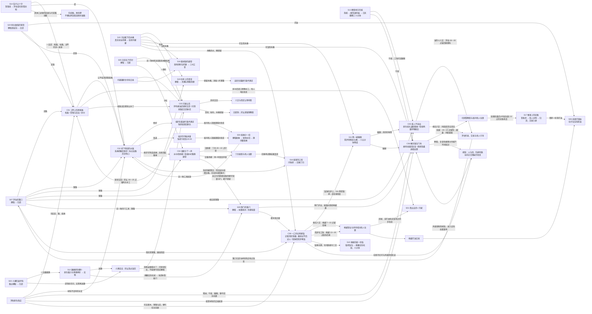

# 当前已接入的事件关系

这里只画已写入原生数据的联系。实机覆盖与未完成部分见 `IMPLEMENTATION.md`；这张图不代表 10 个复杂事件、20 个简单支线已全部完成。

2026-09-06 换机 checkpoint：当前数量仍为 7+18，续做看 `HANDOFF_2026-09-06.md`。S02/S08 只有需求草案，未画成已经接通的边。

背运章节的完整入口、去程与回程，以及认物布签、肩垫的实际用途，还在后续 C09/C10 范围内；这里的通路结果和新道具已经有原生数据，尚不能当作整个背运路线的通关证据。

C06、C08 两条路线均已有分场景实际输入记录；S09 木梆方法、C08 最新腾炉菜单仍待复验。修灶后二十点营业与风路规矩册子、区域入口现已通过实际输入；夜景重建完成前的空采样不能当作 NPC 缺席。S03/S12/S14 是本批新接入，实际输入正在核验。饭后包纸的后续用途尚未接入，未画成完成的连边。
