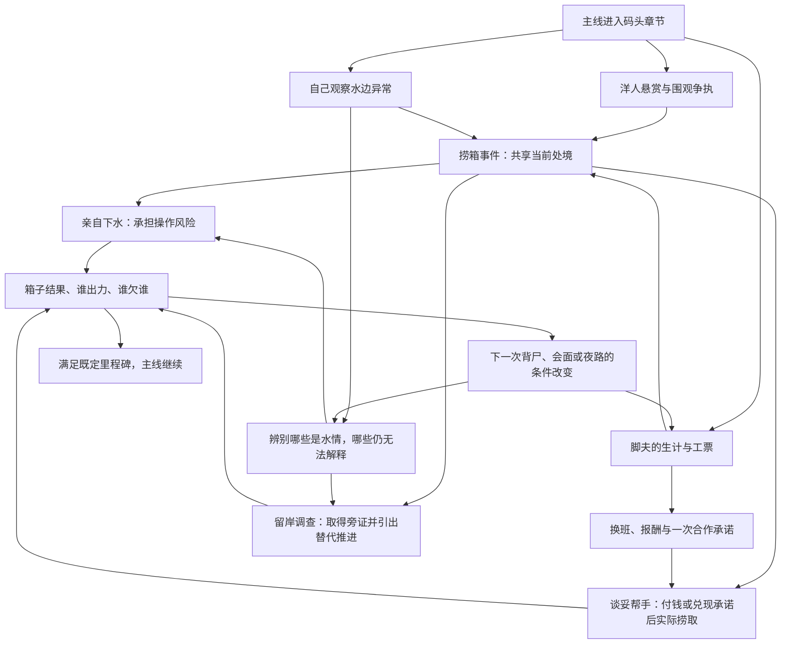

# 开放世界：现状盘点与章节网状叙事需求

日期：2026-09-05。对象：`codex/living-open-world` 当前未提交工作区。

本轮只做源码、内容数据与项目决策的核对，产出分析和方案；没有继续修改游戏运行时、任务、场景或对白。本文的方案不是已实现功能，也不是新剧情正典。

制作人本轮已确认：**保留主线骨架，在章节内做多入口、多解法和相互影响的事件。**

## 1. 判断

上一版交付了可往返的生活圈、居民日程与三条委托，满足了一部分空间和人口基础；核心体验仍然是接单、寻找、交付。主要欠缺是探索动机、知识判断、实际处置和跨事件后果之间的联系。

项目已经有比这些新委托更丰富的玩法基础。真正应当放大的核心是：**遇见异常，听到相互不完全一致的说法，取得或运用规矩，亲手处置，再让结果影响规矩、人物和下一桩事。** 原先“象→理→术→行动→验证”的顶层决策已明确这一点。

空间、信息、行动、人物、后果需要共同连起来。多个任务使用同一位 NPC、三个调查点允许任意顺序、完成后换一句对白，分别只是其中很薄的一部分。

## 2. 需求边界与资料可信度

| 层次 | 本轮依据 | 如何使用 |
| --- | --- | --- |
| 本次范围 | 制作人选择保留主线、章节内网状展开 | 不重做整条主线，不把所有章节同时开放 |
| 核心玩法 | 2026-07-26《核心玩法：象理术》，顶层逻辑已拍板 | 保留知识判断、亲手行动、结果品质与代价、规矩可复用 |
| 调性 | 题材锚点、阿秀冷信号、气味定位等项目决策 | 关二狗仍是混生活的假道士；日常写实托住民俗异常；香粉味不扩散为通用任务提示 |
| 主线编排 | 当前主线图、章节内容、背尸首单决策 | 保留“义庄接路倒首单→交付后工头派淹尸”的顺序；不为接系统绕开章门 |
| 实现事实 | 当前 TS、JSON、配置和真实入口 | 区分可用原语、接入了的内容、关闭或阶段限定的入口 |
| 上轮工作记录 | `artifact/OpenWorld/README.md`、新增 B3.1 | 只证明上一版做过什么；不是独立的用户需求或玩法定稿依据 |

知识库指向的故事权威目录 `D:/FindingDogStory` 当前不存在。本轮依据仓库内决策和实际内容分析；不据此发明主线真相、阿秀含义或新的核心人物关系。下面的章节例子是编排提案。

还有一处需要对齐：核心方案 §9 提出规矩叙事图与动态正文，但当前需求清单 E2 和运行时仍以分层授予、碎片和兼容标记工作。**顶层玩法已经确认，不代表该工程迁移已经实现或可以直接删除旧存档语义。**

## 3. 当前有哪些东西可以用

以下数量来自本轮当前 JSON 读取，是定义数量，不等于完整可玩的关卡数量。

| 设施 / 系统 | 当前实现与内容 | 能承担什么 | 当前限制与接入情况 |
| --- | --- | --- | --- |
| 场景与移动 | 上轮接通九个既有场景；八处歇脚点 | 回访、绕路、观察同一地点在不同时段的变化 | 没有完成章节风险、机会与路线之间的设计；九场景连通不等于全游戏无条件开放 |
| 居民 | 十份命名居民日程、二十二处摆放；六名旧路人补对白 | 劳作、吃饭、收工、巡更、按结果改变活动 | 目前主要按时刻和条件换场景、巡逻；没有普遍的事件立场和社会关系反馈 |
| 叙事编排 | 原生信号、状态图、跨图条件、聚合条件、章节包、可重复活计 | 多入口共享事件、不同顺序、跨事件后果、章节收束 | 引擎能分支；内容须真实喂信号。包名“归档”本身不等于执行被关闭 |
| 任务与引导 | 三十条任务定义；HUD、当前任务、目标清单、地图标记、场景浮标、场景提示 | 清楚交代当下想干什么，以及已经知道的线索去处 | 全局一个跟踪槽；只取第一条未完成必做目标；尚无原生多线索选择和跨日程人物目标解析 |
| 规矩本 | 八条规矩、五个碎片；象/理/术层、部分掌握、完整授予 | 闲话预埋知识，后续辨认异常、开启或改善办法 | 验证状态目前是定义数据；动态验证和正文演化未形成完整闭环。`rule` 尚不在叙事 owner 类型中 |
| 现场使用规矩 | `RuleUseUI`、区域提供规矩操作的原语已存在 | 在具体地点选择已学知识，触发下一步实际行动 | 扫描内容 JSON 未找到 `enableRuleOffers` 使用；不能算已广泛落地的玩法 |
| 线索、文书、档案、日志 | 六条线索、文书揭示、人物档案、书页解锁、首次阅读动作和事件日志 | 记住见闻、读材料获得有用信息、记录事件结果 | 新三委托没有接线索收集与知识复用；这些能力不等于已有推理板或自动推理 |
| 嗅觉 | 六类气味配置，区域与动作两层气味控制，主动嗅闻表现 | 从尸气、阴气、香火、血腥等感知环境，和视觉、人物说法互证 | 数据可驱动感官；不是自动识别真相。香粉味继续保持阿秀专属、稀少 |
| 身体动作 | 蹲、凝视、踢、跳、语境躺下及动作入口回调 | 观察受遮挡痕迹、试探、保持姿态、在现场执行办法 | 新委托没有设计依赖这些动作的处置。凝视当前配置触发等待为零，不能宣称已有长时间凝视挑战 |
| 背尸与位面 | 普通/背尸两种位面，路倒首单、可重复淹尸活 | 运送时判断路线、承担负担，知识影响行动准备 | 背尸配置真实改变速度、漂移、奔跑、地图旅行和生命消耗；“靠近水更沉”尚不能仅凭规矩文案当成空间模拟事实 |
| 承压操作 | 十二份 pressure hold 定义及运行时 | 维持动作、抵抗干扰、决定何时松手或撤出 | 有上下文和代价才有意义；不能靠增加长按次数替代选择 |
| 捞取小游戏 | 五份水域配置，含开发样例；有沉物/游动物/浮物等与不同拉力、失败反馈 | 识别目标和风险，实际完成捞取，比较不同处置效果 | 找到正式码头剧情入口，受 `s05_hebian` 章门控制；不因对话文件名带“线外”就判为关闭 |
| 纸扎 | 一份纸扎日工配置；后巷已有现场入口 | 生活谋生、工艺行动；可提案关联准备或人情 | 新三委托没有利用它；若让纸扎成品解决别的事件，还要编内容、产物与效果，不能当成现成联动 |
| 糖画与交易 | 两份糖画配置、两家商店、二十二种物品 | 日常赚钱花钱、接触人群、选择资源去向 | 糖画和一处商店入口在 `test_room_a`，处于本轮九场景主循环之外；须核实际可达性，不能全算已接入 |
| 物件检视 | 检视系统与一份 `demo_waterlogged_corpse` 样例 | 放大看细节、现场操作、对物件使用道具 | 内容 JSON 未找到 `startObjectExamine` 调用；目前不能宣称已有正式检尸流程使用该系统 |
| 时间与延迟后果 | 明确动作推进时辰、日切换、按目标日执行延迟动作 | 办事耗时、错过一次会面、隔天看到结果 | 时间不自行流逝；`addDelayedEvent` 接绝对目标日，未找到内容调用。通用“接活后三小时截止”还需补建模 |
| 旧生态与多人设计 | 眼力/风评有待建内容；克拉拉有招募剧情；可换玩家外观 | 可作为未来设计材料 | 没有依据把眼力、风评、多人队伍控制称为现成可复用系统；外观切换不是队伍切换 |

## 4. 为什么现在玩起来是流水账

### 4.1 三条新增委托的实际形状

| 委托 | 实际结构 | 缺失的判断 |
| --- | --- | --- |
| 折角工票 | 接取→找到工票→交还→十二铜钱 | 工票只有任务道具用途；没有先发现后追问、不同用途或影响他人的处理 |
| 借出去的一只碗 | 接取→从周三处取碗→归还→六铜钱 | 两次交谈与移动；没有取舍、现场行动或后续机会变化 |
| 桥下那道水痕 | 接取→三处全部看完，可任意顺序→报告→八铜钱 | 任意顺序没有改变解释或办法；必须集齐，答案固定；钱叔换夜间工位是唯一较明显的后果 |

三个主图都通向固定成功结果，彼此没有实质因果依赖。共享周三这个人，并没有让一件事的处理改变另一件事。水痕的三个观察点属于可交换顺序的清单，尚未形成知识判断。

工票与水痕观察入口还由“已经接取”门控并隐藏。这阻断了“先在世界中发现异常，再追问相关人物”的入口；事件存在与否依附于接任务。

两张新对话图与新增事件编排的主要动作是发信号、交付物品、发铜钱和歇脚推进时间。没有把规矩、气味、物件检视、捞取、纸扎或承压操作纳入三个委托的解法。

### 4.2 引导弱有确定原因

1. 三条新委托均为 `autoFocus: false`，接取只给 toast。`QuestManager` 在这里直接跳过自动跟踪；旧主线继续占 HUD，玩家正在办的事情与屏幕提示脱节。
2. 还工票、取碗、还碗、水痕回报都没有目标引导。新增人物会换地点，文字“去找某人”不足以支撑寻找。
3. 水痕虽有三处标记，运行时只取第一条未完成必做目标的引导，表现上进一步像顺序任务。
4. 当前浮标能跟踪同场景 NPC 的实时坐标，但目标仍是固定的“场景+实体”引用；没有按人物身份解析其日程与可会面时段。
5. 入口缺少清楚的处境和选择：为什么现在值得管、哪几条线索能走、哪个动作会付出什么，尚未建立。

前四项是配置和表达能力问题，第五项是内容设计问题。将所有委托自动设为当前，只会导致跟踪互相抢占；给每个物件加标记也不能补出动机。

### 4.3 日程有了，人物的事还没立住

合理工位和上下班只是基础。多数新增 NPC 尚没有明确的私人诉求、信息局限、冲突对象、对玩家处理方式的记忆。玩家等到夜里主要是为了找到交任务的人，时间没有变成值得权衡的资源。

位置合理也应有分层验收：站在可交互的工位、路线不穿墙、不会堵关键通道、离场有出口，是空间正确；在那个时段为什么在那里、受到什么事件影响，是人物逻辑。上一轮的通行测试不能替代后者。

### 4.4 旧系统的存在与开放状态混在一起了

开局 `GameConfig_线外内容=false`，雾津的“线外_归档”实体组被它关闭；一些内容则由主线阶段门控。反过来，码头捞取虽在名为“线外”的对话图里，实际有阶段限定的场景入口。要逐入口判断，不能批量启用整个旧内容组，也不能把所有旧图都归为可玩或废弃。

已有“码头抽象选择图”和真实捞箱流程的并行状态，是知识库已列出的编排风险。扩展前必须确认究竟由哪个真实行动推动章节，避免再叠一个报完成却未真正做事的图。

## 5. 应当做成怎样的章节开放世界

**主线规定章节要面对的处境与必要里程碑；玩家决定从哪里理解它、用什么办法处理、愿意付什么代价。章节结束时，必要故事继续，人物、资源、掌握的知识与局部世界可以不同。**

每个开放段同时提供少量可辨认、彼此有关联的事。按项目已有象理术方案控制事件与规矩复用的规模，不用大量独立委托撑体量。

| 网络 | 对玩家的具体意义 | 编排要求 |
| --- | --- | --- |
| 入口 | 从告示、人群争执、自己看见的异常，都能碰到同一桩事 | 共用事件状态；发现不强制先接取；已知内容不重复表演 |
| 知识 | 茶馆里听来的话，后来在水边或背尸时突然有用 | 一条知识至少有跨事件用途；允许提前知道，不按任务序号发钥匙 |
| 方法 | 硬上、查清后准备、借助别人各有实际操作与代价 | 选择后要真实行动；方法改变至少一个操作过程或结果维度 |
| 人物 | 同一件事，对脚夫、雇主、守船人不是同一个问题 | 信息从立场而来；承诺和处置影响合作，不只换称呼 |
| 后果 | 办完一桩事，另一桩事的路、帮手、成本或理解发生改变 | 因果来自具体事件状态；玩家能看到、理解并记住变化 |

保持民俗知识的不确定性。玩家能知道眼下有什么风险信号、承诺或资源成本，但不应获得全知的成功概率和精确答案。失败可以关闭一条方法，仍须让玩家理解发生了什么，关键主线有合理的继续途径。

## 6. 一个可评审的章节样板提案

建议先选**现有码头章节**验证网状编排，因为这里已有捞箱、官差/脚夫/围观者、洋人出场和戒指等内容，可利用真实行为结果。开场引导另外先修现有“吃饭、找活”的动机与跟踪，不将码头剧情强行提前。

下面是结构提案，具体对白、道具效果与后果尚未实现。仍遵守淹尸活须在路倒首单完成后开放的章门。尤其“淹死的，水汽重”当前只明确用于背尸，不能未经设定论证直接推广成所有箱子都受同一规律支配。

箭头必须成为可测的影响。例如下表中的一行，不能最后退化为多一句台词。

| 玩家此前怎么做 | 同章节后续可发生的变化（提案） | 复用与欠账 |
| --- | --- | --- |
| 帮脚夫核对工票，按约定交还，没有临时反悔 | 他在约定班次可提供一次合作；选择此刻帮捞取，就占用了这次机会 | 工票从单纯快递变成合作入口。原生状态/日程可编；实际协助表现需要新增内容 |
| 为省钱自己下水，准备不足仍坚持做 | 进入真实捞取，结果与代价被事件记录；之后办背尸活时资源更紧 | 复用捞取会话及结果。不同准备对应哪些参数、如何送结果信号须核 API 后配置 |
| 先观察、询问不同立场的人，再决定出手 | 获得可用的信息，减少盲试；调查得到的信息还影响之后对淹尸现象的辨认 | 复用气味、身体观察、档案。跨现象的规矩适用边界必须明写，不能泛化水汽设定 |
| 留岸调查，放弃亲自捞取的工钱 | 保留自己的资源，取得另一种信息或见证；通过替代节点承接既定主线信息 | 扩写既有“看热闹/中间人”分支，让放弃报酬也是完整选择；不得强制绕回同一小游戏 |
| 用已经学到的“淹死的，水汽重”处理后续淹尸活 | 选择远离水边的路线，或在现场重新评估继续走的代价 | 当前已有背尸负担和规矩文本；水边与内街差异需真实落到场景条件/位面或事件上，不能只写“更安全” |

三条旧委托的处理方向：工票保留为事件入口；碗保留为低强度生活交往或获知人物习惯的途径，可结束在轻量回馈；水痕重写为可提前发现、有解释用途的观察。并非每件生活小事都要暗藏惊天秘密，也不强制所有小游戏加入同一事件。

纸扎和糖画适合维持谋生、接触街坊的日常面。当它们的产物或承诺确实能影响另一件事时再联动；不要为了“用过系统”给玩家塞必玩关卡。

## 7. NPC 应有的最小人物设计

每个有叙事作用的居民写清：**自己想要什么、知道什么而误会什么、为什么在这个工位、和谁有具体往来、如何记住玩家的处理。** 重要人物拥有分支；普通居民可以很短，但行为要和生活一致。

以下是对新增角色的提案，不是现有脚本已经做到的状态：

| 人物 | 可成立的生活诉求 | 可以改变的互动与行动 |
| --- | --- | --- |
| 周三，脚夫 | 保住工钱、完成当班活，不轻易替人白担风险 | 工票与合作承诺相连；是否帮忙取决于玩家具体兑现过什么和当班状态 |
| 钱叔，守船人 | 守住饭碗，也不愿承担无法解释的夜间风险 | 玩家仅安慰、确有发现、做过处置，应造成不同的值守决定，而非三点全看完就统一搬家 |
| 何婆婆，浣衣人 | 照常做活，熟悉水边的日常变化 | 能区分普通水情与异样，但不提供万能真相；不同证据改变她愿意透露的细节 |
| 杨嫂，摊主 | 及时收摊、收回器具、照顾熟客生意 | 碗可以带出用餐时段和人物往来；玩家的守约影响一次方便，不必另建全城声望数值 |
| 丁四，巡更人 | 完成巡更、少出事 | 见过的处置改变劝阻、放行或作证；巡逻路线服从街道与班次，紧急反应需要单独编排 |

NPC 不需要靠随机乱走表现生命力。关键是动作有目的，玩家做事后，人的活动、可谈的话和愿意提供的帮助共同变化。已离场的人应能通过熟人、工位或已知日程继续追踪。

## 8. 引导需要达到的体验

开场目标要让玩家在前几分钟说得出：现在缺什么、附近有哪两三件值得理会的事、我为什么选这一件。保留现有吃饭与找活骨架，用场景与人物把下一步接清楚。

| 玩家阶段 | 应给的信息 | 呈现与实现方向 |
| --- | --- | --- |
| 遇到处境 | 有什么事，为什么和我有关 | 环境异常、争执、生活需求，配必要的短提示 |
| 决定跟进 | 当前要查什么，有哪些已知入口 | 一个主动跟踪目标，下挂可选择线索；其余事件可回看，不轮流抢 HUD |
| 找人 | 我最后知道他在哪，什么时候能碰到 | 已知去处与时段、现场询问；人物跨场景目标需要日程解析或对应内容编排 |
| 准备出手 | 会花什么，可能承担什么，是否还有别的办法 | 先呈现可感知的风险和承诺，再进入不可轻易撤销的操作 |
| 行动之后 | 结果怎样、谁受了影响、下一步为何出现 | 世界变化与事件记录相互对应；支持看回原因 |
| 受阻 | 是时间不对、缺知识、缺物件，还是这条路已经失去 | 可理解的受阻理由和已知替代线索；避免无提示的条件隐藏造成死找 |

引导强化的是意图、可尝试的行动和受阻后的恢复。解题仍由玩家观察与判断。任务面板不能把“怀疑水边有问题”直接翻译成“依次点完三个正确物件”。

## 9. 实施缺口与顺序

| 优先级 | 工作 | 分类与交付边界 |
| --- | --- | --- |
| P0 | 恢复上轮错误替换的已知待建引用；重新建立语义基线 | 纠偏。`eco_眼力/风评` 的三十一处引用被换成无关委托/场景状态，违背 K.99。不能把零错误作为这项修改成立的证据。本轮只登记，不执行回退 |
| P0 | 画清现有主线章门、真实事件入口和完成信号；处理码头双重进度风险 | 阅读与内容编排。主线里程碑应来自实际行为结果 |
| P1 | 修开场目标衔接与玩家主动跟踪；补交付与找人提示 | 大部分可用现有能力。仍须调整内容，不批量开启自动跟踪 |
| P1 | 将一个码头章节编成多入口、多方法、有交叉后果的样板 | 主要为原生叙事图、对白、场景行为与小游戏结果接线；先在真实游戏验证 |
| P1 | 多线索跟踪、日程相关找人表达 | 涉及需求清单 D7/D8/D9 的明确演进，不能伪装成现成配置。可先用事件拆分和状态化目标做样板，再决定最小公共扩展 |
| P1 | 规矩验证状态与正文演化、现场使用入口 | 对齐核心方案和 E2 兼容语义；补数据、运行时、编辑器、校验、存档及引用反查；先让一条规矩走完闭环 |
| P2 | 更多日常事件、NPC 联动与空间路线变化 | 在样板玩法成立后扩到其他开放窗口，复用知识与人物关系 |
| 条件性 | 物件检视正式接入、相对时间期限、协作搬运等 | 由具体内容需求拉动；没有现成入口或完整行为时明确列为新增，不靠对白冒充 |

已接通的场景、人物身份与美术复用、日程与巡逻协调修复可以保留作为基础；任务内容和引导需要重新设计。暂不引入眼力等级、通用声望数值、战斗、队伍操控或独立推理板来填空。

## 10. 怎样判断下一版真的成立

以下是建议用于第一个章节样板的验收标准，并非已经通过：

1. 同一核心事件至少三个独立发现入口；先拿到信息再接触当事人也能自然推进。
2. 至少两种方法的实际行动过程不同，且在结果、付出或后续机会中有可见差别；换句选项文字不算。
3. 至少两条明确的跨事件因果边，至少一条是知识复用；每条写清“什么状态改变了什么”。
4. 至少一次回访看见持续变化，涉及人的活动、物件、路线或合作机会，而不只任务完成提示。
5. 线索不齐、顺序相反、提前准备、错过会面、拒绝报酬、尝试失败都有可理解的后续；主线必要信息有合理出口。
6. 规矩至少有一次由玩家亲手应用，并从结果得到验证或细化；知识不能替玩家自动完成实际操作。
7. 找人提示与当前章门、时段、NPC 是否在场一致；切换跟踪不作废手里的活计。
8. 保存后重进仍能解释人物和事件为何处于当前状态；不能只验证标准顺序的一次通关。
9. 新玩家不读攻略进入，在前几分钟能说出自己的当前目的和下一条可追线索；需要不了解答案的试玩，不能只靠知道脚本答案的自动化。

程序与数据检查负责发现断引用、无效状态、编辑器丢数据等问题。完整输入流程测试负责证明操作能走通。**两者都不能单独证明好玩、人物可信或选择有分量。** 本轮没有新增游戏修改，因此没有重跑游戏测试，也没有把旧测试数作为本方案验收结果。

## 11. 关键证据索引

- [核心玩法：象理术](D:/GameDraft/artifact/Design/核心玩法-象理术-方案-2026-07-26.md)：§1 核心循环、§9 工程设想、规矩复用与事件数量纪律。
- [玩法功能需求清单](D:/GameDraft/docs/玩法功能需求清单.md:222)：D6–D9 跟踪与引导；E2 分层授予；K.99 保留待建引用。
- [任务自动跟踪](D:/GameDraft/src/systems/QuestManager.ts:520)、[当前目标与引导](D:/GameDraft/src/systems/QuestManager.ts:585)、[引导数据结构](D:/GameDraft/src/data/types.ts:1677)、[同场景浮标](D:/GameDraft/src/ui/GuidanceLayerUI.ts:140)。
- [新增委托定义](D:/GameDraft/public/assets/data/quests.json:621)、[工票入口](D:/GameDraft/public/assets/scenes/码头白天.json:756)、[水痕入口](D:/GameDraft/public/assets/scenes/bridge_underpass.json:110)。
- [叙事状态与 owner 类型](D:/GameDraft/src/core/NarrativeStateManager.ts:18)、[叙事内容](D:/GameDraft/public/assets/data/narrative_graphs.json)、[原生编排工作法](D:/GameDraft/agent_docs/content/methods/narrative-flow-authoring.md)。
- [规矩实际掌握状态](D:/GameDraft/src/systems/RulesManager.ts:126)、[规矩静态验证字段](D:/GameDraft/src/data/types.ts:1762)、[规矩操作入口](D:/GameDraft/src/core/ActionRegistry.ts:526)、[水汽规矩文本](D:/GameDraft/public/assets/data/rules.json:109)。
- [时间推进契约](D:/GameDraft/src/systems/DayManager.ts:28)、[延迟动作参数](D:/GameDraft/src/core/ActionRegistry.ts:842)、[人物日程](D:/GameDraft/public/assets/data/npc_schedules.json)、[背尸位面负担](D:/GameDraft/public/assets/data/planes.json)。
- [身体动作](D:/GameDraft/src/systems/PlayerActionSystem.ts:28)、[气味系统](D:/GameDraft/src/systems/SmellSystem.ts)、[档案首次阅读](D:/GameDraft/src/systems/ArchiveManager.ts:472)。
- [码头现有三选择](D:/GameDraft/public/assets/dialogues/graphs/线外_寻狗_码头选择.json:66)、[码头阶段入口](D:/GameDraft/public/assets/scenes/码头白天.json:1084)、[纸扎现场入口](D:/GameDraft/public/assets/scenes/test_room_b.json:176)、[糖画入口](D:/GameDraft/public/assets/scenes/test_room_a.json:361)。
- [送货回程变体](D:/GameDraft/public/assets/dialogues/graphs/线外_寻狗_看进山路.json)、[背尸首单决策](D:/GameDraft/agent_docs/content/decisions/2026-07-12-beishi-first-job-yizhuang-reorchestration.md)、[故事权威边界](D:/GameDraft/agent_docs/content/decisions/2026-06-27-xungouji-doc-authority.md)。

入口扫描口径：递归读取 `public/assets` 的 JSON，检查实际动作对象的 `type`，排除字符串表和运行时字段 schema；`enableRuleOffers`、`startObjectExamine`、`addDelayedEvent` 均未找到内容调用。这说明当前可检索内容的接入空缺，不据此断言代码能力失效。
