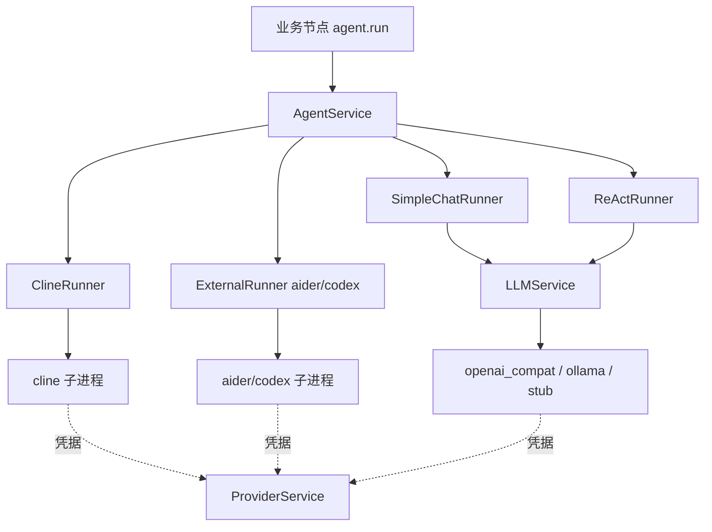
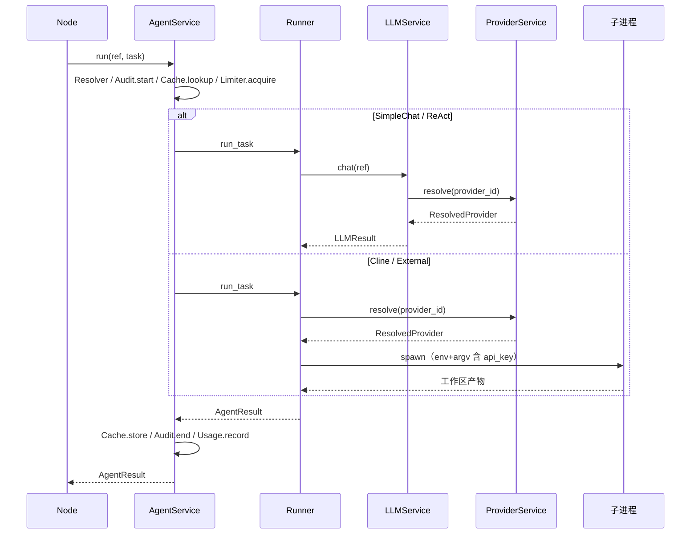

# RFC: ChronicleSim v3 — Agent 抽象层

状态：Draft  
作者：架构组  
范围：AgentService、4 种 Runner（Cline / SimpleChat / ReAct / External）、`agents.yaml` schema、`agent.run` 节点、`csim agent` 命令  
配套：`v3-provider.md`、`v3-llm.md`、`v3-engine.md`、`v3-implementation.md`

---

## 0. 文档范围

本 RFC 描述 v3 的 **Agent 抽象层**：业务节点调用「带 loop 能力」的智能体的**唯一**入口。

**关键定位**：
- 业务节点 (`nodes/`) **不能**直接 import `llm.service` / `providers.service` / `agents.runners.*`，只见 `services.agents`
- LLMService 降级为 Agent 层的内部依赖（`SimpleChatRunner` / `ReActRunner` 用）
- ProviderService 是更底层的凭据源（`ClineRunner` / `ExternalRunner` 直接拿，绕过 LLM 层）

---

## 1. 设计目标

1. **统一入口**：业务通过 `AgentService.run(ref, task)` 调用任何 agent，无需关心是否走子进程 / 直 HTTP / ReAct loop
2. **Runner 可插拔**：4 种 runner（cline / simple_chat / react / external）走同一 Protocol；新增 runner（如 LangGraph / 自研工具调用框架）只加一个文件
3. **凭据双通道**：
   - 走 LLM 层（simple_chat / react）：`ResolvedProvider` 经 `LLMService.Resolver` 拼成 `ResolvedModel`
   - 绕过 LLM 层（cline / external）：Runner 直接 `ctx.provider_service.resolve(provider_id)`
4. **可观测**：单一 audit 源（`audit/agents/<day>.jsonl`）；按 agent_id 聚合的用量；`csim agent audit tail` 实时追踪
5. **可控并发**：per-runner_kind 信号量（cline=1 / simple_chat=4 / react=2 / external=1）；与 LLM 层 limiter 串联
6. **可缓存**：cache key 含 `runner_kind` 与 `agent_hash`；agent 切换或 prompt 改动自动失效
7. **凭据隔离**：api_key 不进 audit / cache / event / log；ResolvedProvider 经 `_scrub` 剔除

---

## 2. 三层架构图



层间约束（CI lint 强制）：

| 层 | 不许 import |
|---|---|
| `providers/` | `llm.*` / `agents.*` / `engine.*` / `nodes.*` / `cli.*` |
| `llm/` | `agents.*` / `nodes.*` / `cli.*`（可 import `providers.*`） |
| `agents/` | `nodes.*` / `cli.*`（可 import `llm.*` / `providers.*`） |
| `nodes/` | `llm.*` / `providers.*` / `agents.runners.*` / `agents.service`（仅可通过 `services.agents` 间接调用） |

---

## 3. `agents.yaml` Schema

每 Run 一份：`<run>/config/agents.yaml`。

```yaml
schema: chronicle_sim_v3/agents@1

agents:
  cline_default:
    runner: cline
    provider: dashscope_coding              # 直接 provider_id
    model_id: qwen3.5-plus
    timeout_sec: 600
    config:
      cline_executable: ""                  # 留空 → which cline

  simple_chat_default:
    runner: simple_chat
    llm_route: smart                        # 走 LLMService.Resolver
    timeout_sec: 60

  react_default:
    runner: react
    llm_route: smart
    timeout_sec: 120
    config:
      max_iter: 10
      tools: ["read_key", "chroma_search", "final"]

  aider_default:
    runner: external
    provider: dashscope_main
    model_id: qwen-max
    config:
      executable: "aider"
      argv_template:
        - "--no-pretty"
        - "--message-file"
        - "${input_file}"
        - "--openai-api-base"
        - "${base_url}"
      env_vars:
        OPENAI_API_KEY: "${api_key}"
      output_file: "agent_output.json"

routes:                                     # 业务逻辑名 → 物理 agent
  npc:        cline_default
  director:   cline_default
  gm:         cline_default
  rumor:      simple_chat_default
  summary:    simple_chat_default
  initializer: cline_default
  probe:      react_default

limiter:
  per_runner:
    cline: 1
    simple_chat: 4
    react: 2
    external: 1

cache:
  enabled: true
  default_mode: hash
  per_route:
    npc: off

audit:
  enabled: true
  log_user_prompt: false
  log_user_prompt_max_chars: 4000
```

约束（`AgentDef.model_validator`）：
- 每个 agent **必须且只能**配 `provider` 之一或 `llm_route` 之一
  - `runner: cline / external` → `provider` 必填
  - `runner: simple_chat / react` → `llm_route` 必填
- `runner` ∈ `{cline, simple_chat, react, external}`
- `routes[*]` 必须指向已注册的 agent
- 字面 `api_key:` 拒绝（凭据应在 `providers.yaml`）

---

## 4. 数据类

`tools/chronicle_sim_v3/agents/types.py`：

```python
@dataclass
class AgentRef:
    role: str                                       # npc / director / probe ...
    agent: str                                      # routes 的 key
    output_kind: Literal["text", "json_object", "json_array", "jsonl"] = "text"
    artifact_filename: str = ""
    json_schema: dict | None = None
    cache: Literal["off", "hash", "exact", "auto"] = "auto"
    timeout_sec: int | None = None

@dataclass
class AgentTask:
    spec_ref: str                                   # data/agent_specs/<x>.toml
    vars: dict[str, Any] = field(default_factory=dict)
    system_extra: str = ""
    extra_argv: list[str] = field(default_factory=list)

@dataclass
class AgentResult:
    text: str
    parsed: Any = None
    tool_log: list[dict] = field(default_factory=list)
    exit_code: int = 0
    cache_hit: bool = False
    cached_at: str | None = None
    timings: dict[str, int] = field(default_factory=dict)
    audit_id: str = ""
    agent_run_id: str = ""                          # ULID
    physical_agent: str = ""
    runner_kind: str = ""
    llm_calls_count: int | None = None              # SimpleChat=1 / ReAct=N / Cline/External=None
```

`AgentResult.parsed` / `tool_log` 取决于 runner：
- `simple_chat`：`parsed` = LLM 输出按 `output_kind` 解析的对象；`tool_log` = []
- `react`：`parsed` = `final` 工具的最终值；`tool_log` = 每轮 `[{step, thought, tool, args, result}]`
- `cline` / `external`：`parsed` = 子进程 `output_file` 的解析结果；`tool_log` = []

---

## 5. AgentRunner Protocol

`tools/chronicle_sim_v3/agents/runners/base.py`：

```python
@dataclass
class AgentRunnerContext:
    run_dir: Path
    spec_search_root: Path
    provider_service: Any                           # ProviderService（cline / external 必需）
    llm_service: Any | None = None                  # LLMService（simple_chat / react 必需）
    chroma: Any = None                              # 给 react tools 用
    observer: AgentObserver = ...

class AgentRunner(Protocol):
    runner_kind: str

    async def run_task(
        self,
        resolved: ResolvedAgent,
        task: AgentTask,
        ref_output_kind: str,
        ref_artifact_filename: str,
        ctx: AgentRunnerContext,
        timeout_sec: int,
    ) -> AgentResult: ...
```

`SubprocessAgentRunner` 基类共享：临时 ws 创建 / 归档、env 强制剥代理（见 §5.1）、Windows libuv 重试、stderr 流式回调 observer。`ClineRunner` 与 `ExternalRunner` 都继承之。

### 5.1 系统代理硬纪律（用户硬约束）

> "本系统所有的连接都强制禁用所有的系统代理。"

实现层为该约束提供两道闸门，**任何 YAML 配置都无法重新打开代理通道**：

| 出口 | 闸门 |
|---|---|
| `agents/runners/base.py::build_no_proxy_env()` | 形参 `no_proxy` 保留只为兼容签名，**实际忽略入参恒按 True 处理**：剥离 `HTTP_PROXY` / `HTTPS_PROXY` / `ALL_PROXY` / `FTP_PROXY` / `SOCKS_PROXY` / `NO_PROXY`（含小写）+ `*proxy*` 正则兜底；显式注入 `NO_PROXY=*` / `no_proxy=*` |
| `ClineRunner` / `ExternalRunner` | 不再读 `cfg.no_proxy`，固定调 `build_no_proxy_env()` |
| `providers/health.py::ping` | `httpx.AsyncClient(trust_env=False)`，不读环境代理 / `.netrc` |
| `llm/backend/openai_compat_chat / openai_compat_embed / ollama_embed` | 同上 `trust_env=False` |

`agents.yaml` 中遗留的 `config.no_proxy: *` 字段被静默忽略（schema 允许任意 `config` key）。新模板已移除该字段并在注释中声明废弃。

---

## 6. AgentService 流水



`AgentService.run` 关键步骤（参见 `agents/service.py`）：

1. `Resolver.resolve(ref.agent)` → `ResolvedAgent(logical, physical, runner_kind, provider, llm_route, model_id, timeout_sec, config, agent_hash)`
2. 渲染 spec 取 `audit_user_text`（仅 audit 用，真正 prompt 在 runner 内部 render）
3. 计算 `cache_mode`：`ref.cache != "auto"` → 用 ref；否则 `cache.per_route[physical] | default_mode`
4. `Audit.start` → 得 `agent_run_id`
5. 若 cache `hash/exact` 命中 → 写 `audit.end(cache_hit=True)` 直接返回
6. `Limiter.acquire(runner_kind)` 内调 `runner.run_task(...)`
7. 异常 → `audit.end(exit_code=1, error_tag=Type)`，`AgentRunnerError` 包装重抛
8. 成功 → 写 `cache.store`、`audit.end`、`usage.record`，返回 `AgentResult`

---

## 7. Runner 实现要点

### 7.1 ClineRunner（`agents/runners/cline.py`）

- 继承 `SubprocessAgentRunner`，`runner_kind = "cline"`
- 流程：
  1. `ctx.provider_service.resolve(resolved.provider)` → `(base_url, api_key)`
  2. `materialize_temp_ws(run_dir, "cline")` 起临时 cwd
  3. `cline auth login --provider <kind> --base-url <base_url> --api-key <api_key> --model <model_id>` 子进程
  4. 把 spec 渲染的 `(system, user)` 写到 `prompt.txt`
  5. `cline run --prompt-file prompt.txt --output <artifact_filename>` 子进程
  6. 读 `artifact_filename` 解析 → `AgentResult.parsed`
  7. `archive_workspace` 归档 ws 到 `.chronicle_sim/ws_archive/<ts>_<role>_<id>/`
- `llm_calls_count = None`（cline 子进程内部 LLM 调用对宿主不可见）

### 7.2 SimpleChatRunner（`agents/runners/simple_chat.py`）

- 内部调 1 次 `ctx.llm_service.chat(LLMRef(role=resolved.physical, model=resolved.llm_route, ...), Prompt(spec_ref=task.spec_ref, vars=task.vars, ...))`
- LLMService 自己通过 ProviderService 拿凭据
- 把 `LLMResult.text / parsed` 包装成 `AgentResult`，`llm_calls_count = 1`

### 7.3 ReActRunner（`agents/runners/react.py`）

- 多轮 loop（默认 max_iter=10）：
  1. 渲染 prompt：spec + `data/agent_specs/_react_protocol.md`（公共工具调用契约）+ 可用 `<tools>` 段
  2. 调 `ctx.llm_service.chat(...)` 一次
  3. 解析输出：
     - `THOUGHT: ... TOOL: <name> ARGS: {...}` → 调 `react_tools[name](args, ctx)` → 把工具结果回写到下一轮 prompt
     - `FINAL: <text>` → 退出 loop，`AgentResult.parsed = <text>`
  4. 每轮记一项 `tool_log`
- 工具集（`agents/runners/react_tools.py`）：
  - `read_key(key)` → `read_key_value(run_dir, key)`
  - `chroma_search(query, collection, n)` → `ctx.chroma.search(...)`
  - `final(text)` → 提交结果，结束 loop
- 超出 `max_iter` → `AgentRunnerError`
- `llm_calls_count = N`（实际轮数）

### 7.4 ExternalRunner（`agents/runners/external.py`）

- 继承 `SubprocessAgentRunner`，`runner_kind = "external"`
- 渲染 spec 后写 `${cwd}/input.md`
- `ctx.provider_service.resolve(resolved.provider)` 得 `(base_url, api_key)`
- 按 `config.argv_template`（list）做占位替换：
  - `${input_file}` / `${output_file}` / `${cwd}` → 本地路径
  - `${api_key}` / `${base_url}` / `${model_id}` → 来自 ResolvedProvider
- `config.env_vars` 同样做占位替换，进入子进程 env
- 子进程跑完读 `output_file` 解析 → `AgentResult.parsed`
- **安全**：argv 是 list 形式 + 占位替换，禁止字符串拼接 shell；测试构造恶意输入应被拒
- `llm_calls_count = None`

---

## 8. 节点接口

`tools/chronicle_sim_v3/nodes/agent/__init__.py`：

### 8.1 主节点 `agent.run`（统一接口）

```yaml
- id: director
  kind: agent.run
  in: { vars: ${vars.director} }
  params:
    agent: director                         # 逻辑 agent id（agents.yaml routes key）
    spec: data/agent_specs/director.toml
    output:
      kind: json_object
      artifact_filename: agent_output.json
      schema_ref: data/schemas/director_output.schema.json
    cache: auto
```

### 8.2 alias 节点 `agent.cline`（兼容）

旧 P3 graph 的 `kind: agent.cline` 节点保留为 thin alias：
- 内部固定 `agent: cline_default`
- 旧字段 `params.llm.output.artifact_filename` 翻译为 `params.output.artifact_filename`
- 顶层 `params.llm.model = smart` 字段忽略（兼容字段，不报错）

让 P3 已写的 4 个 graph + 3 个 subgraph 可几乎不动。

### 8.3 NodeServices 字段

`engine/services.py::EngineServices`：

```python
@dataclass
class EngineServices:
    agents: Any = None          # AgentService（业务唯一入口）
    chroma: Any = None
    clock: ...
    rng_factory: ...
    spec_search_root: ...
    _llm: Any = None            # LLMService（私有；仅 chroma.* 等基础设施节点 / debug CLI 用）
```

`NodeServices.agents` 给业务节点用；`_llm` 是私有字段，仅 `chroma.*` 系列基础设施节点（embed 调用）与 `csim llm test` 调试入口可用。

---

## 9. CLI

新增 `tools/chronicle_sim_v3/cli/agent.py`：

```bash
csim agent list                                      # 列已注册物理 agent_id
csim agent show <agent_id>                           # 展开配置（脱敏）
csim agent test --agent <id> --spec <path> --vars k=v --output text/json
csim agent route show
csim agent route set <logical> <agent_id>
csim agent usage                                     # by-agent 聚合
csim agent audit tail
csim agent cache stats
csim agent cache clear
csim agent cache invalidate <agent_id>
```

`csim llm test` 保留；help 字符串加「（开发调试入口；业务请走 csim agent test）」。

`cli/cook.py::_build_engine` 顺序：`ProviderService` → `LLMService(provider_service=...)` → `AgentService(provider_service=..., llm_service=...)` → 注入 `EngineServices.agents` 与 `EngineServices._llm`。

---

## 10. Cache key

`agents/cache.py::agent_cache_key`：

```
sha256(json({
  agent_hash,                # ResolvedAgent.agent_hash（含 runner / provider / llm_route / model_id / config）
  spec_sha,                  # 渲染前 spec 文件 sha
  vars,                      # 输入变量
  system_extra,              # 业务追加 system 段
  output_kind,               # text / json_object / ...
  runner_kind,               # cline / simple_chat / react / external
  mode,                      # hash / exact
}, sort_keys))
```

`agent_hash` 不含 raw api_key（继承自 `provider_hash`）。换 provider / 换 runner / 改 spec 都会让 key 变。

---

## 11. Audit

`<run>/audit/agents/<day>.jsonl`，每行 `start` / `end` 两条事件：

```jsonc
{"event": "agent.start", "agent_run_id": "01H...", "logical": "director",
 "physical": "cline_default", "runner_kind": "cline", "spec_ref": "...",
 "user_text_len": 1234, "cache_mode": "off", "role": "director", "ts": "..."}

{"event": "agent.end", "agent_run_id": "01H...", "cache_hit": false,
 "exit_code": 0, "timings": {"total_ms": 12345}, "llm_calls_count": null,
 "ts": "..."}
```

`api_key` / `Authorization` 永不进入 audit；spec text 受 `audit.log_user_prompt` 控制（默认 false 只记长度）。

---

## 12. 与 LLM / Provider 层的协作

| 步骤 | Cline / External | SimpleChat / ReAct |
|---|---|---|
| 凭据来源 | Runner 直接 `ctx.provider_service.resolve(provider_id)` | `LLMService.Resolver` 内部 `provider_service.resolve(...)` |
| LLM 层介入 | 否 | 是（每次 chat 走 LLMService limiter / cache / audit） |
| `llm_calls_count` | None | 1（SimpleChat） / N（ReAct） |
| audit 双层 | 仅 agent audit | agent audit + 每次 chat 的 llm audit |

ReAct 一次任务可能产生 N 行 llm audit + 1 行 agent audit；二者通过 `agent_run_id` 关联（chat audit 的 `caller.agent_run_id` 字段）。

---

## 13. 真实 LLM 测试硬约束（重申）

dashscope 风控会封禁直接 httpx user-agent。所有真实 LLM 端到端验证统一走：

```yaml
# config/agents.yaml
agents:
  cline_real:
    runner: cline                                    # 强制 cline 子进程
    provider: dashscope_coding
    model_id: qwen3.5-plus
    timeout_sec: 600

routes:
  npc: cline_real
  director: cline_real
  # ...
```

CI lint 建议（待实施）：`runner: simple_chat / react` 指向 `dashscope_*` provider 时报错；指向 `stub` / `ollama` / 自部署 `openai_compat` 才允许。

---

## 14. 删除项

- `tools/chronicle_sim_v3/llm/backend/cline.py` 已删除（搬到 `agents/runners/cline.py`）
- `LLMService._chat_backend_for` 中对 `ClineBackend` 的特判已删除
- `llm/config.py::ModelDef.base_url / api_key_ref / ollama_host` 已删除（迁到 Provider 层）

---

## 15. 完成标准

- 4 种 Runner 各跑通一次 stub 路径
- `csim agent list / show / test / route / usage / audit / cache` 全可用
- 三层 lint 0 violation
- 真实路径：`csim agent test --agent cline_real --spec data/agent_specs/director.toml`（dashscope coding qwen3.5-plus）跑通；audit 中 `runner_kind: cline`、`llm_calls_count: null`
- `csim cook run week.yaml`（agents.yaml routes 全指 cline_real）端到端真实跑通
- v2 的 57 测试不受影响

## 16. 不在范围

- aider / codex 真实 CLI 集成（仅给框架 + 示例配置）
- ReAct 工具集扩展（write_key / chroma_upsert / file_edit 等）
- 多 agent 协作（agent A 调 agent B）：`AgentService.run` 设计已支持嵌套，但调度策略与防递归暂未实施
- token 成本聚合 / cost estimate
- Runner 热替换（运行期切换 cline ↔ simple_chat）
