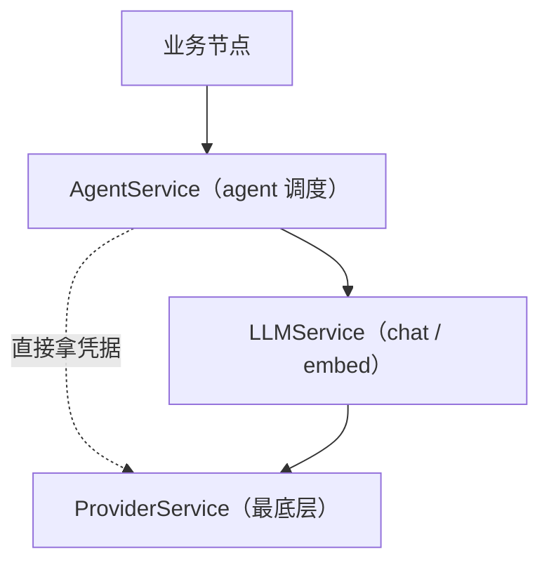

# RFC: ChronicleSim v3 — Provider 层

状态：Draft  
作者：架构组  
范围：ProviderService、ProviderResolver、ProviderKind、`providers.yaml` schema、`csim provider` 命令  
配套：`v3-llm.md`、`v3-agent.md`、`v3-engine.md`、`v3-implementation.md`

---

## 0. 文档范围

本 RFC 描述 v3 的 **Provider 层**：负责管理「我有哪些 API 提供商账号 + 凭据 + endpoint」的最底层模块。

**关键定位**：
- Provider 是**唯一**持有 raw API key 的层
- 不在乎使用方是谁——LLMService（chat / embed）、ClineRunner（cline 子进程）、ExternalRunner（aider / codex 子进程）、未来工具，都从 Provider 拿凭据
- 不依赖 `llm.*` / `agents.*` / `engine.*` / `nodes.*` / `cli.*` 的任何符号（最底层）

---

## 1. 设计目标

1. **凭据集中**：所有 API key 只在 `providers.yaml` 中（且必须用 `api_key_ref:` 引用 env / file，不可内联 raw key）
2. **使用方解耦**：`ResolvedProvider` 是纯数据，调用方拿到 `(base_url, api_key, kind, extra)` 即可自起 HTTP / 子进程
3. **指纹稳定**：`provider_hash` 含 `(kind, base_url, extra)`，**不含 api_key**；用于 cache key，避免 key 轮换造成大量缓存失效
4. **可观测**：`csim provider list` / `show` 仅展示脱敏信息；`test` 可主动 ping 验证连通
5. **可热扩**：新增一个云提供商（如 Moonshot、Kimi、自部署 vLLM）只需加一条 yaml，业务 / LLM / Agent 层全不动

---

## 2. `providers.yaml` Schema

每 Run 一份：`<run>/config/providers.yaml`。

```yaml
schema: chronicle_sim_v3/providers@1

providers:
  dashscope_main:
    kind: dashscope_compat                # ProviderKind 枚举
    base_url: https://dashscope.aliyuncs.com/compatible-mode/v1
    api_key_ref: env:DASHSCOPE_API_KEY
    extra:
      thinking: false

  dashscope_coding:
    kind: dashscope_compat
    base_url: https://coding.dashscope.aliyuncs.com/v1
    api_key_ref: env:DASHSCOPE_API_KEY    # 共用同一 env

  moonshot_main:
    kind: openai_compat
    base_url: https://api.moonshot.cn/v1
    api_key_ref: file:secrets/moonshot.key

  ollama_local:
    kind: ollama
    base_url: http://127.0.0.1:11434      # ollama 不需要 api_key

  stub_local:
    kind: stub                            # 内存占位（测试用）
```

字段约束：

| 字段 | 类型 | 说明 |
|---|---|---|
| `kind` | enum | `openai_compat` / `dashscope_compat` / `ollama` / `stub` |
| `base_url` | str | endpoint；`stub` 可省略 |
| `api_key_ref` | `env:NAME` ⏐ `file:path` | 凭据来源；**禁止字面 api_key** |
| `extra` | dict | provider 默认参数（被 LLMService / Runner 透传给底层调用） |

字面 `api_key:` 被加载器拒绝（`ProviderConfigError`）。`api_key_ref` 在 resolver 中惰性解析（`ResolvedProvider` 构造时才读 env / 文件）。

---

## 3. ProviderKind

| Kind | 调用方式 | 典型用途 |
|---|---|---|
| `openai_compat` | OpenAI 兼容 `/chat/completions` + `/embeddings` | OpenAI / Moonshot / 自部署 vLLM |
| `dashscope_compat` | OpenAI 兼容（行为同 openai_compat，仅作账号自描述） | DashScope 主域 / coding 域 |
| `ollama` | Ollama `/api/chat` + `/api/embeddings` | 本地 ollama |
| `stub` | 内存固定回放 | 单测 / 离线验收 |

`kind` 决定 `health.ping` 的探测路径：
- `openai_compat` / `dashscope_compat`：`GET {base_url}/models`（需 api_key）
- `ollama`：`GET {base_url}/api/tags`
- `stub`：本地直接返回 `{ok: true, kind: stub}`

---

## 4. 数据类

`tools/chronicle_sim_v3/providers/types.py`：

```python
ProviderKind = Literal["openai_compat", "dashscope_compat", "ollama", "stub"]

@dataclass(frozen=True)
class ProviderRef:
    provider_id: str

@dataclass(frozen=True)
class ResolvedProvider:
    provider_id: str
    kind: ProviderKind
    base_url: str
    api_key: str                          # 已惰性解析
    extra: dict = field(default_factory=dict)
    provider_hash: str = ""               # sha256(kind + base_url + extra) 前 16 字符
```

`provider_hash` 故意不含 api_key：cache key 间接引用它，能让密钥轮换不让大量缓存失效。

---

## 5. ProviderResolver

`tools/chronicle_sim_v3/providers/resolver.py`：

- 构造：`ProviderResolver(config: ProvidersConfig, run_dir: Path)`
- `resolve(provider_id) -> ResolvedProvider`
  - 1) 找 `config.providers[provider_id]`，缺失 → `ProviderConfigError`
  - 2) 解析 `api_key_ref`：
     - `env:NAME`：读 `os.environ[NAME]`，缺失/为空 → `ProviderConfigError`
     - `file:path`：先按 `run_dir` 相对路径读，再退回绝对路径；缺失/为空 → `ProviderConfigError`
     - 其他前缀 → `ProviderConfigError`
  - 3) 计算 `provider_hash = sha256("{kind}|{base_url}|{json(extra, sort_keys)}")[:16]`
  - 4) 返回 `ResolvedProvider`
- `stub` kind：允许 `api_key_ref` 为空，`api_key` = `""`

---

## 6. ProviderService

`tools/chronicle_sim_v3/providers/service.py`：

```python
class ProviderService:
    def __init__(self, run_dir: Path, config: ProvidersConfig | None = None) -> None: ...
    def resolve(self, provider_id: str) -> ResolvedProvider: ...
    def has(self, provider_id: str) -> bool: ...
    def list_providers(self) -> list[dict]: ...    # 脱敏：只 has_api_key_ref
    async def health_check(self, provider_id: str, timeout_sec: float = 10.0) -> dict: ...
```

- 默认在 ctor 内 `load_providers_config(run_dir)`；测试可注入 `config`
- `list_providers()` 返回仅含 `(provider_id, kind, base_url, has_api_key_ref, extra_keys)` 的 dict 列表（**不含 api_key**）
- `health_check()` 调 `providers/health.py::ping(resolved, timeout_sec)`：返回 `{ok, status, latency_ms, error?, kind}`，不抛异常

---

## 7. CLI

`tools/chronicle_sim_v3/cli/provider.py`：

```bash
csim provider list                        # 列已注册 provider（id / kind / base_url / has_key）
csim provider show <provider_id>          # 展开（脱敏：api_key 显示 has=true/false）
csim provider test <provider_id>          # 主动 ping；ok / latency / error
```

`show` 输出严格不含 raw key；`test` 输出仅含 `(ok, latency_ms, status, error?)`。

---

## 8. 三层依赖关系



`providers/` 不许 import `llm.*` / `agents.*` / `engine.*` / `nodes.*` / `cli.*`（CI lint 强制；少数无状态工具如 `engine.io` / `engine.canonical` 列入 whitelist）。

---

## 9. 与 LLM / Agent 的协作

### 9.1 LLMService 的依赖

`llm/config.py::ModelDef.provider` 引用 `providers.yaml` 中的 id：

```yaml
# llm.yaml
models:
  qwen-max:
    provider: dashscope_main              # ← provider_id
    model_id: qwen-max
    invocation: openai_compat_chat
```

`LLMService.__init__(run_dir, provider_service: ProviderService, ...)` 必须传 `ProviderService`；`Resolver.resolve_route` 通过 `provider_service.resolve(provider_id)` 拼出 `ResolvedModel(base_url, api_key, model_id, ...)`。

### 9.2 Agent 端 cline / external 直接拿凭据

```yaml
# agents.yaml
agents:
  cline_default:
    runner: cline
    provider: dashscope_coding            # ← cline 子进程直接拿凭据
    model_id: qwen3.5-plus
```

`ClineRunner` / `ExternalRunner` 在 `run_task` 内调 `ctx.provider_service.resolve(resolved.provider)` 得 `ResolvedProvider`，把 `(base_url, api_key)` 注入子进程 argv / env，**绕过 LLMService**。

---

## 10. 凭据安全硬约束

1. **唯一来源**：raw api_key 只能在 `os.environ[*]` 或文件中；`providers.yaml` 只写 `api_key_ref:`
2. **不进 git**：`secrets/` 目录加 `.gitignore`
3. **不进 audit / cache / log / event**：
   - LLM 层 `_scrub` 把 `api_key` / `Authorization` 字段从 audit / event payload 中剔除
   - Agent 层同样应用 `_scrub`
   - `provider_hash` 不含 api_key，所以 cache key 间接引用不会泄漏
4. **不进 ResolvedProvider.dump**：CLI `provider show` 仅展示 `(kind, base_url, has_api_key_ref)`，`extra` 经过 `_scrub`
5. **真实测试只走 cline**：dashscope 风控会封禁直接 httpx user-agent；`runner: simple_chat / react` 指向 `dashscope_*` provider 时建议显式使用 stub 走通本地路径，真实路径走 `runner: cline`
6. **强制无代理**：`providers/health.py::ping` 创建 `httpx.AsyncClient(trust_env=False)`，不读 `HTTP_PROXY` / `HTTPS_PROXY` / `.netrc`。本系统所有出网都不许走代理（用户硬约束），见 `v3-agent.md §5.1`

---

## 11. 错误模型

`tools/chronicle_sim_v3/providers/errors.py`：

| 异常 | 触发 |
|---|---|
| `ProviderError` | 所有 provider 层异常基类 |
| `ProviderConfigError` | yaml 解析 / api_key_ref 缺失 / kind 不识别 |
| `ProviderHealthError` | `health_check` 显式失败（仅在调用方主动 raise 时使用；`ping` 默认返回 `{ok: false}` 不抛） |

---

## 12. 与 v2 的关系

v2 的 `tools/chronicle_sim_v2/llm` 完全不动；本 RFC 仅在 `tools/chronicle_sim_v3/` 子树落地。

---

## 13. 完成标准

- `providers.yaml` 加载 / 校验 / 字面 api_key 拒绝 全部覆盖
- 4 种 ProviderKind 的 `resolve` + `health.ping` 路径覆盖（stub 走本地，其它 mock httpx）
- `csim provider list / show / test` 输出脱敏
- 三层 lint：`providers/` 0 个对 `llm.*` / `agents.*` 的依赖
- DashScope 真实 ping（env 已设）：`csim provider test dashscope_coding` ok
