# 层次叙事状态机设计文档

## 1. 系统定义

层次叙事系统是一套**多层叙事状态机运行时**。

它把游戏中的 Flow、NPC、Hotspot、Zone、Quest、Scenario 等叙事对象组织为可编辑、可查询、可存档的状态子图。每个状态子图记录当前叙事状态，Transition 描述状态迁移关系，Signal 推动迁移发生，状态生命周期 Action 把状态变化投影到现有运行时系统。

核心定义：

> 叙事状态机负责管理叙事状态、状态迁移、状态生命周期 Action、跨子图因果、查询 API、可选 flag projection 和存档；编辑器负责从配置、Action、signal 和读取 API 中推导触发关系与读取关系，帮助作者理解顶层叙事结构。

第一阶段运行时核心由八个部分组成：

```text
NarrativeGraph
NarrativeStateNode
NarrativeTransition
NarrativeTrigger
NarrativeSignal
LifecycleAction
NarrativeStateManager
OptionalStateFlagProjection
```

---

## 2. 总体架构

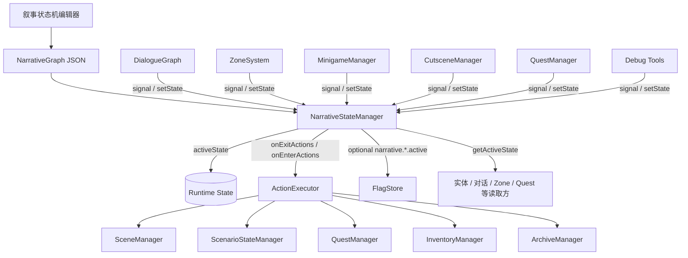

状态机在现有系统上方工作。现有系统通过 `signal` 或显式 `setState` 推动状态机；状态机把 signal 标准化为 triggerKey，再根据当前 activeState、Transition.signal、conditions 匹配 Transition；状态机通过生命周期 Action 调用现有 `ActionExecutor`；其它系统优先通过查询 API 读取叙事状态，旧系统可按需读取可选 flag projection。

---

## 3. 运行流程

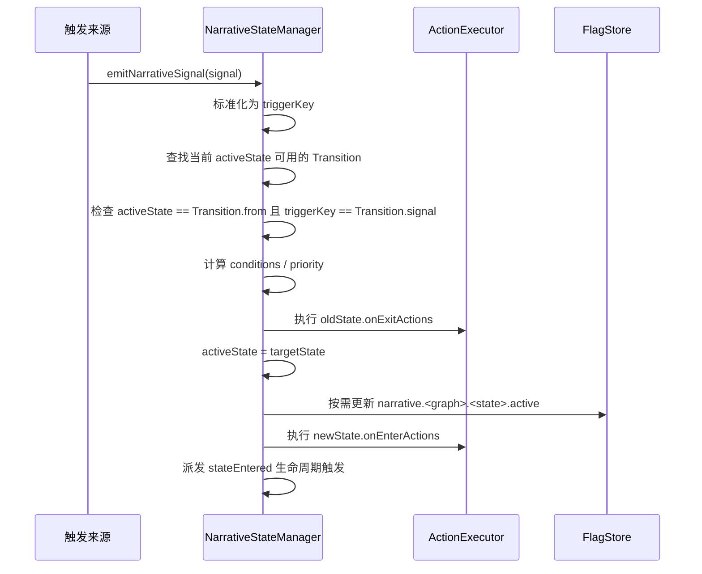

显式设置状态的流程：

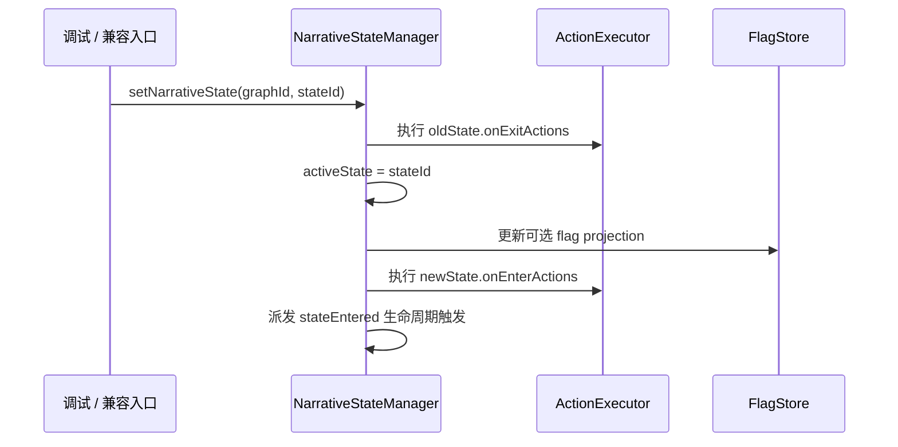

`setNarrativeState` 是直接状态命令，主要用于调试、读档恢复、系统修正和少量明确的强制跳转。常规叙事内容优先使用 signal -> triggerKey -> Transition 的路径，这样迁移原因可以被编辑器完整显示。

编辑器可把 `setNarrativeState` 显示为 `StateCommand`，它的目标是具体 State。

运行时规则：

```text
所有 signal / trigger / setState 请求进入同一个状态机队列。
队列串行处理，避免同一帧内多个来源交错改写状态。
一次 signal / trigger 处理中，每个 Graph 最多迁移一次。
状态迁移产生的 stateEntered / stateExited 作为新 trigger 入队。
级联传播设置最大步数，用于防止循环迁移。
生命周期 Action 失败记录为运行时错误，状态迁移结果保持成立。
```

---

## 4. 核心对象

## 4.1 NarrativeGraph

`NarrativeGraph` 是一个叙事对象的状态子图。

```ts
type NarrativeGraph = {
  id: string;
  ownerType: 'flow' | 'npc' | 'hotspot' | 'zone' | 'quest' | 'scenario' | 'system';
  ownerId?: string;
  initialState: string;
  states: Record<string, NarrativeStateNode>;
  transitions: NarrativeTransition[];
};
```

示例：

```text
graph id: npc_ringboy
ownerType: npc
ownerId: npc_ringboy
initialState: before_event
```

第一阶段每个 Graph 持有一个 `activeState`。并行叙事通过拆分多个 Graph 表达。

## 4.2 NarrativeStateNode

`NarrativeStateNode` 表示叙事状态。

```ts
type NarrativeStateNode = {
  id: string;
  label?: string;
  description?: string;
  onEnterActions?: ActionDef[];
  onExitActions?: ActionDef[];
  meta?: Record<string, unknown>;
};
```

状态节点回答的问题是：

```text
这个叙事对象当前处于哪个叙事状态？
进入该状态时执行哪些生命周期 Action？
退出该状态时执行哪些生命周期 Action？
```

示例：

```json
{
  "id": "after_event",
  "label": "水猴子事件后",
  "onEnterActions": [
    {
      "type": "persistNpcAnimState",
      "params": { "target": "npc_ringboy", "state": "boy_stand_ring" }
    },
    {
      "type": "persistNpcDisablePatrol",
      "params": { "npcId": "npc_ringboy" }
    }
  ]
}
```

## 4.3 NarrativeTransition

`NarrativeTransition` 表示状态迁移。

```ts
type NarrativeTransition = {
  id: string;
  from: string;
  to: string;
  signal: NarrativeTriggerKey;
  conditions?: ConditionExpr[];
  priority?: number;
};

type NarrativeTriggerKey = string;
```

Transition 匹配规则：

```text
1. 只检查当前 Graph 的 activeState 等于 from 的 Transition。
2. 输入 triggerKey 与 Transition.signal 完全匹配，且 conditions 满足时，Transition 成为候选。
3. 候选按 priority 降序排列；未配置 priority 时按 0 处理。
4. priority 相同则按 transitions 数组中的声明顺序排列。
5. 每个 Graph 对一次 triggerKey 只执行第一条候选 Transition。
```

`Transition.signal` 保存标准触发 key。这个字段必填；没有触发 key 的迁移不会自动发生。若需要“进入某状态后立刻推动下一步”，使用 `stateEntered` lifecycle trigger；若需要由 Action 推动，Action 发出明确的 narrative signal。

标准触发 key 由运行时统一生成：

```text
external:<sourceType>:<sourceId>:<signal>
stateEntered:<graphId>:<stateId>
stateExited:<graphId>:<stateId>
```

这让常规配置只需要写顺序；只有同一状态、同一 signal 下存在多个可能分支时，作者才需要配置 `priority`。

`id` 是必填字段，因为 Transition 在编辑器里是可被选中、可被可视化连接的迁移边。Transition id 在所属 Graph 内唯一。

Transition 自身持有 `from`、`to`、`signal`、`conditions`、`priority` 等迁移规则。编辑器可以根据这些字段把 signal 到 Transition 的关系投影成触发边。

Transition 可以表达同一 Graph 内部迁移：

```text
t_ringboy_after_event:
  npc_ringboy.before_event -> npc_ringboy.after_event
  signal: external:minigame:dock_crate_tutorial:pull_success

编辑器推导显示 TriggerEdge:
  Minigame(dock_crate_tutorial).pull_success -> t_ringboy_after_event
```

Transition 也可以表达跨 Graph 因果：

```text
t_crate_done_to_ringboy:
  npc_ringboy.before_event -> npc_ringboy.after_event
  signal: stateEntered:flow_dock_water_monkey:crate_minigame_done

编辑器推导显示 TriggerEdge:
  stateEntered(flow_dock_water_monkey.crate_minigame_done) -> t_crate_done_to_ringboy
```

## 4.4 NarrativeTrigger

`NarrativeTrigger` 是运行时迁移输入。

```ts
type NarrativeTrigger =
  | { type: 'external'; key: NarrativeTriggerKey }
  | { type: 'stateEntered'; graphId: string; stateId: string }
  | { type: 'stateExited'; graphId: string; stateId: string };
```

`external` trigger 是运行时队列里的标准化输入，可由外部 `NarrativeSignal` 转换得到。

`stateEntered` / `stateExited` trigger 由状态机生命周期自动产生，用于跨子图传播。

在作者视图中，`stateEntered` / `stateExited` 也可以作为触发边的来源。

## 4.5 NarrativeSignal

`NarrativeSignal` 是外部系统发出的叙事信号。它描述信号来源，不描述目标状态。

```ts
type NarrativeSignal = {
  sourceType: 'dialogue' | 'zone' | 'minigame' | 'cutscene' | 'quest' | 'action' | 'entity' | 'state' | 'system';
  sourceId: string;
  signal: string;
};
```

运行时把 `NarrativeSignal` 标准化为 `NarrativeTrigger`，再转换为标准触发 key，用它匹配各 Graph 当前 activeState 下可用的 Transition。

```text
external:dialogue:rolling_ring_boy:ring_taken
external:zone:waterside:entered
external:minigame:dock_crate_tutorial:pull_success
stateEntered:flow_dock_water_monkey:crate_minigame_done
```

## 4.6 编辑器投影视图

投影边是编辑器为了让作者看清实体关系而生成的可视化关系。它可以存在于编辑器缓存、辅助索引或独立布局数据中。运行时直接使用 triggerKey、Transition、conditions、Action 和查询 API 完成工作。

投影边分为两类：

```text
TriggerEdge:
  Signal source -> Transition
  画出哪个外部 signal 或 lifecycle trigger 会尝试触发哪条迁移边。

读取边 ReadEdge:
  NarrativeState / getActiveState / optional flag projection -> 外部系统黑盒
  画出外部系统读取哪些叙事状态做内部判断。

```

投影边来源：

```text
触发边从 Transition.signal、DialogueBridge signals、Zone signal、Action signal、stateEntered / stateExited 等配置和调用中推导。
读取边从 getActiveState / isStateActive / 可选 flag projection / 条件配置 / 脚本读取点中推导。
```

可选编辑层类型：

```ts
type EditorTriggerEdge = {
  id: string;
  source: NarrativeTriggerKey;
  target: {
    graphId: string;
    transitionId: string;
  };
};

type EditorReadEdge = {
  id: string;
  fromStateRef: string;
  target: {
    type: 'dialogue' | 'entity' | 'zone' | 'quest' | 'scenario' | 'system';
    id: string;
  };
  usage?: string;
};

```

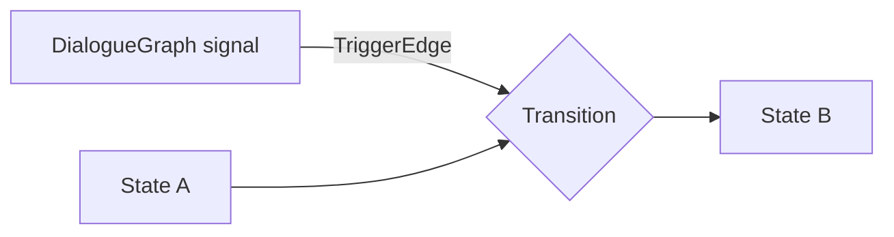

这让黑盒系统和状态机之间的关系变成可读的因果图：黑盒发出 signal，signal 触发迁移边，迁移边再改变 activeState。

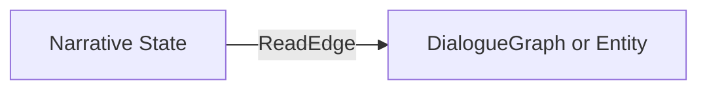

生命周期 Action 是 State 的回调配置，绑定对象是 wrapper 子图的属性。它们在属性面板中查看和编辑，不作为顶层关系边。

## 4.7 LifecycleAction

生命周期 Action 是绑定在状态进入和退出上的 `ActionDef[]`。

```text
oldState.onExitActions
activeState = newState
newState.onEnterActions
```

生命周期 Action 使用现有 `ActionExecutor` 执行，因此可以继续复用当前项目已有的 Action 类型。

生命周期 Action 的执行语义：

```text
Action 按数组顺序 await 执行。
Action 失败视为内容或代码 bug，记录错误。
状态迁移不因 Action 失败回滚。
状态机队列继续处理后续 trigger。
```

## 4.8 Optional State Flag Projection

状态 flag 投影是可选能力。它把某个当前 active 的 narrative state 写成一个全局只读 flag，供现有条件系统、旧 JSON 配置、调试面板读取。

```text
narrative.<graphId>.<stateId>.active
```

示例：

```text
narrative.npc_ringboy.after_event.active = true
narrative.flow_dock_water_monkey.crate_minigame_done.active = true
```

flag projection 由 `NarrativeStateManager` 维护，供 `ConditionExpr`、调试面板和旧系统读取。

运行时主查询方式是：

```ts
narrative.getActiveState(graphId)
narrative.isStateActive(graphId, stateId)
```

`NarrativeStateManager.activeState` 是唯一状态源。flag projection 只是从 activeState 派生出的只读投影。其它系统可以读这个 flag，但不能手动写入它。

第一阶段可以按需开启 projection：

```text
需要给旧 ConditionExpr / DialogueGraph 条件 / 调试面板读取的状态 -> 投影为 flag
只被新系统直接查询的状态 -> 不投影
```

---

## 5. 系统关系图

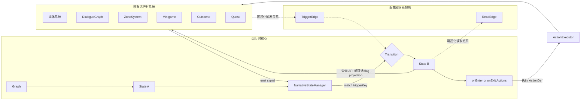

运行时通道：

1. 现有系统发出 signal，状态机匹配可用 Transition。
2. Transition 改变 activeState，并触发状态生命周期 Action。
3. 现有系统通过查询 API 或可选 flag projection 获得叙事上下文。

编辑器投影视图把运行时关系画成两类推导边：

```text
迁移边：State -> Transition -> State
推导触发边：Signal source -> Transition
推导读取边：NarrativeState -> Runtime black box
```

投影边约束：

```text
TriggerEdge 根据 Action、DialogueBridge、Transition.signal、stateEntered / stateExited 等配置推导。
ReadEdge 根据 getActiveState、isStateActive、条件配置、脚本读取点推导。
Transition conditions 是迁移守卫，挂在 Transition 上。
setNarrativeState 可视化时单独显示为 StateCommand。
```

生命周期 Action 是 State 的回调配置，显示在 State 属性面板。Wrapper Graph 的绑定对象是子图属性，显示在 wrapper 属性面板，并提供导航到绑定实体 / Quest / Hotspot 的入口。

---

## 6. 实体接入方式

实体接入按实体自身是否拥有状态分为两条工作流。无论哪一种，实体实例本身都不是主画布上的叙事状态节点；它要么通过自身状态暴露成子图输入，要么通过 wrapper graph 绑定进叙事画布。

## 6.1 有状态实体：暴露实体状态

有状态实体指自身已经有稳定状态字段、实体状态机或实体类型逻辑的对象。叙事层通过状态暴露接口读取它的状态，并把它纳入叙事状态机的可视化、条件和跨图因果中。

有状态实体接入时，实体状态是该实体内部行为的事实来源；叙事层读取这个事实，并可把它映射成可查询的叙事状态输入。若某个状态需要由叙事状态机统一持久化和迁移，则应明确注册为 `NarrativeGraph.activeState`，避免同一状态同时由实体和 `NarrativeStateManager` 双方写入。

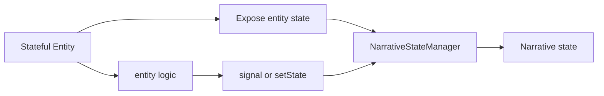

工作流：

```text
选择有状态实体
声明该实体暴露哪些状态
把实体状态映射为叙事层可查询状态或 NarrativeGraph 输入
在 Transition / Condition 中引用这些状态
实体逻辑根据自身结果 emit signal 或 setState
```

适用场景：

```text
复杂 NPC
特殊 Hotspot
有内部状态的小游戏入口
AI 或实体内部状态机
以代码维护复杂规则的实体类型
```

## 6.2 无状态实体：创建叙事包裹对象

无状态实体指当前场景中只有静态配置和普通交互配置的实体。叙事层为它创建一个包裹对象。这个包裹对象本身是一个 `NarrativeGraph`，持有自己的 `activeState`，并绑定到具体实体。

绑定目标使用项目内全局唯一实体 id。包装对象的 `ownerId` 可以直接使用该实体 id。

在编辑器中，画布上显示的是 `Narrative Wrapper Graph` 子图节点；被绑定的 NPC / Hotspot / Zone 等实体显示为 wrapper 子图属性，并可从属性面板导航到原始实体编辑器。

包裹对象通过 State Node 的生命周期事件与被包裹实体交互：

```text
node enter -> onEnterActions -> ActionExecutor -> 目标实体
node exit  -> onExitActions  -> ActionExecutor -> 目标实体
```

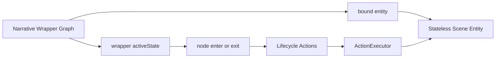

工作流：

```text
选择无状态实体
创建 Narrative Wrapper Graph
绑定全局唯一实体 id
定义 wrapper 的 State Node
定义 wrapper 的 Transition
在 State Node 上配置 onEnterActions / onExitActions
通过 ActionExecutor 改变实体表现或旧系统状态
```

适用场景：

```text
普通场景 NPC
普通 Hotspot
普通 Zone
只有 scene JSON 配置的实体
通过 Action 即可完成表现变化的实体
```

---

## 7. 示例：NPC 三状态

需求：

> 一个 NPC 有三个叙事状态：初始、已交互一次、世界大事后。

状态图：

```text
Graph: npc_x

State:
- initial
- talked_once
- after_world_event

Transition:
t_first_talk:
  initial -> talked_once
  signal: external:entity:npc_x:first_talk_done

t_world_after_talked:
  talked_once -> after_world_event
  signal: stateEntered:flow_world_event:done

t_world_from_initial:
  initial -> after_world_event
  signal: stateEntered:flow_world_event:done

编辑器推导显示 TriggerEdge:
npc_x.first_talk_done -> t_first_talk
stateEntered(flow_world_event.done) -> t_world_after_talked
stateEntered(flow_world_event.done) -> t_world_from_initial
```

状态生命周期：

```json
{
  "id": "after_world_event",
  "onEnterActions": [
    {
      "type": "persistNpcAnimState",
      "params": { "target": "npc_x", "state": "shocked" }
    },
    {
      "type": "persistNpcDisablePatrol",
      "params": { "npcId": "npc_x" }
    }
  ]
}
```

实体交互：

```text
NPC / InteractionSystem 读取 narrative.getActiveState("npc_x")
实体代码根据 activeState 选择自己的交互路径
```

---

## 8. 示例：水猴子到铁环流程

这条链适合作为第一阶段验证目标。

涉及现有系统：

```text
Hotspot：码头告示板
DialogueGraph：码头看板、滚铁环小孩
Scenario：码头水鬼、外国人捞箱子
Zone：水边区域
Cutscene：洋人第一次出场
Minigame：捞箱子小游戏
Flag：foreigner_crate_event_done、铁环小孩_已经获得铁环
Quest：抓水猴子、归还铁环
```

状态图草案：

```text
flow_dock_water_monkey:
  initial
  board_read
  waterside_available
  crate_minigame_done
  ringboy_after_event
  ring_taken
  return_ring_active

npc_ringboy:
  before_event
  after_event
  ring_taken
```

迁移边和编辑器推导触发关系：

```text
Transition:
t_board_read:
  flow_dock_water_monkey.initial -> flow_dock_water_monkey.board_read
  signal: external:dialogue:dock_board:board_read_done

t_waterside_available:
  flow_dock_water_monkey.board_read -> flow_dock_water_monkey.waterside_available
  signal: external:zone:waterside:entered

t_crate_done:
  flow_dock_water_monkey.waterside_available -> flow_dock_water_monkey.crate_minigame_done
  signal: external:minigame:dock_crate_tutorial:pull_success

t_ringboy_after_event:
  npc_ringboy.before_event -> npc_ringboy.after_event
  signal: stateEntered:flow_dock_water_monkey:crate_minigame_done

t_ring_taken:
  npc_ringboy.after_event -> npc_ringboy.ring_taken
  signal: external:dialogue:rolling_ring_boy:ring_taken

编辑器推导显示 TriggerEdge:
DialogueGraph(码头看板).board_read_done -> t_board_read
Zone(水边区域).entered -> t_waterside_available
Minigame(dock_crate_tutorial).pull_success -> t_crate_done
stateEntered(flow_dock_water_monkey.crate_minigame_done) -> t_ringboy_after_event
DialogueGraph(滚铁环小孩).ring_taken -> t_ring_taken
```

当前验证版本把“要铁环”和“抢铁环”都汇入 `ring_taken`，因为后续叙事只关心“玩家已经拿到铁环”。DialogueGraph 内部仍可保留不同对白表现，但在明确叙事事实点统一发出 `external:dialogue:rolling_ring_boy:ring_taken`。如果后续确实需要区分二者，就把 `ring_taken` 拆成 `ring_taken_asked` 和 `ring_taken_snatched` 两个 State，并新增两条不同 Transition。

跨图因果在编辑器里也可以投影为触发边：`flow_dock_water_monkey.crate_minigame_done` 进入状态后，状态机发出内部 lifecycle signal；编辑器把这条 signal 到 `npc_ringboy` 迁移边的关系显示为 TriggerEdge。

生命周期 Action 示例：

```json
{
  "graphId": "npc_ringboy",
  "state": {
    "id": "after_event",
    "onEnterActions": [
      {
        "type": "persistNpcAnimState",
        "params": { "target": "npc_ringboy", "state": "boy_stand_ring" }
      },
      {
        "type": "persistNpcDisablePatrol",
        "params": { "npcId": "npc_ringboy" }
      }
    ]
  }
}
```

---

## 9. 编辑器方向

编辑器第一阶段服务于叙事编排。它的主视图是一张大的 `Narrative Composition Canvas`。

当前打开的主 `NarrativeGraph` 是画布上下文，不作为画布里的普通节点出现。画布内部直接展开显示该主 Graph 的 State 和 Transition。Scenario、NPC Wrapper、Quest Wrapper、DialogueGraph、Zone、Minigame、Cutscene 等对象作为子图或黑盒接入这张画布。

```text
Narrative Composition Canvas
  = 当前打开的主 NarrativeGraph

画布内部显示：
  主 Graph 的 State 节点
  主 Graph 的 Transition 迁移边
  Scenario 子图节点
  NPC / Hotspot / Quest Wrapper Graph 子图节点
  DialogueGraph 黑盒节点
  Zone / Minigame / Cutscene 黑盒节点
  绑定实体引用
  TriggerEdge / ReadEdge 推导图层
```

核心视图：

```text
主 Graph 列表
当前主 Graph 画布
State 节点创建和拖动
Transition 迁移边创建和编辑
Wrapper Graph 创建和绑定
Scenario 子图接入
DialogueGraph / Zone / Minigame / Cutscene 黑盒接入
触发边 TriggerEdge 图层
读取边 ReadEdge 图层
Signal 来源列表
Condition 配置
onEnterActions / onExitActions
Wrapper 绑定对象属性
可选 flag projection 预览
Signal 影响范围预览
运行时 activeState 预览
```

编辑器工作台：

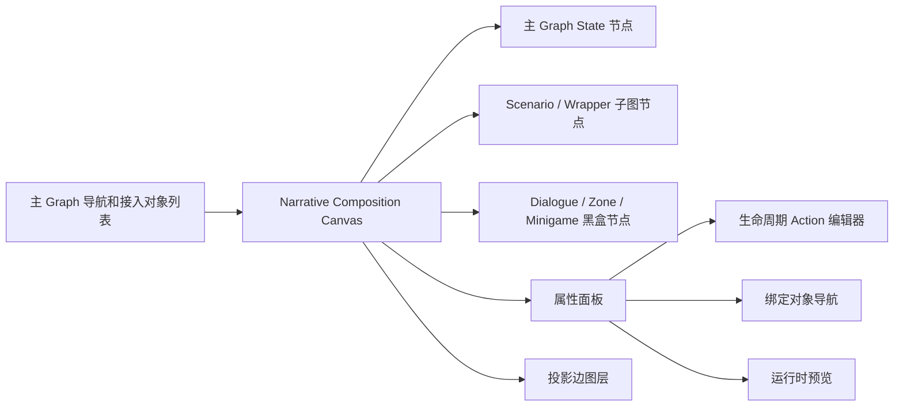

操作能力：

```text
创建主 Graph State
拖动 State / 子图 / 黑盒节点
连接两个 State 创建 Transition
根据 Action / signal 配置自动推导 TriggerEdge
根据读取 API / condition / 脚本读取点自动推导 ReadEdge
编辑节点名称、说明、绑定对象、activeState、Action、condition、signal
从 wrapper 属性面板导航到绑定实体或绑定 Quest 的原始编辑器
模拟 emit signal，预览 activeState 和级联迁移
```

编辑器中 Transition 需要作为可选中的一等对象。作者直接编辑的是 State、Transition、Wrapper 子图、黑盒节点和 Action 配置。TriggerEdge 与 ReadEdge 是编辑器分析配置后生成的顶层关系视图。选中 Transition 时显示它的 `from`、`to`、`signal`、conditions、priority，以及推导出的触发来源。选中外部黑盒时显示它读取哪些叙事状态，以及它能发出哪些 narrative signal。选中 wrapper 子图时显示其绑定对象和内部 State。

---

## 10. 最小可行版本

第一阶段实现状态机核心。

运行时能力：

```text
registerGraph
getActiveState
setActiveState
emitSignal
enqueueTrigger
transition
queue signals and triggers
loop guard
onEnterActions / onExitActions
serialize / deserialize
optional state flag projection
debug inspect
editor relation projection preview
composition canvas edit
node drag
create state / wrapper / blackbox
derive trigger/read relationship view
```

数据结构：

```text
NarrativeGraph
NarrativeStateNode
NarrativeTransition
NarrativeTriggerKey
NarrativeTrigger
NarrativeSignal
```

新增 Action：

```text
emitNarrativeSignal
setNarrativeState
```

可选 flag projection：

```text
narrative.<graphId>.<stateId>.active
```

---

## 11. 与现有系统关系

| 现有系统 | 在状态机架构中的位置 |
|---|---|
| FlagStore | 普通事实存储；可选 narrative state flag projection 读取入口 |
| ScenarioStateManager | 有状态叙事子系统；直接暴露 Scenario 子图状态 |
| QuestManager | 任务子系统；通过 Quest Wrapper Graph 接入 |
| ActionExecutor | 生命周期 Action 执行器 |
| SceneManager | 实体显隐、动画、位置等 Action 落地目标；Wrapper Graph 的绑定对象来源 |
| DialogueGraphManager | 可执行交互子图；signal 来源；叙事状态读取方 |
| ZoneSystem | 区域逻辑系统；signal 来源；状态读取方 |
| MinigameManager | 小游戏逻辑系统；signal 来源 |
| CutsceneManager | 演出系统；signal 来源 |

---

## 12. Quest / Scenario / DialogueGraph 接入

Quest、Scenario、DialogueGraph 都可以按“叙事子系统实体”理解。它们在编辑器画布上的形态不同：

```text
Scenario:
  直接显示为 Scenario 子图节点。
  可展开查看 line / phase 映射出的状态。

Quest:
  先创建 Quest Wrapper Graph。
  Wrapper Graph 绑定具体 quest id。
  wrapper 属性面板显示绑定的 quest id，并提供导航。

DialogueGraph:
  显示为可执行黑盒节点。
  它读取叙事状态，发出 narrative signal。
  内部节点、执行游标、等待选择等保留在 DialogueGraphManager。
```

NPC / Hotspot 使用的 DialogueGraph 通常会和对应 wrapper 子图一起出现在画布上：wrapper 管理叙事状态，DialogueGraph 黑盒负责具体交互执行。

## 12.1 Scenario：直接接入叙事层

Scenario 本身已经接近一个轻量子图。它有线、阶段、状态和条件，内部逻辑相对简单。因此 Scenario 采用直接接入方式：

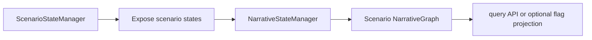

接入规则：

```text
Scenario line -> NarrativeGraph
Scenario phase -> NarrativeStateNode 或可映射状态
Scenario phase status/outcome -> 暴露为叙事状态输入
NarrativeGraph state -> 可通过 Action 投影回 ScenarioStateManager
```

例如：

```text
Scenario: 码头水鬼
  phase: 看板初读 done
  -> isStateActive(flow_dock_water_monkey, board_read)

Narrative state: flow_dock_water_monkey.board_read
  -> onEnterActions:
     activateScenario(码头水鬼)
     setScenarioPhase(码头水鬼, 看板初读, done)
```

Scenario 的输入和输出状态都暴露到叙事层。输入状态可参与 Transition conditions；输出状态可作为 stateEntered / stateExited source 触发其它 Graph 的迁移边；编辑器可把这种跨图关系显示为 TriggerEdge。若旧条件系统或调试面板需要读取某个 Scenario 状态，再把它可选投影为只读 flag。

## 12.2 Quest：通过包裹对象接入

Quest 当前更像 Action 驱动 + 自条件驱动的玩家引导系统。它适合用 `Quest Wrapper Graph` 接入叙事层。画布上显示的是 wrapper 子图，不是 QuestManager 内部对象本身。

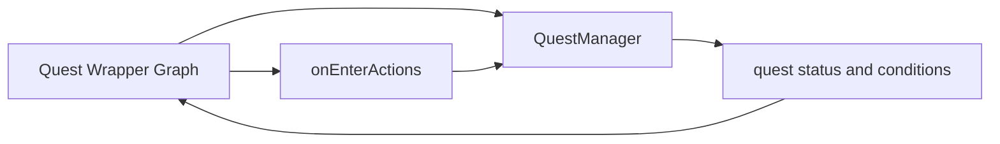

接入规则：

```text
每个重要 Quest 可创建一个 Quest Wrapper Graph
Quest Wrapper Graph 绑定具体 quest id
Quest status 可暴露为 wrapper 的输入状态
wrapper onEnterActions 调用 updateQuest / completeQuest 等 Action
Quest 自身 completionConditions 仍可作为输入条件
编辑器在 wrapper 属性面板显示绑定的 quest id
```

例如：

```text
Quest Wrapper: quest_return_ring
  inactive
  active
  completed

Transition:
t_activate_return_ring:
  quest_return_ring.inactive -> quest_return_ring.active
  signal: stateEntered:npc_ringboy:ring_taken

编辑器推导显示 TriggerEdge:
stateEntered(npc_ringboy.ring_taken) -> t_activate_return_ring

quest_return_ring.active onEnterActions:
  updateQuest(支线-归还小孩铁环-归还铁环)
```

Quest 面板继续负责玩家引导；叙事状态机负责它在大叙事中的位置和因果关系。

## 12.3 DialogueGraph：可执行交互子图

DialogueGraph 是 `ExecutableGraph`。它负责对白播放、选项等待、条件分支、临时变量、runActions、结束节点等交互执行逻辑。DialogueGraphManager 持有它的执行游标和恢复数据。叙事层把 DialogueGraph 看成一个黑盒实体：黑盒读取叙事状态，黑盒在明确叙事点发出 signal。

在编辑器画布上，DialogueGraph 黑盒通常与 NPC / Hotspot wrapper 一起出现。NPC wrapper 负责状态，DialogueGraph 黑盒负责交互执行；二者之间通过 ReadEdge 表示 DialogueGraph 读取 wrapper activeState。

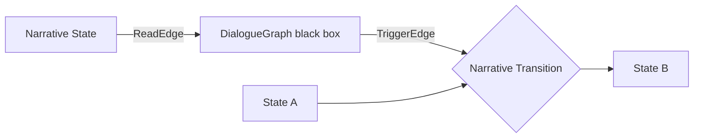

接入规则：

```text
DialogueGraph 可读取 getActiveState / isStateActive，或在兼容旧条件系统时读取可选 flag projection 做分支条件；编辑器把这些读取关系显示为 ReadEdge。
DialogueGraph 在选择、分支终点、对话结束等设计者声明的位置发出 narrative signal。
编辑器把 narrative signal 到 NarrativeTransition 的关系显示为 TriggerEdge。
DialogueGraph 可通过 runActions 调用 emitNarrativeSignal / setNarrativeState。
DialogueGraph 的 currentNode、waitingChoice、runningActions、ended 等执行数据由 DialogueGraphManager 管理。
叙事层记录这次对话造成的持久叙事状态变化。
```

设计者只在代表明确叙事事实的位置配置 narrative signal。普通对白节点、等待选择、执行动作、自动跳转等执行细节由 DialogueGraphManager 自己管理。

可定义一个轻量桥接配置：

```ts
type DialogueNarrativeBridge = {
  dialogueGraphId: string;
  readNarrativeState?: string[];
  signals?: string[];
};
```

DialogueBridge 声明 DialogueGraph 会发出哪些 narrative signal，Transition.signal 声明哪些迁移边消费这些 signal；编辑器根据二者推导显示 TriggerEdge。

例如：

```text
滚铁环小孩.after_evt_choice 选择“要铁环”
  -> runActions:
     emitNarrativeSignal(ring_taken)
  -> 编辑器推导显示 TriggerEdge:
     external:dialogue:rolling_ring_boy:ring_taken -> { graphId: npc_ringboy, transitionId: t_ring_taken }

滚铁环小孩.after_evt_choice 选择“抢铁环”
  -> runActions:
     emitNarrativeSignal(ring_taken)
  -> 编辑器推导显示 TriggerEdge:
     external:dialogue:rolling_ring_boy:ring_taken -> { graphId: npc_ringboy, transitionId: t_ring_taken }
```

这时 DialogueGraph 内部仍然只是执行了一条对白分支；真正进入叙事状态机的是被 `external:dialogue:rolling_ring_boy:ring_taken` 命中的迁移边。若以后“要”和“抢”需要形成不同持久叙事事实，再拆成两个不同 signal、两个不同 Transition 和两个不同 State。

---

## 13. 最终定义

层次叙事系统是：

> 一套运行在现有游戏系统上方的多层叙事状态机。它用 Graph 组织叙事对象，用 State 表达叙事状态，用 Transition 表达状态迁移，用 Signal 表达外部叙事信号，用 onEnterActions / onExitActions 投影到现有 Action 系统，用查询 API 和可选 flag projection 向旧系统提供叙事上下文。编辑器以当前主 Graph 作为叙事编排画布，直接展开主 Graph 的 State 和 Transition，并把 Scenario 子图、Wrapper Graph、DialogueGraph 黑盒、Zone / Minigame / Cutscene 黑盒接入画布；同时从 Action、signal 配置、读取 API、conditions 和脚本读取点推导 TriggerEdge、ReadEdge，让作者看清实体、对话、任务、场景和叙事状态之间的联系。有状态实体和有状态子系统通过状态暴露接入叙事层；无状态实体和 Action/Condition 驱动的子系统通过叙事包裹对象接入叙事层；可执行交互子图通过叙事状态读取和 narrative signal 接入叙事层。

一句话定义：

> 实体负责行为，Action 负责落地，叙事状态机负责因果与状态迁移。
