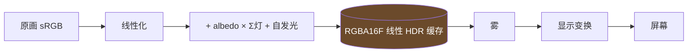

# 光照模型总览

## 一眼看全

**原画就是最终的光照结果。** 运行时不重新照亮场景，只把作者摆的实体灯加上去。

场景：

$$
\mathrm{screen} = \mathrm{Display}\Big(\mathrm{Fog}\big(\underbrace{\mathrm{painting} + \mathrm{albedo}\times\textstyle\sum_i E_i}_{\mathrm{surf}} + \mathrm{emissive}\big)\Big)
$$

角色：

$$
\mathrm{screen} = \mathrm{Display}\Big(\mathrm{srgb2lin}(a)\cdot\frac{E_{\text{probe}}\cdot V_{\text{skyao}} + \sum_i E_i}{\pi}\cdot 2^{\beta}\Big)
$$

影子：角色剪影按**绑定的灯**投在行走面上。遮挡：sprite 逐像素与场景深度比较。

| 符号 | 是什么 | 细节 |
|---|---|---|
| $\mathrm{painting}$ | 原画线性化 | [场景受光](02-场景受光.md) |
| $\mathrm{albedo}$ | 烘出来的反照率贴图，作者可手改 | [场景受光](02-场景受光.md) · [数据与文件](05-数据与文件.md) |
| $E_i$ | 第 $i$ 盏实体灯在该点的辐照度；**场景与角色用同一批灯** | [场景受光](02-场景受光.md) |
| $\mathrm{emissive}$ | 灯体自发光 + 大气光晕，不乘 albedo | [场景受光](02-场景受光.md) |
| $\mathrm{Fog}$ / $\mathrm{Display}$ | 雾 / 显示变换；**场景与角色同一份** | [场景受光](02-场景受光.md) |
| $a$、$E_{\text{probe}}$、$V_{\text{skyao}}$、$\beta$ | 角色贴图 / probe 底光 / 天穹遮蔽 / 曝光 | [角色受光](03-角色受光.md) |
| 影子、遮挡 | 绑定解算、深度比较 | [实体阴影与遮挡](04-实体阴影与遮挡.md) |

不变量：**没有灯时 $\mathrm{surf} \equiv \mathrm{painting}$**，原画分毫不动。

「夜」= 换一张夜原画 + 该时段的 probe + 该时段的灯。灯按各自的时段归属 `phases` 过滤，不靠调暗天光。

## 两级结构

| 级 | 何时跑 | 做什么 |
|---|---|---|
| ① 脏时重算 | 进场景、灯或参数改动、时段切换、F2 调参 | 原画 + albedo × 灯 + 自发光 → RGBA16F 线性 HDR 缓存 |
| ② 逐帧 | 每帧 | 采样缓存 → 雾 → 显示变换 → 屏幕 |

缓存是线性 HDR：显示变换（曝光 / tonemap / 调色）**不进第一级**。角色是独立 sprite，在自己的 shader 里调同一份光照代码、吃同一组参数。

## 坐标空间与单位

| 空间 | 定义 | 单位 | 住户 |
|---|---|---|---|
| 场景世界 | 场景 JSON 的 `worldWidth` × `worldHeight`，原点 = 世界原点 | **wu** | NPC、热区、spawn、碰撞、**灯位与一切光照长度** |
| 原生像素栅格 | 背景原画 / 深度图的像素 | native px | 深度图、法线、albedo、标定 `depthConfig.M` 的 `ppu, cx, cy` |
| 工作像素栅格 | 照明载荷的工作分辩率（`lighting.json` 的 `work`） | work px | probe 载荷、`ground_d`、`lighting.json` 的 `cal` |
| 伪世界 $q$ | $q_x = \dfrac{s_x - c_x}{\mathrm{ppu}},\quad q_y = \dfrac{c_y - s_y}{\mathrm{ppu}},\quad q_z = d$（$d$ = 深度图解码值） | q 单位 | 深度场、阴影线扫、大气光晕的视线积分 |
| M-world | $P = R \cdot q$，$R$ = `depthConfig.M.R`，$\det R = +1$ | q 单位 → 乘 $\mathrm{wuPerQUnit}$ 得 wu | 灯位、法线、$N \cdot L$、$1/r^2$、影子、碰撞格 |
| probe 世界 | $X_w = M_{\text{lab}} \cdot q$，$M_{\text{lab}}$ = `lighting.json` 的 `world.M`，$\det = -1$ | q 单位 | **只给** probe / 体素 / skyao 查表 |

两个 $M$ 不许混：$M_{\text{lab}} = \mathrm{diag}(1,1,-1)\cdot R$。两套像素栅格不许混：native / work 的比例逐场景不同。

$$
\mathrm{wuPerQUnit} = \frac{\mathrm{worldWidth}}{\mathrm{native}_w / \mathrm{ppu}}
$$

尺度锚：角色高 **150 wu**，所有场景恒定。

## 铁律

1. **一切光照在世界空间（M-world）算，单位 wu。** 法线、灯位、灯的方向、$N\cdot L$、$1/r^2$ 进光照函数之前必须已经在 M-world；朝向过 $R$、尺度过 $\mathrm{wuPerQUnit}$，一次转到底。
2. **一切颜色量在线性空间。** 显示变换是流水线最后一步，且**同时作用于场景与角色**。
3. **场景与角色用同一份光照代码、同一次灯打包、同一组显示参数。**

## 光源类型

| kind | 含义 |
|---|---|
| `point` | 点光 |
| `spot` | 聚光 |
| `area` | 矩形面光 |
| `directional` | 平行光 |

天光不是灯：`lighting.sky.intensity` 只作实体影子浓度解算的环境照度分母，运行时不再加天光。
