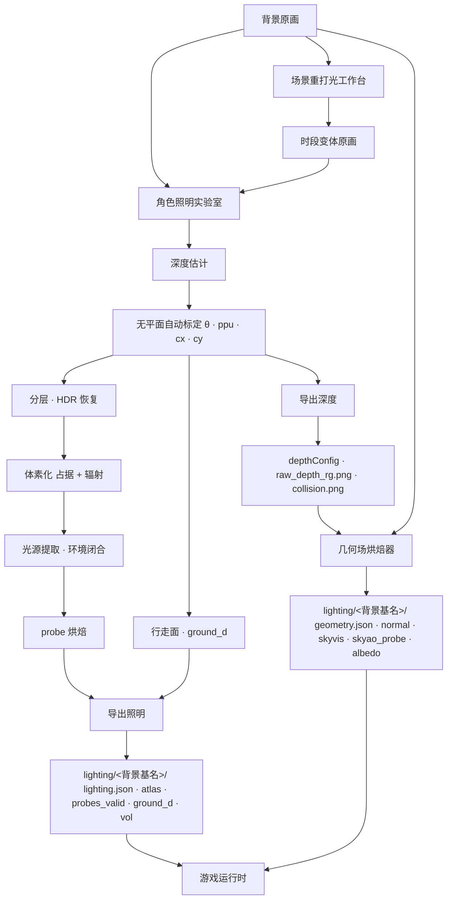

# 烘焙管线与工具链

## 一眼看全

```text
原画 ──实验室──────────▶ 深度 · 标定 · probe · 行走面 ─┐
                                                      ├─▶ lighting/<背景基名>/ ──▶ 游戏
原画 + 深度 ──几何场烘焙器──▶ 法线 · albedo · 天穹遮蔽 ─┘
```

- 时段变体原画由**场景重打光工作台**从白天原画产出，每张再各走一遍上面两步。
- 灯由**主编辑器**或游戏内 **F3** 摆，两边双向同步。
- 出包前过**校验器 → 新鲜度门 → 真跑扫描**三道门。

## 从一张原画到载荷



每张时段原画各走一遍实验室与几何场烘焙；`albedo.png` 只按主背景算一次。

### 实验室内的阶段

| 阶段 | 输入 | 产出 |
|---|---|---|
| 深度估计 | 原画 | 相对深度（Depth Anything，small / base 两档） |
| 标定 | 深度 | $\theta$、ppu、cx、cy；地面掩码 |
| 分层 | 标定 + 线性原画 | 前景 / 地面分层、前表面深度 |
| HDR 恢复 | sRGB 原画 | 线性辐射场（逆 Reinhard 展开 / 全局 gamma / 亮度扩展，可配发光体门） |
| 体素化 | 标定、分层、辐射 | 占据 + 辐射体素卷、发光卷 |
| 光源提取 | 发光前表面 | 光源 surfel `{pos, radiance, area}` |
| 环境闭合 | 逃逸方向 | `ambient_sh` |
| probe 烘焙 | 以上全部 | 规则网格 probe：布点 → validity → 积分 → 自适应细化 → 联合双边重建 → NEE 直射分账 → dilation → 逐颗去环；三种编码（L1 / L2 / 八面体 bins） |
| 行走面 | 标定、分层、体素 | 可走掩码、行走面深度场 |
| 导出照明 | 以上产物 | `lighting.json`、probe 图集、`probes_valid.bin`、`ground_d.png`、`vol_*.bin` |
| 导出深度 | 标定、深度 | 场景 JSON 的 `depthConfig`、`raw_depth_rg.png`、`collision.png` |

### 几何场烘焙器的阶段

只依赖深度场与标定，与时刻、天气、灯无关。

| 阶段 | 输入 | 产出 |
|---|---|---|
| 世界重建 | `raw_depth_rg.png`（运行时实际 march 的那份）+ `depthConfig.M.R` | M-world 位置场 |
| 法线 | 位置场梯度叉积 | `normal.png`（世界法线） |
| 天穹可见性 | 逐像素向天穹 march | `skyvis.png` |
| 天穹遮蔽矩 | 网格点向天穹 march | `skyao_probe.bin` |
| 遮蔽响应拟合 | 原画 + skyvis | `day_hemi` |
| albedo | 主背景 + skyvis + day_hemi | `albedo.png`（`authored = true` 的不覆盖） |
| 元数据 | 以上 | `geometry.json`（含 `background_sha1`、`depth_sha1`、版本） |

## 工具

| 工具 | 职责 | 产出 |
|---|---|---|
| **角色照明实验室**（桌面壳） | 2D 场景 / 3D 检视 / 顶视编辑三个视图。顶视编辑：深度抬高 / 压低 / 抹平到地面 / 平滑、碰撞改可走 / 阻挡、地形标物体 / 地形、多边形批量、擦除；深度模型 small / base；HDR 恢复方式与发光体门；probe 编码 RT / L1 / L2 / BIN 切换与对照；重烘此场景 / 重烘全部；只存着色参数；导出照明 → 游戏；导出深度 → 游戏 | `lighting/<背景基名>/` 的照明载荷；`depthConfig` + 深度图 + 碰撞图 |
| **几何场烘焙器** | 一张背景的全部几何派生物；可只补 albedo；作者手改过的 albedo 默认跳过 | `geometry.json`、`normal.png`、`skyvis.png`、`skyao_probe.bin`、`albedo.png` |
| **场景重打光工作台** | 把白天原画确定性地 relight 成任意时段 / 天气的变体图（入夜、向晚、清晨、阴、雨、雾）；同输入同参数同字节 | 时段变体原画 + 贴进场景 JSON 的 `timeVariants` 片段 |
| **主编辑器 · 场景页** | 「统一光影 lighting（灯位）」块：加点光 / 聚光 / 面光 / 平行光、启用、投影、删除，每盏灯的字段表单；「在画布上定位灯」：点地面取深度反投影落灯、拉杆调高度；带影灯数 / 预算；albedo 状态行（烘的 / 作者手改 / 与主背景是否同步）、重生成默认 albedo、画布底图看 albedo；「日夜与出口」块的时段外观表：每个 `timeVariants` 项三态（沿用 / 覆盖 / 覆盖成空）；与运行中游戏的双向同步状态行 | 场景 JSON |
| **游戏内 F2 / F3** | F3 摆灯；F2 光影页：调试视图循环（正常 / 法线 / albedo 贴图 / 灯的辐照度 / 线性化原画 / GI 体 / GI 体·纯 E / GI 体·棋盘 / GI 体·最近邻 / skyao 体）、曝光 $\beta$、probe 编码档、RT 档参数、灯阴影、灯体自发光、阴影组（含天光强度）、雾、显示变换 | 运行时参数（经同步写回场景 `lighting`） |
| **双向实时同步** | 游戏（F2 / F3）与编辑器场景页改同一份 `lighting`；经 dev server 的一个文件槽，服务端自增 `rev` 做回声抑制；拖灯 / 独奏时只发不收；请求带超时、指数退避、连接状态可见 | — |

## 校验与打包

| 门 | 查什么 |
|---|---|
| **全量数据校验**（validate-data） | `lighting` 须为对象，`sky` / `display` 须为对象，`lights` 须为数组；每盏灯的类型、锥角范围、面光 `size`、`rollDeg` 只对面光、已删 / 已改名字段；`phases` 值须是已登记时段；`shadowBias` 数值与范围；配 `lighting` 但无 `depthConfig`；几何场载荷存在、代次与运行时一致、尺寸对得上 |
| **深度体检**（audit-depth） | 背景 / 深度图 / 碰撞图 / `ground_d` 存在；标定与深度图同尺寸（cx / cy = 半幅）；碰撞图与网格声明同尺寸；照明载荷版本 ≥ 2 且背景哈希未失配；已废字段残留 |
| **可走性体检**（audit-walkable） | 出生点、过场移动目标、NPC 巡逻点按运行时同一条反投影链落进碰撞格是否阻挡 |
| **烘焙验证**（verify） | 只读盘上产物，按运行时着色器口径重建，与烘焙器自己的高 spp 参照比 |
| **打包清单** | 只登记入口 `lighting.json` / `geometry.json`，旁边要抽的文件按载荷的 `shading.mode` 展开；文件名表与运行时共用一份 |
| **烘焙新鲜度门**（发行前） | `lighting.json` 的 `background_sha1` 与当前背景哈希比对 |
| **全场景真跑扫描**（scene_sweep） | 隔离 dev 服上无头真跑每个场景，反向核对清单 |

几何场载荷代次在烘焙器、运行时、校验器三处必须一致，不一致运行时整包忽略。
